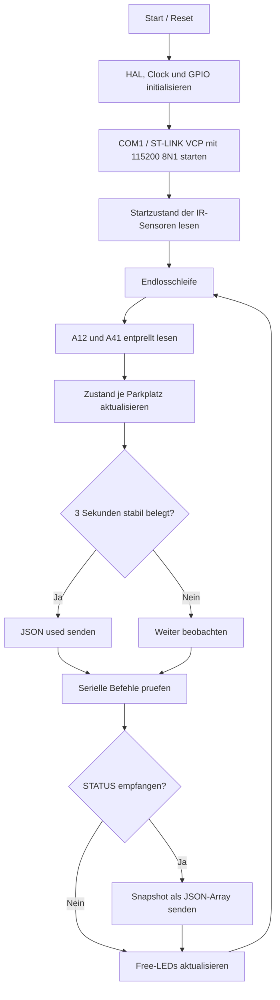
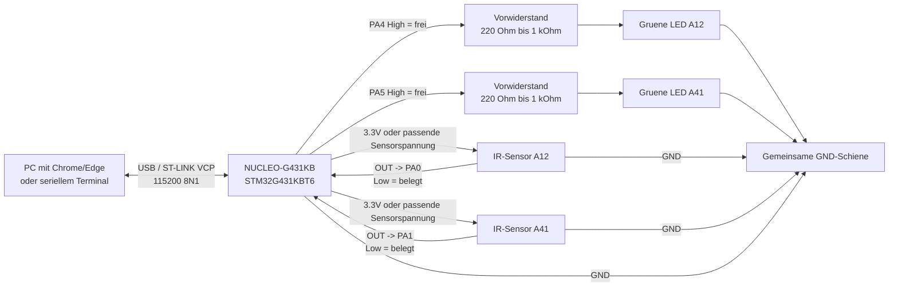

# ParkingStation

ParkingStation ist ein STM32-Prototyp fuer eine kleine Parkplatz-Erkennung mit zwei echten IR-Sensoren, zwei gruenen Frei-LEDs und einer einfachen Web-Serial-Oberflaeche. Das Projekt erkennt, ob die Parkplaetze `A12` und `A41` belegt oder frei sind, gibt Statusaenderungen als JSON ueber den ST-LINK Virtual COM Port aus und stellt die Werte in `parking-station.html` visuell dar. Die Firmware laeuft auf einem NUCLEO-G431KB mit STM32G431KBT6 und nutzt STM32 HAL/BSP sowie CMake als Build-System. Im Fokus stehen der Hardwareaufbau, das Verhalten der Sensorlogik, die seriellen Schnittstellen und die Grenzen des Modells.

## Inhaltsverzeichnis

- [Projektziel](#projektziel)
- [Handlungsergebnis](#handlungsergebnis)
- [Hardware](#hardware)
- [Pinbelegung](#pinbelegung)
- [Schaltplan / Verdrahtung](#schaltplan--verdrahtung)
- [Softwarestruktur](#softwarestruktur)
- [Firmware-Verhalten](#firmware-verhalten)
- [Serielles Protokoll](#serielles-protokoll)
- [Web-Dashboard](#web-dashboard)
- [Werkzeuge und Referenzen](#werkzeuge-und-referenzen)
- [Build, Flash und Start](#build-flash-und-start)
- [Test und Kontrolle](#test-und-kontrolle)
- [Grenzen und bekannte Einschraenkungen](#grenzen-und-bekannte-einschraenkungen)
- [Fotos und Videos vom Handlungsergebnis](#fotos-und-videos-vom-handlungsergebnis)
- [IPERKA 6-Phasen-Methode](#iperka-6-phasen-methode)
- [Kommentierter Programmcode](#kommentierter-programmcode)
- [Moegliche Erweiterungen](#moegliche-erweiterungen)

## Projektziel

Ziel des Projekts ist ein funktionsfaehiges Modell einer Parking Station. Zwei Parkplaetze werden mit IR-Sensoren ueberwacht, damit der Mikrocontroller erkennt, ob ein Objekt beziehungsweise ein Modellfahrzeug auf dem Parkplatz steht. Zusaetzlich zeigt pro Parkplatz eine gruene LED direkt an, ob der Platz frei ist. Der Mikrocontroller verarbeitet die Sensordaten, filtert kurze Stoerungen und meldet den Zustand als JSON-Zeilen ueber die serielle Verbindung. Eine HTML-Oberflaeche kann ueber Web Serial verbunden werden und zeigt die Live-Plaetze zusammen mit weiteren Dummy-Parkplaetzen als Modellparkplatz an.

Das Projekt ist bewusst als Prototyp aufgebaut. Es zeigt die Grundfunktion einer Parkplatzueberwachung, ersetzt aber kein robustes industrielles Parkleitsystem. Die Hardware ist einfach gehalten, damit Aufbau, Code und Verhalten gut nachvollziehbar bleiben. Dadurch eignet sich das Projekt besonders fuer Dokumentation, Praesentation und Demonstration des Zusammenspiels von Sensorik, Mikrocontroller und Benutzeroberflaeche.

## Handlungsergebnis

Das Handlungsergebnis besteht aus drei Teilen:

| Teil | Ergebnis |
| --- | --- |
| Hardware | NUCLEO-G431KB mit zwei IR-Sensoren und zwei gruenen Frei-LEDs fuer die Plaetze `A12` und `A41` |
| Firmware | C-Code in `Core/Src/main.c`, der Sensoren auswertet, JSON sendet und serielle Befehle empfaengt |
| Bedienoberflaeche | `parking-station.html` als lokales Dashboard mit Web-Serial-Verbindung |

Die Parking Station arbeitet nach folgendem Ablauf:



## Hardware

### Zentrale Komponenten

| Komponente | Aufgabe im Projekt | Hinweis |
| --- | --- | --- |
| NUCLEO-G431KB | Mikrocontroller-Board und ST-LINK USB-Verbindung | Board aus dem STM32G4-Umfeld |
| STM32G431KBT6 | Fuehrt Firmware, GPIO-Logik und UART-Kommunikation aus | Systemtakt laut Projekt auf 170 MHz konfiguriert |
| IR-Sensor A12 | Erkennt Belegung des Parkplatzes `A12` | Aktives Low-Signal wird erwartet |
| IR-Sensor A41 | Erkennt Belegung des Parkplatzes `A41` | Aktives Low-Signal wird erwartet |
| Gruene LED A12 | Zeigt an, ob Parkplatz `A12` frei ist | GPIO High = LED an = Platz frei |
| Gruene LED A41 | Zeigt an, ob Parkplatz `A41` frei ist | GPIO High = LED an = Platz frei |
| USB/ST-LINK VCP | Stromversorgung, Programmierung und serielle Datenverbindung | COM-Port fuer Dashboard oder Terminal |

### Funktionsprinzip der Sensoren

Die IR-Sensoren werden als digitale Eingaben gelesen. Die Firmware behandelt ein Low-Signal am Sensor-GPIO als erkannte Belegung, weil die Eingaben mit internem Pull-up konfiguriert sind. Liegt kein Objekt vor oder ist der Sensorausgang nicht aktiv, bleibt der Eingang durch den Pull-up auf High und der Parkplatz gilt als frei. Diese Logik passt zu vielen einfachen IR-Obstacle-Sensoren, muss aber bei anderer Sensorhardware geprueft werden. Ein offener oder abgezogener Sensorausgang kann durch den Pull-up ebenfalls wie ein freier Parkplatz wirken.

Jeder Sensor wird zweimal gelesen. Zwischen den beiden Messungen liegt eine kurze Wartezeit von `20 ms`. Nur wenn beide Messwerte eine Erkennung liefern, wird der Parkplatz als belegt akzeptiert. Damit werden sehr kurze Stoerspitzen reduziert, aber langsame Fehlmessungen oder falsch ausgerichtete Sensoren werden dadurch nicht automatisch verhindert.

### Stromversorgung und Signalpegel

Das Board wird normalerweise ueber USB versorgt. Die IR-Sensoren sollten mit einer fuer das Board geeigneten Spannung betrieben werden, empfohlen ist ein 3.3-V-kompatibler Ausgang. GND von Sensoren und NUCLEO-Board muss gemeinsam verbunden sein, sonst sind die digitalen Pegel nicht eindeutig. Vor dem Anschluss eines Sensors muss geprueft werden, ob dessen Ausgangspegel fuer den STM32-GPIO zulaessig ist.

## Pinbelegung

| Funktion | Parkplatz / Signal | STM32-Pin | Port | Richtung | Logik |
| --- | --- | --- | --- | --- | --- |
| IR-Sensor | `A12` | `PA0` | `GPIOA` | Eingang | Low = belegt |
| IR-Sensor | `A41` | `PA1` | `GPIOA` | Eingang | Low = belegt |
| Gruene Frei-LED | `A12` | `PA4` | `GPIOA` | Ausgang | High = frei / LED an |
| Gruene Frei-LED | `A41` | `PA5` | `GPIOA` | Ausgang | High = frei / LED an |
| Virtual COM TX | ST-LINK VCP | `PA2` | `GPIOA` | Alternate Function | LPUART1 TX ueber BSP-COM1 |
| Virtual COM RX | ST-LINK VCP | `PA3` | `GPIOA` | Alternate Function | LPUART1 RX ueber BSP-COM1 |
| SWDIO | Debug | `PA13` | `GPIOA` | Debug | ST-LINK |
| SWCLK | Debug | `PA14` | `GPIOA` | Debug | ST-LINK |
| SWO | Debug | `PB3` | `GPIOB` | Debug | Optional |

Die Live-Parkplaetze sind in `Core/Inc/main.h` definiert:

```c
#define PARKING_PLACE_A12_Pin GPIO_PIN_0
#define PARKING_PLACE_A12_GPIO_Port GPIOA
#define PARKING_PLACE_A41_Pin GPIO_PIN_1
#define PARKING_PLACE_A41_GPIO_Port GPIOA
#define PARKING_PLACE_A12_LED_Pin GPIO_PIN_4
#define PARKING_PLACE_A12_LED_GPIO_Port GPIOA
#define PARKING_PLACE_A41_LED_Pin GPIO_PIN_5
#define PARKING_PLACE_A41_LED_GPIO_Port GPIOA
```

Der aktive serielle Code nutzt die BSP-Definition `COM1`. In `Drivers/BSP/STM32G4xx_Nucleo/stm32g4xx_nucleo.h` ist `COM1` fuer dieses Board auf `LPUART1` mit `PA2` und `PA3` gelegt. Bei einer spaeteren Regeneration mit STM32CubeMX muss geprueft werden, dass diese BSP-COM-Konfiguration und der Handler `LPUART1_IRQHandler` weiter zusammenpassen.

## Schaltplan / Verdrahtung

Der folgende Schaltplan zeigt den logischen Aufbau des Prototyps. Er ersetzt keinen professionellen KiCad- oder EDA-Schaltplan, macht aber fuer die Dokumentation sichtbar, welche Signale zwischen Sensoren, LEDs, NUCLEO-Board und Web-Dashboard verbunden sind.



### Verdrahtungstabelle

| Bauteil / Signal | Verbindung am NUCLEO-G431KB | Zweck |
| --- | --- | --- |
| Sensor A12 `VCC` | `3.3V` oder passende Sensorspannung | Versorgung des linken Live-Sensors |
| Sensor A12 `GND` | `GND` | Gemeinsamer Bezugspunkt |
| Sensor A12 `OUT` | `PA0` | Digitales aktives Low-Signal fuer Parkplatz `A12` |
| Sensor A41 `VCC` | `3.3V` oder passende Sensorspannung | Versorgung des rechten Live-Sensors |
| Sensor A41 `GND` | `GND` | Gemeinsamer Bezugspunkt |
| Sensor A41 `OUT` | `PA1` | Digitales aktives Low-Signal fuer Parkplatz `A41` |
| Gruene LED A12 Anode | `PA4 -> Vorwiderstand -> LED-Anode` | LED leuchtet, wenn `A12` frei ist |
| Gruene LED A12 Kathode | `GND` | Rueckleitung der LED |
| Gruene LED A41 Anode | `PA5 -> Vorwiderstand -> LED-Anode` | LED leuchtet, wenn `A41` frei ist |
| Gruene LED A41 Kathode | `GND` | Rueckleitung der LED |
| USB / ST-LINK | USB-Kabel zum PC | Programmierung, Stromversorgung und Virtual COM Port |

`PA6` und `PA7` werden in der aktuellen Firmware nicht verwendet. Eine offene oder defekte Sensorleitung wird deshalb nicht als eigener Fehlerzustand erkannt, sondern kann durch den internen Pull-up wie ein freier Parkplatz wirken.

## Softwarestruktur

```text
ParkingStation/
+-- Core/
|   +-- Inc/
|   |   +-- main.h
|   |   +-- stm32g4xx_hal_conf.h
|   |   +-- stm32g4xx_it.h
|   +-- Src/
|       +-- main.c
|       +-- stm32g4xx_it.c
|       +-- stm32g4xx_hal_msp.c
|       +-- syscalls.c
|       +-- sysmem.c
|       +-- system_stm32g4xx.c
+-- Drivers/
|   +-- BSP/STM32G4xx_Nucleo/
|   +-- CMSIS/
|   +-- STM32G4xx_HAL_Driver/
+-- cmake/
|   +-- gcc-arm-none-eabi.cmake
|   +-- starm-clang.cmake
|   +-- stm32cubemx/CMakeLists.txt
+-- CMakeLists.txt
+-- CMakePresets.json
+-- ParkingStation.ioc
+-- STM32G431XX_FLASH.ld
+-- startup_stm32g431xx.s
+-- Assets/
|   +-- image-20260520-232528-615.jpeg
|   +-- ...
+-- parking-station.html
+-- 03 Vorlage - IPERKA 6-Phasen-Methode.docx
+-- README.md
```

### Wichtige Dateien

| Datei | Bedeutung |
| --- | --- |
| `Core/Src/main.c` | Hauptlogik der Firmware: Initialisierung, Sensoren, Zustandsautomat, JSON-Ausgabe, UART-Befehle |
| `Core/Inc/main.h` | Pin-Defines fuer die Live-Parkplaetze und Frei-LEDs |
| `Core/Src/stm32g4xx_it.c` | Interrupt-Handler, unter anderem `LPUART1_IRQHandler` fuer COM1 |
| `parking-station.html` | Lokales Dashboard mit Web Serial API |
| `ParkingStation.ioc` | STM32CubeMX-Projektkonfiguration |
| `CMakeLists.txt` | Oberes Build-Skript fuer CMake |
| `cmake/stm32cubemx/CMakeLists.txt` | Von CubeMX erzeugte Source-, Include- und Treiberlisten |
| `STM32G431XX_FLASH.ld` | Linker-Script fuer Flash/RAM-Aufteilung |

## Firmware-Verhalten

### Initialisierung

Beim Start ruft die Firmware zuerst `HAL_Init()` auf und konfiguriert danach den Systemtakt. Anschliessend werden die GPIO-Ports fuer die IR-Sensoren und die zwei gruenen Frei-LEDs initialisiert. Danach wird `BSP_COM_Init(COM1, ...)` mit 115200 Baud, 8 Datenbits, 1 Stoppbit, keiner Paritaet und ohne Hardware-Flow-Control gestartet. Der Empfang wird interruptbasiert mit `HAL_UART_Receive_IT()` aktiviert.

### Parkplatzzustand

Jeder echte Parkplatz besitzt eine kleine Zustandsstruktur:

```c
typedef struct
{
  uint8_t occupied;
  uint8_t usedReported;
  uint32_t occupiedStartedAt;
} ParkingPlaceState;
```

`occupied` beschreibt den aktuell stabil erkannten Belegungszustand. `usedReported` verhindert, dass die Firmware staendig neue `used`-Events sendet, solange dasselbe Fahrzeug unveraendert auf dem Platz steht. `occupiedStartedAt` speichert den Zeitpunkt, an dem die Belegung begonnen hat. Damit kann die Firmware pruefen, ob ein Platz laenger als die definierte Meldeverzoegerung belegt ist.

### Belegt-Erkennung

Ein Parkplatz gilt nicht sofort beim ersten aktiven Sensorwert als belegt. Die Firmware wartet zuerst auf zwei gleiche aktive Samples im Abstand von `SENSOR_DEBOUNCE_MS`, also `20 ms`. Wenn ein Platz danach durchgehend belegt bleibt, wird erst nach `PARKING_USED_REPORT_DELAY_MS`, also `3000 ms`, ein `used`-Event gesendet. Dadurch wird ein kurzes Vorbeifahren oder eine Handbewegung nicht sofort als echtes Parken gemeldet.

### Frei-Erkennung

Wenn ein Parkplatz wieder frei wird, sendet die Firmware `free`, aber nur wenn vorher fuer diese Belegung bereits ein `used`-Event gesendet wurde. Das verhindert unnoetige Meldungen bei sehr kurzen Stoerungen, die die Drei-Sekunden-Grenze nie erreicht haben. Falls ein Objekt nur kurz erkannt und wieder entfernt wird, kann es sein, dass ueberhaupt keine JSON-Meldung entsteht. Der aktuelle Zustand kann jederzeit mit dem Befehl `STATUS` abgefragt werden.

### LED-Verhalten

Jeder Live-Parkplatz hat eine eigene gruene Frei-LED. Die LED fuer `A12` haengt an `PA4`, die LED fuer `A41` haengt an `PA5`. Eine LED ist eingeschaltet, solange der zugehoerige Parkplatz frei ist. Sobald der Sensor dieses Parkplatzes eine Belegung erkennt, schaltet die Firmware die zugehoerige LED aus.

Die LED-Anzeige folgt dem aktuellen Sensorzustand nach der Entprellung. Sie wartet nicht auf die Drei-Sekunden-Verzoegerung der seriellen `used`-Meldung. Dadurch sieht man am Aufbau sofort, dass der Platz nicht mehr frei ist, waehrend die JSON-Ausgabe weiterhin kurze Stoerungen herausfiltert.

### Verdrahtung der gruenen LEDs

Die LEDs sind als aktive High-Ausgaenge geplant. Das bedeutet: Der STM32-Pin liefert ein High-Signal, Strom fliesst durch Vorwiderstand und LED nach GND, und die LED leuchtet. Jede LED braucht einen eigenen Vorwiderstand, typischerweise `220 Ohm` bis `1 kOhm`; ein guter Startwert ist `330 Ohm`.

| Parkplatz | STM32-Pin | Verbindung |
| --- | --- | --- |
| `A12` | `PA4` | `PA4 -> Vorwiderstand -> LED-Anode`, LED-Kathode -> `GND` |
| `A41` | `PA5` | `PA5 -> Vorwiderstand -> LED-Anode`, LED-Kathode -> `GND` |

Die lange LED-Seite ist normalerweise die Anode, die kurze Seite beziehungsweise die abgeflachte Gehaeuseseite ist normalerweise die Kathode. Wenn die LED falsch herum eingebaut ist, leuchtet sie nicht, geht dadurch bei normaler Beschaltung aber in der Regel nicht kaputt. Wichtig ist, dass jede LED einen Vorwiderstand hat und dass kein GPIO direkt kurzgeschlossen wird.

## Serielles Protokoll

### Verbindung

| Parameter | Wert |
| --- | --- |
| Port | ST-LINK Virtual COM Port |
| Firmware-Schnittstelle | `COM1` / `LPUART1` ueber BSP |
| Baudrate | `115200` |
| Datenbits | `8` |
| Stoppbits | `1` |
| Paritaet | Keine |
| Flow Control | Keine |
| Zeilenende fuer Befehle | `\r`, `\n` oder `\r\n` |

### Automatische Events

Wenn ein Platz lange genug belegt ist, sendet die Firmware eine JSON-Zeile:

```json
{"place":"A12","state":"used","timestamp_ms":3120}
```

Wenn ein vorher gemeldeter Platz wieder frei wird, sendet die Firmware:

```json
{"place":"A12","state":"free","timestamp_ms":9400}
```

`timestamp_ms` stammt aus `HAL_GetTick()` und beschreibt die Millisekunden seit Start des Controllers. Dieser Wert ist keine echte Uhrzeit. Nach langer Laufzeit kann der Tick-Wert ueberlaufen; fuer die kurzen Projektintervalle ist das unkritisch.

### Befehl `STATUS`

Der einzige unterstuetzte Befehl ist:

```text
STATUS
```

Die Antwort ist ein JSON-Array mit den beiden Live-Parkplaetzen:

```json
[{"place":"A12","state":"free","timestamp_ms":12055},{"place":"A41","state":"used","timestamp_ms":12055}]
```

### Fehlerausgaben

| Situation | Antwort |
| --- | --- |
| Unbekannter Befehl | `{"error":"unknown_command"}` |
| Befehl laenger als Buffer | `{"error":"command_too_long"}` |

Der Befehlsbuffer ist `16` Zeichen gross. Da ein Zeichen fuer den String-Abschluss reserviert ist, darf ein Befehl maximal `15` sichtbare Zeichen haben. Das reicht fuer `STATUS`, ist aber eine bewusste Grenze des Prototyps.

## Web-Dashboard

Die Datei `parking-station.html` ist eine einfache lokale Benutzeroberflaeche. Sie zeigt einen Parkplatzblock mit 20 Feldern von `A11` bis `A45`. Nur `A12` und `A41` sind echte Hardwareplaetze, weil nur diese beiden Plaetze in der Firmware mit IR-Sensoren verbunden sind. Die restlichen Plaetze sind Dummy-Werte und werden standardmaessig als belegt dargestellt, damit das Modell wie ein groesserer Parkplatz aussieht.

### Bedienung

1. Firmware auf das NUCLEO-Board flashen.
2. Board per USB mit dem Computer verbinden.
3. `parking-station.html` ueber einen lokalen Server in Chrome oder Edge oeffnen.
4. Auf `Connect` klicken und den ST-LINK Virtual COM Port auswaehlen.
5. Mit `Request Status` den aktuellen Zustand anfordern.
6. Sensor A12 oder A41 abdecken und die zugehoerige gruene LED beobachten; nach etwa drei Sekunden erscheint zusaetzlich die JSON-Aenderung.

### Lokaler Start des Dashboards

Web Serial funktioniert in der Regel in Chrome oder Edge und benoetigt einen sicheren Kontext. Fuer lokale Entwicklung ist `localhost` geeignet. Ein einfacher Start ist zum Beispiel:

```powershell
py -m http.server 8000
```

Danach im Browser oeffnen:

```text
http://localhost:8000/parking-station.html
```

Wenn `py` nicht verfuegbar ist, kann auch ein anderer lokaler Static-File-Server oder eine IDE-Erweiterung wie Live Server verwendet werden.

## Werkzeuge und Referenzen

### Verwendete Werkzeuge

| Werkzeug | Zweck im Projekt | Link |
| --- | --- | --- |
| STM32CubeMX | Pinout, Takt, Peripherie-Konfiguration und Code-Generierung fuer STM32-Projekte | [STM32CubeMX](https://www.st.com/stm32cubemx) |
| STM32CubeProgrammer | Flashen und Pruefen der Firmware ueber ST-LINK/SWD | [STM32CubeProgrammer](https://www.st.com/en/product/stm32cubeprog) |
| Visual Studio Code | Editor fuer C-Code, README und HTML-Dashboard | [Visual Studio Code](https://code.visualstudio.com/) |
| STM32CubeIDE for Visual Studio Code | STM32-Unterstuetzung in VS Code, Projektimport, Build/Debug und ST-LINK-Funktionen | [VS Code Marketplace](https://marketplace.visualstudio.com/items?itemName=stmicroelectronics.stm32-vscode-extension) |
| C/C++ Extension Pack | IntelliSense, C/C++-Unterstuetzung und CMake Tools fuer VS Code | [VS Code Marketplace](https://marketplace.visualstudio.com/items?itemName=ms-vscode.cpptools-extension-pack) |
| Live Server | Lokaler Webserver fuer `parking-station.html` | [VS Code Marketplace](https://marketplace.visualstudio.com/items?itemName=ritwickdey.LiveServer) |
| CMake | Build-System fuer das STM32-Projekt | [CMake Download](https://cmake.org/download/) |
| ARM GNU Toolchain | Compiler, Assembler und Linker fuer ARM Cortex-M | [Arm GNU Toolchain Downloads](https://developer.arm.com/downloads/-/arm-gnu-toolchain-downloads) |

### Technische Referenzen

| Referenz | Bedeutung fuer das Projekt | Link |
| --- | --- | --- |
| UM2397 - STM32G4 Nucleo-32 board (MB1430) | Offizielles User Manual fuer das verwendete NUCLEO-G431KB-Board, ST-LINK, Header und Board-Funktionen | [STMicroelectronics PDF](https://www.st.com/resource/en/user_manual/um2397-stm32g4-nucleo32-board-mb1430-stmicroelectronics.pdf) |
| GP2A200LCS0F Series Datenblatt | Referenz fuer reflektive IR-Sensorik mit `VCC`, `VOUT` und `GND` sowie Erkennungsabstand | [Reichelt / SHARP PDF](https://cdn-reichelt.de/documents/datenblatt/C900/GP2A200LCS0FN.pdf) |

## Build, Flash und Start

### Voraussetzungen

- CMake ab Version 3.22
- Ninja oder ein kompatibler CMake-Generator
- ARM GCC Toolchain, passend zu `cmake/gcc-arm-none-eabi.cmake`
- STM32CubeProgrammer oder eine IDE mit ST-LINK-Unterstuetzung
- Chrome oder Edge fuer das Web-Dashboard

### Build mit CMake

```powershell
cmake --preset Debug
cmake --build --preset Debug
```

Fuer einen Release-Build:

```powershell
cmake --preset Release
cmake --build --preset Release
```

Die Build-Dateien liegen je nach Preset unter `build/Debug` oder `build/Release`. Das Projekt erzeugt das STM32-Ziel `ParkingStation`. Je nach Toolchain-Konfiguration entstehen daraus Dateien wie `.elf`, `.hex` oder `.bin`.

### Flashen

Das Flashen ist im Repository nicht als eigenes Skript hinterlegt. Praktisch ist der Weg ueber STM32CubeProgrammer oder eine passende STM32-IDE. Dazu das NUCLEO-Board ueber USB verbinden, die erzeugte Firmwaredatei aus dem Build-Ordner auswaehlen und auf den Controller schreiben. Danach startet das Board entweder automatisch neu oder kann ueber Reset neu gestartet werden.

## Test und Kontrolle

### Grundtest mit Terminal

Ein serielles Terminal kann direkt mit `115200 8N1` auf den ST-LINK Virtual COM Port verbunden werden. Nach dem Start sendet die Firmware nicht zwingend sofort einen Status, weil der Anfangszustand nur intern uebernommen wird. Wenn `STATUS` mit Enter gesendet wird, muss ein JSON-Array mit `A12` und `A41` zurueckkommen. Wird ein Sensor laenger als drei Sekunden abgedeckt, muss ein `used`-Event erscheinen. Wird der Sensor danach freigegeben, muss ein `free`-Event erscheinen.

### Testfaelle

| Nr. | Aktion | Erwartetes Ergebnis |
| --- | --- | --- |
| 1 | Nichts abdecken | Beide gruenen Frei-LEDs an, `STATUS` zeigt beide Plaetze frei |
| 2 | Sensor A12 kurz unter 3 Sekunden abdecken | LED A12 waehrend der Abdeckung aus, danach wieder an; kein `used`-Event |
| 3 | Sensor A41 kurz abdecken | LED A41 aus, LED A12 bleibt an |
| 4 | Sensor A12 laenger als 3 Sekunden abdecken | LED A12 aus und JSON `{"place":"A12","state":"used",...}` |
| 5 | Sensor A12 nach `used` wieder freigeben | LED A12 an und JSON `{"place":"A12","state":"free",...}` |
| 6 | Sensor A41 laenger als 3 Sekunden abdecken | LED A41 aus und JSON `{"place":"A41","state":"used",...}` |
| 7 | Beide Sensoren abdecken | Beide gruenen Frei-LEDs aus, beide Plaetze werden bei `STATUS` als `used` gezeigt |
| 8 | Unbekannten Befehl senden, z. B. `HELLO` | JSON `{"error":"unknown_command"}` |
| 9 | Sehr langen Befehl senden | JSON `{"error":"command_too_long"}` |

### Kontrolle am Dashboard

Im Dashboard sollten die Felder `A12` und `A41` den echten Sensorzustand anzeigen. Bei `Request Status` aktualisiert sich der Live-Zustand sofort anhand der Snapshot-Antwort. Automatische Events werden im Log angezeigt und aktualisieren die Kacheln. Die Dummy-Plaetze bleiben unveraendert und dienen nur der Darstellung.

## Grenzen und bekannte Einschraenkungen

### Hardware-Grenzen

- Es werden nur zwei echte Parkplaetze ueberwacht: `A12` und `A41`.
- Die Sensorik erkennt nur ein digitales Signal, aber keine Fahrzeugklasse, Kennzeichen, Richtung oder genaue Position.
- Die Logik erwartet aktive Low-Sensoren; bei aktiven High-Sensoren muesste `IR_SensorDetected()` angepasst werden.
- Die LED-Ausgaenge sind aktive High-Ausgaenge; bei anderer Verdrahtung muesste `ParkingStation_UpdateFreeLeds()` invertiert werden.
- Ein abgezogener oder defekter Sensorausgang kann durch den internen Pull-up wie ein freier Parkplatz gelesen werden.
- IR-Sensoren koennen durch Abstand, Winkel, Fremdlicht, spiegelnde Oberflaechen oder schlechte Ausrichtung beeinflusst werden.
- Die internen Pull-ups helfen gegen offene Eingaenge, ersetzen aber keine saubere Verdrahtung und keine stabile Stromversorgung.
- Der Prototyp besitzt keine galvanische Trennung und keine Schutzbeschaltung fuer raue Umgebungen.

### Firmware-Grenzen

- Das Entprellen ist blockierend umgesetzt: pro Sensor wartet die Firmware `20 ms`.
- Bei zwei Sensoren ist das unproblematisch, bei vielen Sensoren wuerde die Schleife deutlich langsamer.
- Ein `used`-Event entsteht erst nach `3000 ms` stabiler Belegung.
- Sehr kurze Belegungen werden absichtlich ignoriert und erscheinen nicht als Ereignis.
- Ein `free`-Event wird nur gesendet, wenn vorher ein `used`-Event fuer dieselbe Belegung gemeldet wurde.
- Es gibt keinen persistenten Speicher; nach Reset ist die Historie verloren.
- Es gibt keine echte Zeitbasis wie RTC oder NTP, nur `HAL_GetTick()` seit Start.
- Der serielle Befehlssatz besteht nur aus `STATUS`.
- Der Befehlsbuffer ist auf `16` Zeichen begrenzt.

### Dashboard-Grenzen

- Web Serial ist nicht in jedem Browser verfuegbar.
- Die Oberflaeche sollte ueber `localhost` oder einen anderen sicheren Kontext laufen.
- Nur `A12` und `A41` sind Live-Daten, die anderen Parkplaetze sind Dummy-Anzeige.
- Das Dashboard speichert keine Daten dauerhaft.
- Die berechnete Parkdauer und Gebuehr im Dashboard basiert auf der Browserzeit seit Empfang des `used`-Status und ist nur eine Anzeige fuer die Demo.

## Fotos und Videos vom Handlungsergebnis

Die folgenden Bilder liegen im Ordner `Assets/` und dokumentieren den realen Aufbau. Sie zeigen das Kartonmodell, die beiden Parkbereiche, die gruenen LEDs, die Sensorpositionen und die Rueckseite mit Verkabelung. Videos liegen aktuell nicht im Repository; fuer eine spaetere Abgabe koennen zusaetzlich kurze Clips vom Abdecken und Freigeben der Sensoren aufgenommen werden.

| Bild | Beschreibung | Zweck fuer die Dokumentation |
| --- | --- | --- |
|  | Innenansicht des Kartonmodells mit zwei getrennten Parkplaetzen | Zeigt den mechanischen Aufbau und die Position der Parkflaechen |
|  | Aussenansicht des Modellgehaeuses | Dokumentiert das fertige Gehaeuse aus Karton |
|  | Rueckseite mit NUCLEO-Board und Jumper-Kabeln | Zeigt, dass die Elektronik am Modell angeschlossen ist |
|  | Seitenansicht mit Leitungsfuehrung | Hilft beim Nachvollziehen der Verkabelung vom Board zu Sensoren und LEDs |
|  | Gehaeuseansicht von aussen | Dokumentiert Stabilitaet, Form und Bauweise des Modells |
|  | Innenansicht mit beiden gruenen Frei-LEDs | Zeigt die direkte Hardwareanzeige fuer freie Parkplaetze |
|  | Breadboard, NUCLEO-Bereich und Anschlussleitungen | Dient als Nachweis fuer den elektrischen Testaufbau |
|  | Eingeschaltete gruene LED im Parkplatz | Zeigt die Funktion: freier Platz wird mit gruenem Licht signalisiert |
|  | Parkplatz mit Modellauto im Sensorbereich | Zeigt das Handlungsergebnis in einer realistischen Testsituation |

## IPERKA 6-Phasen-Methode

Dieser Abschnitt orientiert sich an der Vorlage `03 Vorlage - IPERKA 6-Phasen-Methode.docx`. Die Vorlage enthaelt die Bereiche Auftrag/Handlungsprodukt, Termin, Schueler, sonstige Festlegungen, Bewertungskriterien sowie die sechs Handlungsschritte Informieren, Planen, Entscheiden, Realisieren/Durchfuehren, Kontrollieren und Auswerten/Reflektieren. Fuer jeden Handlungsschritt sind hier ausformulierte Saetze eingefuegt, damit die Dokumentation direkt fuer eine Projektabgabe weiterverwendet werden kann.

### Auftrag und Handlungsprodukt

Der Auftrag besteht darin, eine Parking Station als Mikrocontroller-Projekt aufzubauen, zu programmieren und zu dokumentieren. Das Handlungsprodukt ist ein funktionierender Prototyp, der zwei Parkplaetze mit IR-Sensoren erkennt und den Zustand ueber eine serielle Schnittstelle ausgibt. Zusaetzlich gehoert eine Web-Oberflaeche dazu, mit der die Live-Daten sichtbar gemacht werden koennen. Die Dokumentation beschreibt Aufbau, Funktion, Grenzen, Testfaelle und die Arbeit nach IPERKA.

### Termin, Ort und Schueler

| Feld aus Vorlage | Eintrag |
| --- | --- |
| Termin Abschluss / Abgabe | 20.05.2026 |
| Ort / VZ | Nordhorn KBS |
| Schueler | Mohammad Dyaa Addin Shami |
| Sonstige Festlegungen | STM32-Projekt, zwei echte Sensoren, Web-Dashboard, README-Dokumentation |

### Bewertungskriterien aus der Vorlage

| Anteil | Kriterium |
| --- | --- |
| 1/3 | Dokumentation nach IPERKA-Modell, Idee und Projektantrag |
| 2/3 | Projektergebnis und Praesentation |

### Handlungsschritt 1: Informieren

In der Informationsphase wurde zuerst geklaert, welche Funktion die Parking Station am Ende haben soll. Wichtig war, dass mindestens zwei Parkplaetze mit Sensoren erkannt und die Zustaende sichtbar ausgegeben werden koennen. Danach wurden die vorhandenen Projektdateien, das NUCLEO-G431KB-Board, die STM32CubeMX-Konfiguration und die HTML-Oberflaeche untersucht. Dabei wurde festgestellt, dass `A12` und `A41` als echte Sensorplaetze vorgesehen sind und die Kommunikation ueber den ST-LINK Virtual COM Port erfolgt. Als Ergebnis dieser Phase lagen die wichtigsten Anforderungen, Schnittstellen und Grenzen des Prototyps vor.

Kurzangaben: Genutzt wurden STM32Cube-Projektdateien, `main.c`, `main.h`, `ParkingStation.ioc`, `parking-station.html` und die IPERKA-Vorlage. Ergebnis ist ein klares Verstaendnis ueber Hardware, Software, Sensorlogik und Dokumentationsanforderungen.

### Handlungsschritt 2: Planen

In der Planungsphase wurde festgelegt, wie Hardware, Firmware und Web-Dashboard zusammenarbeiten sollen. Die Sensoren sollten auf `PA0` und `PA1` liegen, die gruenen Frei-LEDs auf `PA4` und `PA5`, waehrend die serielle Ausgabe ueber `COM1` mit 115200 Baud laufen sollte. Fuer die Firmware wurde ein einfacher Zustandsautomat geplant, der kurze Stoerungen ignoriert und eine Belegung erst nach drei Sekunden meldet. Fuer die Dokumentation wurde entschieden, die Projektstruktur, die Pinbelegung, das Protokoll, die Tests und die Grenzen ausfuehrlich in der README zu beschreiben. Damit entstand ein umsetzbarer Plan, der direkt an den vorhandenen Dateien ansetzt.

Kurzangaben: Genutzt wurden CMake-Struktur, CubeMX-Pinbelegung, vorhandenes HTML-Dashboard und die Anforderungen aus der Aufgabenstellung. Ergebnis ist ein Arbeitsplan fuer Firmware-Kommentare, README-Aufbau und Nachweisstruktur fuer Fotos/Videos.

### Handlungsschritt 3: Entscheiden

In der Entscheidungsphase wurde die bestehende Architektur beibehalten, weil sie fuer einen Prototyp uebersichtlich und passend ist. Es wurde entschieden, nur den eigenen Programmcode gezielt zu kommentieren und die generierten HAL- und Treiberdateien nicht inhaltlich umzubauen. Fuer die Statusausgabe wurde JSON beibehalten, weil es sowohl im Terminal lesbar ist als auch vom Web-Dashboard direkt verarbeitet werden kann. Als Live-Plaetze bleiben `A12` und `A41` definiert, waehrend die anderen Dashboard-Plaetze als Dummy-Werte dienen. Diese Entscheidungen halten das Projekt einfach, praesentierbar und gut wartbar.

Kurzangaben: Genutzt wurden vorhandene Projektentscheidungen wie STM32 HAL/BSP, CMake, Web Serial und JSON-Zeilenprotokoll. Ergebnis ist eine klare technische Richtung ohne unnoetige Erweiterung des Projektumfangs.

### Handlungsschritt 4: Realisieren / Durchfuehren

In der Realisierungsphase wurde die Firmware so strukturiert, dass sie Sensorwerte liest, entprellt und als Parkplatzstatus verarbeitet. Der Code initialisiert GPIO, Systemtakt, COM1, die zwei Frei-LEDs und den interruptbasierten UART-Empfang. Die Zustandslogik meldet `used` erst nach einer stabilen Belegung und sendet `free`, wenn ein vorher belegter Platz wieder frei wird. Das Dashboard kann ueber Web Serial verbunden werden, den Befehl `STATUS` senden und die JSON-Antwort anzeigen. Zusaetzlich wurde die README als zentrale Projektdokumentation erstellt und der Programmcode mit erklaerenden Kommentaren versehen.

Kurzangaben: Bearbeitet wurden `README.md`, `Core/Src/main.c`, `Core/Inc/main.h` und `parking-station.html`. Ergebnis ist eine besser dokumentierte Firmware und eine grosse Projektdokumentation mit Aufbau, Funktion, Grenzen und IPERKA.

### Handlungsschritt 5: Kontrollieren

In der Kontrollphase muss ueberprueft werden, ob Sensoren, Firmware und Dashboard das erwartete Verhalten zeigen. Dazu werden die Sensoren einzeln abgedeckt, wieder freigegeben und die JSON-Ausgaben im Terminal oder Dashboard beobachtet. Besonders wichtig ist der Test, dass kurze Belegungen unter drei Sekunden nicht als echter Parkplatzwechsel gemeldet werden. Ebenfalls muss kontrolliert werden, ob `STATUS` immer den aktuellen Zustand von `A12` und `A41` zurueckliefert. Wenn diese Tests erfolgreich sind, ist das zentrale Handlungsergebnis erreicht.

Kurzangaben: Genutzt werden serielles Terminal, Web-Dashboard, Sensor-Abdecktests und die Testtabelle in dieser README. Ergebnis ist ein nachvollziehbarer Funktionsnachweis fuer die Praesentation.

### Handlungsschritt 6: Auswerten / Reflektieren

In der Reflexionsphase wird bewertet, ob das Projektziel mit den vorhandenen Mitteln erreicht wurde. Der Prototyp zeigt die Grundidee einer Parkplatzueberwachung gut, weil Sensorwerte verarbeitet und sichtbar ausgegeben werden. Gleichzeitig sind die Grenzen klar erkennbar, da nur zwei echte Plaetze angeschlossen sind und die Sensorik nur einfache digitale Belegung erkennt. Fuer ein groesseres System muessten mehr Sensoren, eine nicht blockierende Auswertung, dauerhafte Speicherung und eine robustere Hardware ergaenzt werden. Insgesamt eignet sich das Projekt gut als Lern- und Demonstrationsaufbau, weil die Verbindung zwischen Hardware, Firmware und Oberflaeche transparent bleibt.

Kurzangaben: Bewertet wurden Funktion, Grenzen, Erweiterbarkeit und Dokumentationsqualitaet. Ergebnis ist eine realistische Selbsteinschaetzung mit konkreten Verbesserungsmoeglichkeiten.

## Kommentierter Programmcode

Der selbstgeschriebene Programmcode ist in den relevanten Bereichen kommentiert. Besonders wichtig sind die Kommentare zur aktiven Low-Sensorlogik, zum Entprellen, zum Parkplatz-Zustandsautomaten, zum UART-Befehlsbuffer und zu den Callback-Funktionen. Die Kommentare sollen nicht jede einzelne C-Zeile wiederholen, sondern die technischen Entscheidungen erklaeren. Generierte STM32 HAL-, CMSIS- und BSP-Dateien bleiben weitgehend unveraendert, weil sie normalerweise nicht manuell kommentiert oder umgeschrieben werden.

Kommentierte Kernstellen:

| Datei | Kommentierter Bereich |
| --- | --- |
| `Core/Src/main.c` | `ParkingPlaceState`, Timing-Defines, Hauptschleife, GPIO-Setup, Sensorfunktionen, Frei-LEDs, JSON-Ausgabe, UART-Command-Handling |
| `Core/Inc/main.h` | Pin-Defines fuer Live-Parkplaetze und Frei-LEDs |
| `parking-station.html` | Live-Platz-Auswahl, JSON-Verarbeitung, Web-Serial-Verbindung, `STATUS`-Befehl |

## Moegliche Erweiterungen

- Weitere Parkplaetze als echte Sensoren anschliessen.
- Sensorabfrage nicht blockierend mit Timer oder Interrupts umsetzen.
- Dashboard so erweitern, dass alle Parkplaetze live vom Controller kommen.
- Konfigurierbare Platznamen statt fest codierter `A12`/`A41` verwenden.
- Ereignisse mit echter Uhrzeit speichern, zum Beispiel ueber RTC.
- Daten an einen Server, MQTT-Broker oder eine Datenbank senden.
- Eine separate Sensorfehler-Erkennung nachruesten, falls abgezogene oder defekte Sensoren automatisch erkannt werden sollen.
- Gehaeuse, stabile Steckverbindungen und Schutzbeschaltung fuer einen robusteren Aufbau ergaenzen.
