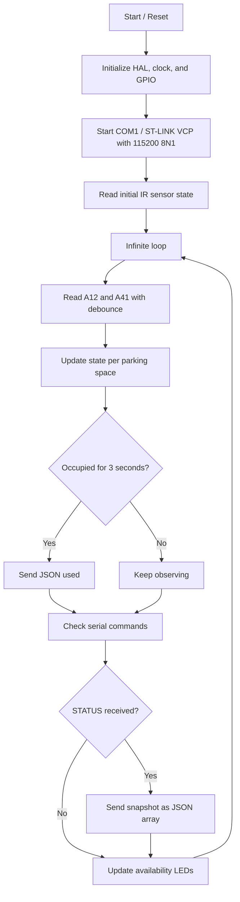
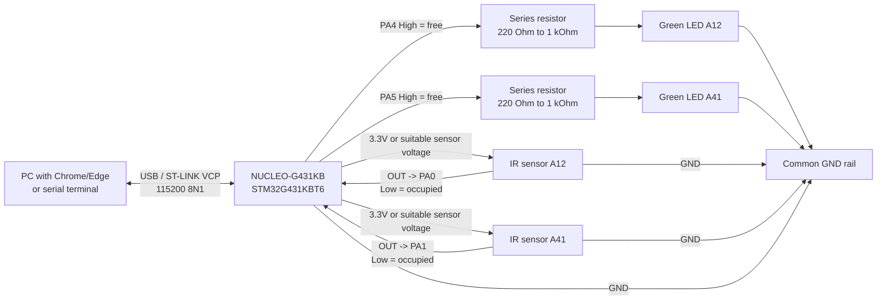

# ParkingStation

[Deutsch](README_DE.md) | [English](README.md) | [العربية](README_AR.md) | [Español](README_ES.md) | [Français](README_FR.md)

ParkingStation is an STM32 prototype for a small parking-space detection system with two real IR sensors, two green availability LEDs, and a simple Web Serial interface. The project detects whether parking spaces `A12` and `A41` are occupied or free, sends status changes as JSON through the ST-LINK Virtual COM Port, and visualizes the values in `parking-station.html`. The firmware runs on a NUCLEO-G431KB with an STM32G431KBT6 and uses STM32 HAL/BSP together with CMake as the build system. The focus is on the hardware setup, the behavior of the sensor logic, the serial interfaces, and the limits of the model.

## Table of Contents

- [Project Goal](#project-goal)
- [Final Result](#final-result)
- [Hardware](#hardware)
- [Pinout](#pinout)
- [Circuit Diagram / Wiring](#circuit-diagram--wiring)
- [Software Structure](#software-structure)
- [Firmware Behavior](#firmware-behavior)
- [Serial Protocol](#serial-protocol)
- [Web Dashboard](#web-dashboard)
- [Tools and References](#tools-and-references)
- [Build, Flash, and Start](#build-flash-and-start)
- [Testing and Checks](#testing-and-checks)
- [Limits and Known Restrictions](#limits-and-known-restrictions)
- [Photos and Videos of the Final Result](#photos-and-videos-of-the-final-result)
- [IPERKA 6-Phase Method](#iperka-6-phase-method)
- [Commented Program Code](#commented-program-code)
- [Possible Extensions](#possible-extensions)

## Project Goal

The goal of the project is a functional model of a parking station. Two parking spaces are monitored with IR sensors so that the microcontroller can detect whether an object or model vehicle is standing on a space. In addition, one green LED per parking space directly indicates whether the space is free. The microcontroller processes the sensor data, filters short disturbances, and reports the state as JSON lines over the serial connection. An HTML interface can connect through Web Serial and displays the two live spaces together with additional dummy spaces as a model parking lot.

The project is intentionally built as a prototype. It shows the basic function of parking-space monitoring, but it does not replace a robust industrial parking guidance system. The hardware is kept simple so that the setup, code, and behavior remain easy to understand. This makes the project especially suitable for documentation, presentation, and demonstration of how sensors, microcontroller firmware, and a user interface work together.

## Final Result

The final result consists of three parts:

| Part | Result |
| --- | --- |
| Hardware | NUCLEO-G431KB with two IR sensors and two green availability LEDs for spaces `A12` and `A41` |
| Firmware | C code in `Core/Src/main.c` that evaluates the sensors, sends JSON, and receives serial commands |
| User interface | `parking-station.html` as a local dashboard with a Web Serial connection |

The Parking Station works according to the following flow:



## Hardware

### Main Components

| Component | Task in the project | Note |
| --- | --- | --- |
| NUCLEO-G431KB | Microcontroller board and ST-LINK USB connection | Board from the STM32G4 environment |
| STM32G431KBT6 | Runs firmware, GPIO logic, and UART communication | Project clock configured to 170 MHz |
| IR sensor A12 | Detects occupancy of parking space `A12` | Active-low signal expected |
| IR sensor A41 | Detects occupancy of parking space `A41` | Active-low signal expected |
| Green LED A12 | Indicates whether parking space `A12` is free | GPIO High = LED on = space free |
| Green LED A41 | Indicates whether parking space `A41` is free | GPIO High = LED on = space free |
| USB/ST-LINK VCP | Power supply, programming, and serial data connection | COM port for dashboard or terminal |

### Sensor Principle

The IR sensors are read as digital inputs. The firmware treats a low signal on the sensor GPIO as detected occupancy because the inputs are configured with internal pull-ups. If no object is present or the sensor output is inactive, the pull-up keeps the input high and the parking space is considered free. This logic matches many simple IR obstacle sensors, but it must be checked when different sensor hardware is used. An open or disconnected sensor output can also look like a free parking space because of the pull-up.

Each sensor is read twice. A short delay of `20 ms` lies between the two measurements. A parking space is accepted as occupied only when both readings report detection. This reduces very short noise spikes, but slow false measurements or poorly aligned sensors are not automatically prevented by it.

### Power Supply and Signal Levels

The board is normally powered through USB. The IR sensors should be operated with a voltage suitable for the board; a 3.3-V-compatible output is recommended. Sensor GND and NUCLEO board GND must be connected together, otherwise the digital levels are not clearly defined. Before connecting a sensor, verify that its output level is allowed for the STM32 GPIO.

## Pinout

| Function | Parking space / signal | STM32 pin | Port | Direction | Logic |
| --- | --- | --- | --- | --- | --- |
| IR sensor | `A12` | `PA0` | `GPIOA` | Input | Low = occupied |
| IR sensor | `A41` | `PA1` | `GPIOA` | Input | Low = occupied |
| Green availability LED | `A12` | `PA4` | `GPIOA` | Output | High = free / LED on |
| Green availability LED | `A41` | `PA5` | `GPIOA` | Output | High = free / LED on |
| Virtual COM TX | ST-LINK VCP | `PA2` | `GPIOA` | Alternate Function | LPUART1 TX through BSP-COM1 |
| Virtual COM RX | ST-LINK VCP | `PA3` | `GPIOA` | Alternate Function | LPUART1 RX through BSP-COM1 |
| SWDIO | Debug | `PA13` | `GPIOA` | Debug | ST-LINK |
| SWCLK | Debug | `PA14` | `GPIOA` | Debug | ST-LINK |
| SWO | Debug | `PB3` | `GPIOB` | Debug | Optional |

The live parking spaces are defined in `Core/Inc/main.h`:

```c
#define PARKING_PLACE_A12_Pin GPIO_PIN_0
#define PARKING_PLACE_A12_GPIO_Port GPIOA
#define PARKING_PLACE_A41_Pin GPIO_PIN_1
#define PARKING_PLACE_A41_GPIO_Port GPIOA
#define PARKING_PLACE_A12_LED_Pin GPIO_PIN_4
#define PARKING_PLACE_A12_LED_GPIO_Port GPIOA
#define PARKING_PLACE_A41_LED_Pin GPIO_PIN_5
#define PARKING_PLACE_A41_LED_GPIO_Port GPIOA
```

The active serial code uses the BSP definition `COM1`. In `Drivers/BSP/STM32G4xx_Nucleo/stm32g4xx_nucleo.h`, `COM1` for this board is mapped to `LPUART1` with `PA2` and `PA3`. If the project is regenerated later with STM32CubeMX, make sure that this BSP-COM configuration and the `LPUART1_IRQHandler` still match.

## Circuit Diagram / Wiring

The following circuit diagram shows the logical structure of the prototype. It does not replace a professional KiCad or EDA schematic, but it makes the signals between sensors, LEDs, NUCLEO board, and Web Dashboard visible for the documentation.



### Wiring Table

| Component / signal | Connection on NUCLEO-G431KB | Purpose |
| --- | --- | --- |
| Sensor A12 `VCC` | `3.3V` or suitable sensor voltage | Supply for the left live sensor |
| Sensor A12 `GND` | `GND` | Common reference point |
| Sensor A12 `OUT` | `PA0` | Digital active-low signal for parking space `A12` |
| Sensor A41 `VCC` | `3.3V` or suitable sensor voltage | Supply for the right live sensor |
| Sensor A41 `GND` | `GND` | Common reference point |
| Sensor A41 `OUT` | `PA1` | Digital active-low signal for parking space `A41` |
| Green LED A12 anode | `PA4 -> series resistor -> LED anode` | LED lights when `A12` is free |
| Green LED A12 cathode | `GND` | LED return path |
| Green LED A41 anode | `PA5 -> series resistor -> LED anode` | LED lights when `A41` is free |
| Green LED A41 cathode | `GND` | LED return path |
| USB / ST-LINK | USB cable to PC | Programming, power supply, and Virtual COM Port |

`PA6` and `PA7` are not used in the current firmware. An open or defective sensor line is therefore not detected as a separate error state and can appear as a free parking space because of the internal pull-up.

## Software Structure

```text
ParkingStation/
+-- Core/
|   +-- Inc/
|   |   +-- main.h
|   |   +-- stm32g4xx_hal_conf.h
|   |   +-- stm32g4xx_it.h
|   +-- Src/
|       +-- main.c
|       +-- stm32g4xx_it.c
|       +-- stm32g4xx_hal_msp.c
|       +-- syscalls.c
|       +-- sysmem.c
|       +-- system_stm32g4xx.c
+-- Drivers/
|   +-- BSP/STM32G4xx_Nucleo/
|   +-- CMSIS/
|   +-- STM32G4xx_HAL_Driver/
+-- cmake/
|   +-- gcc-arm-none-eabi.cmake
|   +-- starm-clang.cmake
|   +-- stm32cubemx/CMakeLists.txt
+-- CMakeLists.txt
+-- CMakePresets.json
+-- ParkingStation.ioc
+-- STM32G431XX_FLASH.ld
+-- startup_stm32g431xx.s
+-- Assets/
|   +-- image-20260520-232528-615.jpeg
|   +-- ...
+-- parking-station.html
+-- 03 Vorlage - IPERKA 6-Phasen-Methode.docx
+-- README.md
+-- README_DE.md
+-- README_AR.md
+-- README_ES.md
+-- README_FR.md
```

### Important Files

| File | Meaning |
| --- | --- |
| `Core/Src/main.c` | Main firmware logic: initialization, sensors, state machine, JSON output, UART commands |
| `Core/Inc/main.h` | Pin definitions for the live parking spaces and availability LEDs |
| `Core/Src/stm32g4xx_it.c` | Interrupt handlers, including `LPUART1_IRQHandler` for COM1 |
| `parking-station.html` | Local dashboard with the Web Serial API |
| `ParkingStation.ioc` | STM32CubeMX project configuration |
| `CMakeLists.txt` | Top-level CMake build script |
| `cmake/stm32cubemx/CMakeLists.txt` | Source, include, and driver lists generated by CubeMX |
| `STM32G431XX_FLASH.ld` | Linker script for flash/RAM layout |

## Firmware Behavior

### Initialization

On startup, the firmware first calls `HAL_Init()` and then configures the system clock. It then initializes the GPIO ports for the IR sensors and the two green availability LEDs. After that, `BSP_COM_Init(COM1, ...)` starts the serial interface with 115200 baud, 8 data bits, 1 stop bit, no parity, and no hardware flow control. Reception is enabled interrupt-based with `HAL_UART_Receive_IT()`.

### Parking Space State

Each real parking space has a small state structure:

```c
typedef struct
{
  uint8_t occupied;
  uint8_t usedReported;
  uint32_t occupiedStartedAt;
} ParkingPlaceState;
```

`occupied` describes the currently stable detected occupancy state. `usedReported` prevents the firmware from constantly sending new `used` events while the same vehicle remains unchanged on the space. `occupiedStartedAt` stores the moment at which occupancy began. This allows the firmware to check whether a space has been occupied longer than the defined reporting delay.

### Occupied Detection

A parking space is not considered occupied immediately after the first active sensor value. The firmware first waits for two equal active samples separated by `SENSOR_DEBOUNCE_MS`, which is `20 ms`. If the space then remains continuously occupied, a `used` event is sent only after `PARKING_USED_REPORT_DELAY_MS`, which is `3000 ms`. This means a short pass-by or hand movement is not immediately reported as real parking.

### Free Detection

When a parking space becomes free again, the firmware sends `free`, but only if a `used` event had already been sent for that occupancy. This prevents unnecessary messages for very short disturbances that never reached the three-second threshold. If an object is detected only briefly and then removed again, there may be no JSON message at all. The current state can be queried at any time with the `STATUS` command.

### LED Behavior

Each live parking space has its own green availability LED. The LED for `A12` is connected to `PA4`, and the LED for `A41` is connected to `PA5`. An LED is switched on while the corresponding parking space is free. As soon as the sensor of that space detects occupancy, the firmware switches the matching LED off.

The LED display follows the current sensor state after debouncing. It does not wait for the three-second delay of the serial `used` message. This makes the hardware setup show immediately that a space is no longer free, while the JSON output still filters out short disturbances.

### Wiring of the Green LEDs

The LEDs are planned as active-high outputs. This means: the STM32 pin outputs a high signal, current flows through the series resistor and LED to GND, and the LED lights. Each LED needs its own series resistor, typically `220 Ohm` to `1 kOhm`; a good starting value is `330 Ohm`.

| Parking space | STM32 pin | Connection |
| --- | --- | --- |
| `A12` | `PA4` | `PA4 -> series resistor -> LED anode`, LED cathode -> `GND` |
| `A41` | `PA5` | `PA5 -> series resistor -> LED anode`, LED cathode -> `GND` |

The long side of an LED is normally the anode, while the short side or flattened side of the package is normally the cathode. If the LED is inserted the wrong way around, it will not light, but in normal wiring it usually will not be damaged. It is important that every LED has a series resistor and that no GPIO is shorted directly.

## Serial Protocol

### Connection

| Parameter | Value |
| --- | --- |
| Port | ST-LINK Virtual COM Port |
| Firmware interface | `COM1` / `LPUART1` through BSP |
| Baud rate | `115200` |
| Data bits | `8` |
| Stop bits | `1` |
| Parity | None |
| Flow control | None |
| Line ending for commands | `\r`, `\n`, or `\r\n` |

### Automatic Events

When a space has been occupied long enough, the firmware sends a JSON line:

```json
{"place":"A12","state":"used","timestamp_ms":3120}
```

When a previously reported space becomes free again, the firmware sends:

```json
{"place":"A12","state":"free","timestamp_ms":9400}
```

`timestamp_ms` comes from `HAL_GetTick()` and describes the milliseconds since the controller started. This value is not a real clock time. After long runtime the tick value can overflow; for the short project intervals this is not critical.

### `STATUS` Command

The only supported command is:

```text
STATUS
```

The response is a JSON array with the two live parking spaces:

```json
[{"place":"A12","state":"free","timestamp_ms":12055},{"place":"A41","state":"used","timestamp_ms":12055}]
```

### Error Output

| Situation | Response |
| --- | --- |
| Unknown command | `{"error":"unknown_command"}` |
| Command longer than buffer | `{"error":"command_too_long"}` |

The command buffer is `16` characters long. Because one character is reserved for the string terminator, a command may contain at most `15` visible characters. This is enough for `STATUS`, but it is an intentional limit of the prototype.

## Web Dashboard

The file `parking-station.html` is a simple local user interface. It displays a parking block with 20 spaces from `A11` to `A45`. Only `A12` and `A41` are real hardware spaces because only these two spaces are connected to IR sensors in the firmware. The remaining spaces are dummy values and are shown as occupied by default so that the model looks like a larger parking lot.

### Operation

1. Flash the firmware to the NUCLEO board.
2. Connect the board to the computer through USB.
3. Open `parking-station.html` through a local server in Chrome or Edge.
4. Click `Connect` and select the ST-LINK Virtual COM Port.
5. Use `Request Status` to request the current state.
6. Cover sensor A12 or A41 and observe the corresponding green LED; after about three seconds, the JSON change also appears.

### Starting the Dashboard Locally

Web Serial usually works in Chrome or Edge and requires a secure context. For local development, `localhost` is suitable. A simple start is:

```powershell
py -m http.server 8000
```

Then open this in the browser:

```text
http://localhost:8000/parking-station.html
```

If `py` is not available, another local static-file server or an IDE extension such as Live Server can also be used.

## Tools and References

### Used Tools

| Tool | Purpose in the project | Link |
| --- | --- | --- |
| STM32CubeMX | Pinout, clock, peripheral configuration, and code generation for STM32 projects | [STM32CubeMX](https://www.st.com/stm32cubemx) |
| STM32CubeProgrammer | Flashing and checking firmware through ST-LINK/SWD | [STM32CubeProgrammer](https://www.st.com/en/product/stm32cubeprog) |
| Visual Studio Code | Editor for C code, README, and HTML dashboard | [Visual Studio Code](https://code.visualstudio.com/) |
| STM32CubeIDE for Visual Studio Code | STM32 support in VS Code, project import, build/debug, and ST-LINK functions | [VS Code Marketplace](https://marketplace.visualstudio.com/items?itemName=stmicroelectronics.stm32-vscode-extension) |
| C/C++ Extension Pack | IntelliSense, C/C++ support, and CMake Tools for VS Code | [VS Code Marketplace](https://marketplace.visualstudio.com/items?itemName=ms-vscode.cpptools-extension-pack) |
| Live Server | Local web server for `parking-station.html` | [VS Code Marketplace](https://marketplace.visualstudio.com/items?itemName=ritwickdey.LiveServer) |
| CMake | Build system for the STM32 project | [CMake Download](https://cmake.org/download/) |
| ARM GNU Toolchain | Compiler, assembler, and linker for ARM Cortex-M | [Arm GNU Toolchain Downloads](https://developer.arm.com/downloads/-/arm-gnu-toolchain-downloads) |

### Technical References

| Reference | Meaning for the project | Link |
| --- | --- | --- |
| UM2397 - STM32G4 Nucleo-32 board (MB1430) | Official user manual for the NUCLEO-G431KB board, ST-LINK, headers, and board functions | [STMicroelectronics PDF](https://www.st.com/resource/en/user_manual/um2397-stm32g4-nucleo32-board-mb1430-stmicroelectronics.pdf) |
| GP2A200LCS0F Series datasheet | Reference for reflective IR sensing with `VCC`, `VOUT`, and `GND` as well as detection distance | [Reichelt / SHARP PDF](https://cdn-reichelt.de/documents/datenblatt/C900/GP2A200LCS0FN.pdf) |

## Build, Flash, and Start

### Requirements

- CMake version 3.22 or newer
- Ninja or a compatible CMake generator
- ARM GCC Toolchain matching `cmake/gcc-arm-none-eabi.cmake`
- STM32CubeProgrammer or an IDE with ST-LINK support
- Chrome or Edge for the Web Dashboard

### Build with CMake

```powershell
cmake --preset Debug
cmake --build --preset Debug
```

For a release build:

```powershell
cmake --preset Release
cmake --build --preset Release
```

The build files are placed under `build/Debug` or `build/Release`, depending on the preset. The project creates the STM32 target `ParkingStation`. Depending on the toolchain configuration, this produces files such as `.elf`, `.hex`, or `.bin`.

### Flashing

No dedicated flashing script is stored in the repository. The practical path is through STM32CubeProgrammer or a suitable STM32 IDE. Connect the NUCLEO board through USB, select the generated firmware file from the build folder, and write it to the controller. The board then either restarts automatically or can be restarted with reset.

## Testing and Checks

### Basic Test with a Terminal

A serial terminal can connect directly to the ST-LINK Virtual COM Port with `115200 8N1`. After startup, the firmware does not necessarily send a status immediately because the initial state is only adopted internally. When `STATUS` is sent with Enter, a JSON array with `A12` and `A41` must be returned. If a sensor is covered for longer than three seconds, a `used` event must appear. When the sensor is released again, a `free` event must appear.

### Test Cases

| No. | Action | Expected result |
| --- | --- | --- |
| 1 | Cover nothing | Both green availability LEDs on, `STATUS` shows both spaces free |
| 2 | Cover sensor A12 briefly for less than 3 seconds | LED A12 off during cover, then on again; no `used` event |
| 3 | Cover sensor A41 briefly | LED A41 off, LED A12 remains on |
| 4 | Cover sensor A12 longer than 3 seconds | LED A12 off and JSON `{"place":"A12","state":"used",...}` |
| 5 | Release sensor A12 again after `used` | LED A12 on and JSON `{"place":"A12","state":"free",...}` |
| 6 | Cover sensor A41 longer than 3 seconds | LED A41 off and JSON `{"place":"A41","state":"used",...}` |
| 7 | Cover both sensors | Both green availability LEDs off, both spaces are shown as `used` in `STATUS` |
| 8 | Send an unknown command, for example `HELLO` | JSON `{"error":"unknown_command"}` |
| 9 | Send a very long command | JSON `{"error":"command_too_long"}` |

### Dashboard Check

In the dashboard, the fields `A12` and `A41` should show the real sensor state. When `Request Status` is used, the live state updates immediately from the snapshot response. Automatic events are shown in the log and update the tiles. The dummy spaces remain unchanged and are only used for display.

## Limits and Known Restrictions

### Hardware Limits

- Only two real parking spaces are monitored: `A12` and `A41`.
- The sensors detect only a digital signal, not vehicle class, license plate, direction, or exact position.
- The logic expects active-low sensors; for active-high sensors, `IR_SensorDetected()` would need to be adapted.
- The LED outputs are active-high outputs; with different wiring, `ParkingStation_UpdateFreeLeds()` would need to be inverted.
- A disconnected or defective sensor output can be read as a free parking space because of the internal pull-up.
- IR sensors can be affected by distance, angle, ambient light, reflective surfaces, or poor alignment.
- The internal pull-ups help against open inputs, but they do not replace clean wiring or a stable power supply.
- The prototype has no galvanic isolation and no protection circuitry for harsh environments.

### Firmware Limits

- Debouncing is implemented in a blocking way: the firmware waits `20 ms` per sensor.
- With two sensors this is unproblematic; with many sensors the loop would become much slower.
- A `used` event is created only after `3000 ms` of stable occupancy.
- Very short occupancies are intentionally ignored and do not appear as events.
- A `free` event is sent only if a `used` event for the same occupancy was sent before.
- There is no persistent storage; after reset, the history is lost.
- There is no real time base such as RTC or NTP, only `HAL_GetTick()` since startup.
- The serial command set contains only `STATUS`.
- The command buffer is limited to `16` characters.

### Dashboard Limits

- Web Serial is not available in every browser.
- The interface should run through `localhost` or another secure context.
- Only `A12` and `A41` are live data; the other parking spaces are dummy displays.
- The dashboard does not store data permanently.
- The calculated parking duration and fee in the dashboard are based on the browser time since receiving the `used` state and are only a display for the demo.

## Photos and Videos of the Final Result

The following images are stored in the `Assets/` folder and document the real setup. They show the cardboard model, the two parking areas, the green LEDs, the sensor positions, and the rear side with wiring. Videos are currently not stored in the repository; for a later submission, short clips of covering and releasing the sensors can be added.

| Image | Description | Purpose for documentation |
| --- | --- | --- |
|  | Interior view of the cardboard model with two separated parking spaces | Shows the mechanical setup and the position of the parking surfaces |
|  | Exterior view of the model housing | Documents the finished cardboard housing |
|  | Rear side with NUCLEO board and jumper wires | Shows that the electronics are connected to the model |
|  | Side view with cable routing | Helps trace the wiring from the board to sensors and LEDs |
|  | Exterior housing view | Documents stability, shape, and construction of the model |
|  | Interior view with both green availability LEDs | Shows the direct hardware display for free parking spaces |
|  | Breadboard, NUCLEO area, and connection wires | Serves as proof of the electrical test setup |
|  | Switched-on green LED in the parking space | Shows the function: a free space is signaled with green light |
|  | Parking space with a model car in the sensor area | Shows the final result in a realistic test situation |

## IPERKA 6-Phase Method

This section follows the template `03 Vorlage - IPERKA 6-Phasen-Methode.docx`. The template contains the areas task/final product, deadline, student, other agreements, evaluation criteria, and the six action steps: informing, planning, deciding, implementing/carrying out, checking, and evaluating/reflecting. For each action step, full sentences are included here so that the documentation can be reused directly for a project submission.

### Task and Final Product

The task is to build, program, and document a Parking Station as a microcontroller project. The final product is a working prototype that detects two parking spaces with IR sensors and outputs the state through a serial interface. A Web interface is also included so that the live data can be made visible. The documentation describes setup, function, limits, test cases, and the work according to IPERKA.

### Deadline, Location, and Student

| Field from template | Entry |
| --- | --- |
| Final deadline / submission | 20.05.2026 |
| Location / VZ | Nordhorn KBS |
| Student | Mohammad Dyaa Addin Shami |
| Other agreements | STM32 project, two real sensors, Web Dashboard, README documentation |

### Evaluation Criteria from the Template

| Share | Criterion |
| --- | --- |
| 1/3 | Documentation according to the IPERKA model, idea, and project proposal |
| 2/3 | Project result and presentation |

### Action Step 1: Informing

In the information phase, the first step was to clarify which function the Parking Station should have at the end. It was important that at least two parking spaces could be detected with sensors and that the states could be displayed visibly. After that, the existing project files, the NUCLEO-G431KB board, the STM32CubeMX configuration, and the HTML interface were examined. This showed that `A12` and `A41` are intended as real sensor spaces and that communication happens through the ST-LINK Virtual COM Port. As a result of this phase, the most important requirements, interfaces, and limits of the prototype were available.

Short details: STM32Cube project files, `main.c`, `main.h`, `ParkingStation.ioc`, `parking-station.html`, and the IPERKA template were used. The result is a clear understanding of hardware, software, sensor logic, and documentation requirements.

### Action Step 2: Planning

In the planning phase, it was defined how hardware, firmware, and Web Dashboard should work together. The sensors should be placed on `PA0` and `PA1`, the green availability LEDs on `PA4` and `PA5`, while the serial output should run through `COM1` at 115200 baud. For the firmware, a simple state machine was planned that ignores short disturbances and reports occupancy only after three seconds. For the documentation, it was decided to describe the project structure, pinout, protocol, tests, and limits in detail in the README. This created an executable plan that directly builds on the existing files.

Short details: The CMake structure, CubeMX pinout, existing HTML Dashboard, and the requirements from the task were used. The result is a work plan for firmware comments, README structure, and evidence structure for photos/videos.

### Action Step 3: Deciding

In the decision phase, the existing architecture was kept because it is clear and suitable for a prototype. It was decided to comment only the project's own program code in a targeted way and not to restructure the generated HAL and driver files. JSON was kept for status output because it is readable in the terminal and can also be processed directly by the Web Dashboard. `A12` and `A41` remain the live spaces, while the other dashboard spaces are used as dummy values. These decisions keep the project simple, presentable, and maintainable.

Short details: Existing project decisions such as STM32 HAL/BSP, CMake, Web Serial, and JSON line protocol were used. The result is a clear technical direction without unnecessary expansion of the project scope.

### Action Step 4: Implementing / Carrying Out

In the implementation phase, the firmware was structured so that it reads sensor values, debounces them, and processes them as parking-space status. The code initializes GPIO, system clock, COM1, the two availability LEDs, and interrupt-based UART reception. The state logic reports `used` only after stable occupancy and sends `free` when a previously occupied space becomes free again. The dashboard can connect through Web Serial, send the `STATUS` command, and display the JSON response. In addition, the README was created as the central project documentation and the program code was provided with explanatory comments.

Short details: `README.md`, `Core/Src/main.c`, `Core/Inc/main.h`, and `parking-station.html` were edited. The result is better documented firmware and large project documentation with setup, function, limits, and IPERKA.

### Action Step 5: Checking

In the checking phase, it must be verified whether sensors, firmware, and dashboard show the expected behavior. For this, the sensors are covered individually, released again, and the JSON output in the terminal or dashboard is observed. The test that short occupancies below three seconds are not reported as a real parking change is especially important. It must also be checked whether `STATUS` always returns the current state of `A12` and `A41`. If these tests are successful, the central final result has been achieved.

Short details: A serial terminal, Web Dashboard, sensor cover tests, and the test table in this README are used. The result is traceable functional evidence for the presentation.

### Action Step 6: Evaluating / Reflecting

In the reflection phase, it is evaluated whether the project goal was reached with the available resources. The prototype shows the basic idea of parking-space monitoring well because sensor values are processed and visibly output. At the same time, the limits are clear because only two real spaces are connected and the sensors detect only simple digital occupancy. For a larger system, more sensors, non-blocking evaluation, persistent storage, and more robust hardware would need to be added. Overall, the project is well suited as a learning and demonstration setup because the connection between hardware, firmware, and interface remains transparent.

Short details: Function, limits, expandability, and documentation quality were evaluated. The result is a realistic self-assessment with concrete improvement options.

## Commented Program Code

The self-written program code is commented in the relevant areas. The comments on the active-low sensor logic, debouncing, parking-space state machine, UART command buffer, and callback functions are especially important. The comments should not repeat every single C line, but explain the technical decisions. Generated STM32 HAL, CMSIS, and BSP files remain mostly unchanged because they are normally not manually commented or rewritten.

Commented key locations:

| File | Commented area |
| --- | --- |
| `Core/Src/main.c` | `ParkingPlaceState`, timing defines, main loop, GPIO setup, sensor functions, availability LEDs, JSON output, UART command handling |
| `Core/Inc/main.h` | Pin definitions for live parking spaces and availability LEDs |
| `parking-station.html` | Live-space selection, JSON processing, Web Serial connection, `STATUS` command |

## Possible Extensions

- Connect more parking spaces as real sensors.
- Implement sensor reading in a non-blocking way with timers or interrupts.
- Extend the dashboard so that all parking spaces come live from the controller.
- Use configurable space names instead of hard-coded `A12`/`A41`.
- Store events with real time, for example through RTC.
- Send data to a server, MQTT broker, or database.
- Add separate sensor error detection if disconnected or defective sensors should be detected automatically.
- Add a housing, stable connectors, and protection circuitry for a more robust setup.
