# ParkingStation

[Deutsch](README_DE.md) | [English](README.md) | [العربية](README_AR.md) | [Español](README_ES.md) | [Français](README_FR.md)

ParkingStation هو نموذج أولي مبني على STM32 للكشف عن أماكن وقوف السيارات باستخدام حساسي IR حقيقيين، ومصباحي LED أخضرين لبيان أن المكان متاح، وواجهة بسيطة عبر Web Serial. يكتشف المشروع ما إذا كان المكانان `A12` و `A41` مشغولين أو فارغين، ويرسل تغييرات الحالة بصيغة JSON عبر منفذ ST-LINK Virtual COM Port، ويعرض القيم بصريا في `parking-station.html`. يعمل البرنامج الثابت على لوحة NUCLEO-G431KB مع المتحكم STM32G431KBT6 ويستخدم STM32 HAL/BSP مع CMake كنظام بناء. يركز المشروع على تركيب العتاد، وسلوك منطق الحساسات، والواجهات التسلسلية، وحدود النموذج.

## جدول المحتويات

- [هدف المشروع](#هدف-المشروع)
- [النتيجة النهائية](#النتيجة-النهائية)
- [العتاد](#العتاد)
- [توزيع الأرجل](#توزيع-الأرجل)
- [المخطط / التوصيل](#المخطط--التوصيل)
- [بنية البرمجيات](#بنية-البرمجيات)
- [سلوك البرنامج الثابت](#سلوك-البرنامج-الثابت)
- [البروتوكول التسلسلي](#البروتوكول-التسلسلي)
- [لوحة التحكم الويب](#لوحة-التحكم-الويب)
- [الأدوات والمراجع](#الأدوات-والمراجع)
- [البناء والبرمجة والتشغيل](#البناء-والبرمجة-والتشغيل)
- [الاختبار والتحقق](#الاختبار-والتحقق)
- [الحدود والقيود المعروفة](#الحدود-والقيود-المعروفة)
- [صور وفيديوهات النتيجة النهائية](#صور-وفيديوهات-النتيجة-النهائية)
- [طريقة IPERKA ذات الست مراحل](#طريقة-iperka-ذات-الست-مراحل)
- [الكود البرمجي المعلق](#الكود-البرمجي-المعلق)
- [توسعات ممكنة](#توسعات-ممكنة)

## هدف المشروع

هدف المشروع هو إنشاء نموذج يعمل لمحطة وقوف سيارات. تتم مراقبة مكانين لوقوف السيارات باستخدام حساسات IR حتى يستطيع المتحكم الصغير معرفة ما إذا كان جسم أو سيارة نموذجية موجودة على المكان. بالإضافة إلى ذلك، يوضح LED أخضر لكل مكان مباشرة ما إذا كان المكان فارغا. يعالج المتحكم بيانات الحساسات، ويرشح التشويش القصير، ويرسل الحالة على شكل أسطر JSON عبر الاتصال التسلسلي. يمكن لواجهة HTML الاتصال عبر Web Serial وعرض المكانين الحيين مع أماكن وهمية إضافية كنموذج لموقف سيارات.

تم بناء المشروع عمدا كنموذج أولي. فهو يوضح الوظيفة الأساسية لمراقبة أماكن الوقوف، لكنه لا يستبدل نظاما صناعيا قويا لإرشاد مواقف السيارات. تم إبقاء العتاد بسيطا حتى يبقى التركيب والكود والسلوك سهل الفهم. لذلك يناسب المشروع التوثيق والعرض التقديمي وشرح التفاعل بين الحساسات والمتحكم وواجهة المستخدم.

## النتيجة النهائية

تتكون النتيجة النهائية من ثلاثة أجزاء:

| الجزء | النتيجة |
| --- | --- |
| العتاد | لوحة NUCLEO-G431KB مع حساسي IR ومصباحي LED أخضرين لبيان توفر المكانين `A12` و `A41` |
| البرنامج الثابت | كود C في `Core/Src/main.c` يقرأ الحساسات، ويرسل JSON، ويستقبل أوامر تسلسلية |
| واجهة المستخدم | `parking-station.html` كلوحة تحكم محلية مع اتصال Web Serial |

تعمل Parking Station وفق التسلسل التالي:

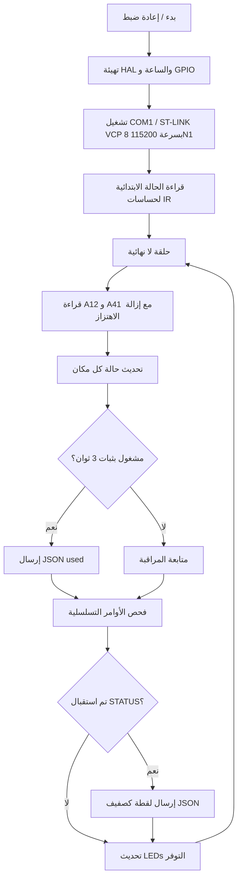

## العتاد

### المكونات الرئيسية

| المكون | مهمته في المشروع | ملاحظة |
| --- | --- | --- |
| NUCLEO-G431KB | لوحة المتحكم واتصال USB عبر ST-LINK | لوحة من عائلة STM32G4 |
| STM32G431KBT6 | يشغل البرنامج الثابت ومنطق GPIO واتصال UART | ساعة النظام مضبوطة في المشروع على 170 MHz |
| حساس IR A12 | يكتشف إشغال مكان الوقوف `A12` | متوقع إشارة active-low |
| حساس IR A41 | يكتشف إشغال مكان الوقوف `A41` | متوقع إشارة active-low |
| LED أخضر A12 | يوضح ما إذا كان المكان `A12` فارغا | GPIO High = LED مضاء = المكان فارغ |
| LED أخضر A41 | يوضح ما إذا كان المكان `A41` فارغا | GPIO High = LED مضاء = المكان فارغ |
| USB/ST-LINK VCP | تغذية وبرمجة واتصال بيانات تسلسلي | منفذ COM للوحة التحكم أو الطرفية |

### مبدأ عمل الحساسات

تقرأ حساسات IR كمدخلات رقمية. يعتبر البرنامج الثابت وجود إشارة منخفضة على GPIO الحساس دليلا على وجود إشغال، لأن المداخل مهيأة بمقاومات pull-up داخلية. إذا لم يوجد جسم أو كانت خرجة الحساس غير فعالة، يبقي pull-up الدخل في الحالة العالية ويعتبر مكان الوقوف فارغا. هذه المنطقية تناسب كثيرا من حساسات العوائق IR البسيطة، لكنها يجب أن تفحص عند استخدام عتاد حساس مختلف. كما يمكن لخرج حساس مفتوح أو مفصول أن يظهر كمكان فارغ بسبب pull-up.

يقرأ كل حساس مرتين. توجد مهلة قصيرة مقدارها `20 ms` بين القراءتين. لا يقبل المكان كمشغول إلا إذا أعطت القراءتان كشفا. هذا يقلل نبضات التشويش القصيرة جدا، لكنه لا يمنع تلقائيا القياسات الخاطئة البطيئة أو الحساسات غير المضبوطة جيدا.

### التغذية ومستويات الإشارة

تتم تغذية اللوحة عادة عبر USB. يجب تشغيل حساسات IR بجهد مناسب للوحة؛ يوصى بخرج متوافق مع 3.3 V. يجب توصيل GND الحساسات مع GND لوحة NUCLEO معا، وإلا فلن تكون المستويات الرقمية معرفة بوضوح. قبل توصيل حساس، يجب التحقق من أن مستوى خرجه مسموح به لمدخل GPIO في STM32.

## توزيع الأرجل

| الوظيفة | مكان الوقوف / الإشارة | رجل STM32 | المنفذ | الاتجاه | المنطق |
| --- | --- | --- | --- | --- | --- |
| حساس IR | `A12` | `PA0` | `GPIOA` | دخل | Low = مشغول |
| حساس IR | `A41` | `PA1` | `GPIOA` | دخل | Low = مشغول |
| LED أخضر للتوفر | `A12` | `PA4` | `GPIOA` | خرج | High = فارغ / LED مضاء |
| LED أخضر للتوفر | `A41` | `PA5` | `GPIOA` | خرج | High = فارغ / LED مضاء |
| Virtual COM TX | ST-LINK VCP | `PA2` | `GPIOA` | Alternate Function | LPUART1 TX عبر BSP-COM1 |
| Virtual COM RX | ST-LINK VCP | `PA3` | `GPIOA` | Alternate Function | LPUART1 RX عبر BSP-COM1 |
| SWDIO | Debug | `PA13` | `GPIOA` | Debug | ST-LINK |
| SWCLK | Debug | `PA14` | `GPIOA` | Debug | ST-LINK |
| SWO | Debug | `PB3` | `GPIOB` | Debug | اختياري |

أماكن الوقوف الحية معرفة في `Core/Inc/main.h`:

```c
#define PARKING_PLACE_A12_Pin GPIO_PIN_0
#define PARKING_PLACE_A12_GPIO_Port GPIOA
#define PARKING_PLACE_A41_Pin GPIO_PIN_1
#define PARKING_PLACE_A41_GPIO_Port GPIOA
#define PARKING_PLACE_A12_LED_Pin GPIO_PIN_4
#define PARKING_PLACE_A12_LED_GPIO_Port GPIOA
#define PARKING_PLACE_A41_LED_Pin GPIO_PIN_5
#define PARKING_PLACE_A41_LED_GPIO_Port GPIOA
```

يستخدم الكود التسلسلي الفعال تعريف BSP باسم `COM1`. في `Drivers/BSP/STM32G4xx_Nucleo/stm32g4xx_nucleo.h` تم ربط `COM1` لهذه اللوحة مع `LPUART1` على الرجلين `PA2` و `PA3`. عند إعادة توليد المشروع لاحقا باستخدام STM32CubeMX، يجب التأكد من أن إعداد BSP-COM هذا والمعالج `LPUART1_IRQHandler` لا يزالان متوافقين.

## المخطط / التوصيل

يبين المخطط التالي البنية المنطقية للنموذج الأولي. هو لا يستبدل مخطط KiCad أو EDA احترافي، لكنه يجعل الإشارات بين الحساسات والـ LEDs ولوحة NUCLEO ولوحة الويب واضحة في التوثيق.

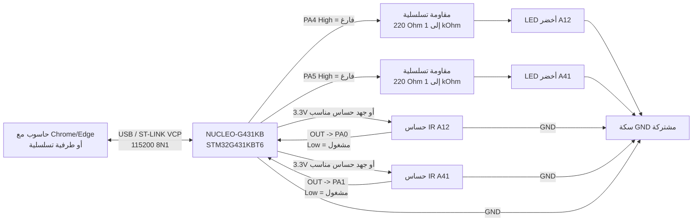

### جدول التوصيل

| المكون / الإشارة | التوصيل على NUCLEO-G431KB | الهدف |
| --- | --- | --- |
| حساس A12 `VCC` | `3.3V` أو جهد حساس مناسب | تغذية الحساس الحي الأيسر |
| حساس A12 `GND` | `GND` | نقطة مرجعية مشتركة |
| حساس A12 `OUT` | `PA0` | إشارة رقمية active-low لمكان الوقوف `A12` |
| حساس A41 `VCC` | `3.3V` أو جهد حساس مناسب | تغذية الحساس الحي الأيمن |
| حساس A41 `GND` | `GND` | نقطة مرجعية مشتركة |
| حساس A41 `OUT` | `PA1` | إشارة رقمية active-low لمكان الوقوف `A41` |
| مصعد LED الأخضر A12 | `PA4 -> مقاومة تسلسلية -> مصعد LED` | يضيء LED عندما يكون `A12` فارغا |
| مهبط LED الأخضر A12 | `GND` | مسار رجوع LED |
| مصعد LED الأخضر A41 | `PA5 -> مقاومة تسلسلية -> مصعد LED` | يضيء LED عندما يكون `A41` فارغا |
| مهبط LED الأخضر A41 | `GND` | مسار رجوع LED |
| USB / ST-LINK | كابل USB إلى الحاسوب | برمجة وتغذية و Virtual COM Port |

لا يستخدم البرنامج الثابت الحالي الرجلين `PA6` و `PA7`. لذلك لا يتم اكتشاف خط حساس مفتوح أو معطوب كحالة خطأ مستقلة، بل يمكن أن يظهر كمكان فارغ بسبب pull-up الداخلي.

## بنية البرمجيات

```text
ParkingStation/
+-- Core/
|   +-- Inc/
|   |   +-- main.h
|   |   +-- stm32g4xx_hal_conf.h
|   |   +-- stm32g4xx_it.h
|   +-- Src/
|       +-- main.c
|       +-- stm32g4xx_it.c
|       +-- stm32g4xx_hal_msp.c
|       +-- syscalls.c
|       +-- sysmem.c
|       +-- system_stm32g4xx.c
+-- Drivers/
|   +-- BSP/STM32G4xx_Nucleo/
|   +-- CMSIS/
|   +-- STM32G4xx_HAL_Driver/
+-- cmake/
|   +-- gcc-arm-none-eabi.cmake
|   +-- starm-clang.cmake
|   +-- stm32cubemx/CMakeLists.txt
+-- CMakeLists.txt
+-- CMakePresets.json
+-- ParkingStation.ioc
+-- STM32G431XX_FLASH.ld
+-- startup_stm32g431xx.s
+-- Assets/
|   +-- image-20260520-232528-615.jpeg
|   +-- ...
+-- parking-station.html
+-- 03 Vorlage - IPERKA 6-Phasen-Methode.docx
+-- README.md
+-- README_DE.md
+-- README_AR.md
+-- README_ES.md
+-- README_FR.md
```

### ملفات مهمة

| الملف | المعنى |
| --- | --- |
| `Core/Src/main.c` | منطق البرنامج الثابت الرئيسي: التهيئة، الحساسات، آلة الحالات، خرج JSON، أوامر UART |
| `Core/Inc/main.h` | تعريفات الأرجل لأماكن الوقوف الحية و LEDs التوفر |
| `Core/Src/stm32g4xx_it.c` | معالجات المقاطعة، ومنها `LPUART1_IRQHandler` الخاص بـ COM1 |
| `parking-station.html` | لوحة تحكم محلية مع Web Serial API |
| `ParkingStation.ioc` | إعداد مشروع STM32CubeMX |
| `CMakeLists.txt` | سكربت البناء العلوي لـ CMake |
| `cmake/stm32cubemx/CMakeLists.txt` | قوائم المصادر وملفات التضمين والتعريفات التي يولدها CubeMX |
| `STM32G431XX_FLASH.ld` | سكربت الرابط لتوزيع Flash/RAM |

## سلوك البرنامج الثابت

### التهيئة

عند بدء التشغيل يستدعي البرنامج الثابت أولا `HAL_Init()` ثم يضبط ساعة النظام. بعد ذلك يهيئ منافذ GPIO الخاصة بحساسات IR و LEDي التوفر الأخضرين. ثم يتم تشغيل `BSP_COM_Init(COM1, ...)` بسرعة 115200 baud، و 8 بت بيانات، و 1 بت توقف، بدون parity وبدون hardware flow control. يتم تفعيل الاستقبال بالمقاطعة عبر `HAL_UART_Receive_IT()`.

### حالة مكان الوقوف

كل مكان وقوف حقيقي يملك بنية حالة صغيرة:

```c
typedef struct
{
  uint8_t occupied;
  uint8_t usedReported;
  uint32_t occupiedStartedAt;
} ParkingPlaceState;
```

`occupied` تصف حالة الإشغال المستقرة المكتشفة حاليا. `usedReported` تمنع البرنامج الثابت من إرسال أحداث `used` جديدة بشكل مستمر ما دام نفس الجسم أو السيارة على المكان من دون تغيير. `occupiedStartedAt` تحفظ الزمن الذي بدأ فيه الإشغال. بذلك يستطيع البرنامج الثابت فحص ما إذا كان المكان مشغولا لمدة أطول من تأخير الإبلاغ المحدد.

### كشف الإشغال

لا يعتبر المكان مشغولا مباشرة عند أول قيمة حساس فعالة. ينتظر البرنامج الثابت أولا عينتين فعالتين متماثلتين بفاصل `SENSOR_DEBOUNCE_MS`، أي `20 ms`. إذا بقي المكان بعد ذلك مشغولا بشكل مستمر، لا يرسل حدث `used` إلا بعد `PARKING_USED_REPORT_DELAY_MS`، أي `3000 ms`. بهذه الطريقة لا يتم تسجيل مرور سريع أو حركة يد كوقوف حقيقي مباشرة.

### كشف الفراغ

عندما يصبح مكان الوقوف فارغا مرة أخرى، يرسل البرنامج الثابت `free`، لكن فقط إذا كان حدث `used` قد أرسل سابقا لنفس الإشغال. هذا يمنع الرسائل غير الضرورية عند التشويش القصير جدا الذي لم يصل أبدا إلى حد الثلاث ثوان. إذا تم اكتشاف جسم لفترة قصيرة ثم أزيل، فقد لا ينتج أي إخراج JSON. يمكن طلب الحالة الحالية في أي وقت بالأمر `STATUS`.

### سلوك LEDs

كل مكان حي يملك LED أخضر خاصا لبيان التوفر. LED الخاص بـ `A12` متصل مع `PA4`، و LED الخاص بـ `A41` متصل مع `PA5`. يكون LED مضاء عندما يكون المكان المقابل فارغا. بمجرد أن يكتشف حساس ذلك المكان إشغالا، يطفئ البرنامج الثابت LED المقابل.

يتبع عرض LED حالة الحساس الحالية بعد إزالة الاهتزاز. هو لا ينتظر تأخير الثلاث ثوان الخاص برسالة `used` التسلسلية. لذلك يظهر على التركيب مباشرة أن المكان لم يعد فارغا، بينما يستمر خرج JSON في ترشيح التشويش القصير.

### توصيل LEDs الخضراء

تم تخطيط LEDs كمخارج active-high. هذا يعني أن رجل STM32 تخرج إشارة High، فيمر التيار عبر المقاومة التسلسلية و LED إلى GND، فيضيء LED. يحتاج كل LED إلى مقاومته التسلسلية الخاصة، عادة بين `220 Ohm` و `1 kOhm`؛ قيمة بداية جيدة هي `330 Ohm`.

| مكان الوقوف | رجل STM32 | التوصيل |
| --- | --- | --- |
| `A12` | `PA4` | `PA4 -> مقاومة تسلسلية -> مصعد LED`، مهبط LED -> `GND` |
| `A41` | `PA5` | `PA5 -> مقاومة تسلسلية -> مصعد LED`، مهبط LED -> `GND` |

الطرف الطويل في LED هو عادة المصعد، والطرف القصير أو الجانب المسطح من الغلاف هو عادة المهبط. إذا ركب LED بالعكس فلن يضيء، لكنه في التوصيل العادي غالبا لا يتلف. المهم أن يملك كل LED مقاومة تسلسلية وألا يتم قصر أي GPIO مباشرة.

## البروتوكول التسلسلي

### الاتصال

| المعامل | القيمة |
| --- | --- |
| المنفذ | ST-LINK Virtual COM Port |
| واجهة البرنامج الثابت | `COM1` / `LPUART1` عبر BSP |
| معدل البود | `115200` |
| بتات البيانات | `8` |
| بتات التوقف | `1` |
| Parity | لا يوجد |
| Flow Control | لا يوجد |
| نهاية السطر للأوامر | `\r` أو `\n` أو `\r\n` |

### الأحداث التلقائية

عندما يكون المكان مشغولا مدة كافية، يرسل البرنامج الثابت سطر JSON:

```json
{"place":"A12","state":"used","timestamp_ms":3120}
```

عندما يصبح مكان تم الإبلاغ عنه سابقا فارغا مرة أخرى، يرسل البرنامج الثابت:

```json
{"place":"A12","state":"free","timestamp_ms":9400}
```

`timestamp_ms` يأتي من `HAL_GetTick()` ويمثل عدد الميلي ثانية منذ بدء المتحكم. هذه القيمة ليست وقتا حقيقيا. بعد مدة تشغيل طويلة يمكن أن يحدث overflow لقيمة tick؛ بالنسبة لفواصل المشروع القصيرة فهذا غير حرج.

### أمر `STATUS`

الأمر الوحيد المدعوم هو:

```text
STATUS
```

الرد هو صفيف JSON يحوي المكانين الحيين:

```json
[{"place":"A12","state":"free","timestamp_ms":12055},{"place":"A41","state":"used","timestamp_ms":12055}]
```

### خرج الأخطاء

| الحالة | الرد |
| --- | --- |
| أمر غير معروف | `{"error":"unknown_command"}` |
| أمر أطول من المخزن المؤقت | `{"error":"command_too_long"}` |

حجم مخزن الأوامر هو `16` محرفا. وبما أن محرفا واحدا محجوز لإنهاء السلسلة النصية، فيسمح للأمر بحد أقصى `15` محرفا مرئيا. هذا يكفي للأمر `STATUS`، لكنه حد مقصود في النموذج الأولي.

## لوحة التحكم الويب

الملف `parking-station.html` هو واجهة مستخدم محلية بسيطة. يعرض كتلة موقف سيارات مع 20 مكانا من `A11` إلى `A45`. فقط `A12` و `A41` هما مكانان حقيقيان مرتبطان بالعتاد، لأن هذين المكانين فقط متصلان بحساسات IR في البرنامج الثابت. الأماكن الأخرى قيم وهمية وتعرض افتراضيا كمشغولة حتى يبدو النموذج كموقف أكبر.

### الاستخدام

1. برمجة البرنامج الثابت على لوحة NUCLEO.
2. توصيل اللوحة بالحاسوب عبر USB.
3. فتح `parking-station.html` عبر خادم محلي في Chrome أو Edge.
4. النقر على `Connect` واختيار ST-LINK Virtual COM Port.
5. استخدام `Request Status` لطلب الحالة الحالية.
6. تغطية حساس A12 أو A41 ومراقبة LED الأخضر المقابل؛ بعد حوالي ثلاث ثوان يظهر أيضا تغيير JSON.

### تشغيل لوحة التحكم محليا

تعمل Web Serial عادة في Chrome أو Edge وتحتاج إلى سياق آمن. للتطوير المحلي يكون `localhost` مناسبا. مثال تشغيل بسيط:

```powershell
py -m http.server 8000
```

ثم افتح في المتصفح:

```text
http://localhost:8000/parking-station.html
```

إذا لم يكن `py` متوفرا، يمكن أيضا استخدام خادم ملفات ثابت محلي آخر أو إضافة IDE مثل Live Server.

## الأدوات والمراجع

### الأدوات المستخدمة

| الأداة | الغرض في المشروع | الرابط |
| --- | --- | --- |
| STM32CubeMX | توزيع الأرجل والساعة وإعداد الطرفيات وتوليد الكود لمشاريع STM32 | [STM32CubeMX](https://www.st.com/stm32cubemx) |
| STM32CubeProgrammer | برمجة البرنامج الثابت وفحصه عبر ST-LINK/SWD | [STM32CubeProgrammer](https://www.st.com/en/product/stm32cubeprog) |
| Visual Studio Code | محرر لكود C و README ولوحة HTML | [Visual Studio Code](https://code.visualstudio.com/) |
| STM32CubeIDE for Visual Studio Code | دعم STM32 في VS Code، واستيراد المشروع، والبناء/التنقيح، ووظائف ST-LINK | [VS Code Marketplace](https://marketplace.visualstudio.com/items?itemName=stmicroelectronics.stm32-vscode-extension) |
| C/C++ Extension Pack | IntelliSense ودعم C/C++ و CMake Tools في VS Code | [VS Code Marketplace](https://marketplace.visualstudio.com/items?itemName=ms-vscode.cpptools-extension-pack) |
| Live Server | خادم ويب محلي للملف `parking-station.html` | [VS Code Marketplace](https://marketplace.visualstudio.com/items?itemName=ritwickdey.LiveServer) |
| CMake | نظام بناء لمشروع STM32 | [CMake Download](https://cmake.org/download/) |
| ARM GNU Toolchain | مترجم ومجمع ورابط لـ ARM Cortex-M | [Arm GNU Toolchain Downloads](https://developer.arm.com/downloads/-/arm-gnu-toolchain-downloads) |

### مراجع تقنية

| المرجع | أهميته للمشروع | الرابط |
| --- | --- | --- |
| UM2397 - STM32G4 Nucleo-32 board (MB1430) | دليل المستخدم الرسمي للوحة NUCLEO-G431KB المستخدمة، و ST-LINK، والموصلات، ووظائف اللوحة | [STMicroelectronics PDF](https://www.st.com/resource/en/user_manual/um2397-stm32g4-nucleo32-board-mb1430-stmicroelectronics.pdf) |
| ورقة بيانات GP2A200LCS0F Series | مرجع لحساسات IR الانعكاسية مع `VCC` و `VOUT` و `GND` ومسافة الكشف | [Reichelt / SHARP PDF](https://cdn-reichelt.de/documents/datenblatt/C900/GP2A200LCS0FN.pdf) |

## البناء والبرمجة والتشغيل

### المتطلبات

- CMake بالإصدار 3.22 أو أحدث
- Ninja أو مولد CMake متوافق
- ARM GCC Toolchain مناسب لـ `cmake/gcc-arm-none-eabi.cmake`
- STM32CubeProgrammer أو IDE يدعم ST-LINK
- Chrome أو Edge للوحة التحكم الويب

### البناء باستخدام CMake

```powershell
cmake --preset Debug
cmake --build --preset Debug
```

لبناء Release:

```powershell
cmake --preset Release
cmake --build --preset Release
```

توجد ملفات البناء حسب الإعداد في `build/Debug` أو `build/Release`. ينشئ المشروع هدف STM32 باسم `ParkingStation`. حسب إعداد toolchain قد ينتج عن ذلك ملفات مثل `.elf` أو `.hex` أو `.bin`.

### البرمجة على المتحكم

لا يحتوي المستودع على سكربت خاص للبرمجة. الطريقة العملية هي استخدام STM32CubeProgrammer أو IDE مناسب لـ STM32. يتم توصيل لوحة NUCLEO عبر USB، ثم اختيار ملف البرنامج الثابت الناتج من مجلد البناء وكتابته إلى المتحكم. بعد ذلك إما أن تعيد اللوحة التشغيل تلقائيا أو يمكن إعادة تشغيلها بزر Reset.

## الاختبار والتحقق

### اختبار أساسي بالطرفية

يمكن لطرفية تسلسلية الاتصال مباشرة بـ ST-LINK Virtual COM Port بإعداد `115200 8N1`. بعد البدء لا يرسل البرنامج الثابت بالضرورة حالة مباشرة، لأن الحالة الابتدائية تعتمد داخليا فقط. عند إرسال `STATUS` مع Enter يجب أن يرجع صفيف JSON يحوي `A12` و `A41`. إذا تم تغطية حساس لأكثر من ثلاث ثوان يجب أن يظهر حدث `used`. عند تحرير الحساس بعد ذلك يجب أن يظهر حدث `free`.

### حالات الاختبار

| الرقم | الإجراء | النتيجة المتوقعة |
| --- | --- | --- |
| 1 | عدم تغطية أي شيء | كلا LEDي التوفر الأخضرين مضاءان، و `STATUS` يعرض كلا المكانين فارغين |
| 2 | تغطية حساس A12 لفترة قصيرة أقل من 3 ثوان | LED A12 مطفأ أثناء التغطية ثم يضيء مجددا؛ لا يوجد حدث `used` |
| 3 | تغطية حساس A41 لفترة قصيرة | LED A41 مطفأ، و LED A12 يبقى مضاء |
| 4 | تغطية حساس A12 لأكثر من 3 ثوان | LED A12 مطفأ و JSON `{"place":"A12","state":"used",...}` |
| 5 | تحرير حساس A12 بعد `used` | LED A12 مضاء و JSON `{"place":"A12","state":"free",...}` |
| 6 | تغطية حساس A41 لأكثر من 3 ثوان | LED A41 مطفأ و JSON `{"place":"A41","state":"used",...}` |
| 7 | تغطية الحساسين معا | كلا LEDي التوفر الأخضرين مطفآن، وكلا المكانين يظهران كـ `used` في `STATUS` |
| 8 | إرسال أمر غير معروف مثل `HELLO` | JSON `{"error":"unknown_command"}` |
| 9 | إرسال أمر طويل جدا | JSON `{"error":"command_too_long"}` |

### التحقق في لوحة التحكم

في لوحة التحكم يجب أن تعرض الحقول `A12` و `A41` حالة الحساسات الحقيقية. عند استخدام `Request Status` يتم تحديث الحالة الحية مباشرة اعتمادا على رد اللقطة. تظهر الأحداث التلقائية في السجل وتحدث البطاقات. تبقى الأماكن الوهمية من دون تغيير وتستخدم للعرض فقط.

## الحدود والقيود المعروفة

### حدود العتاد

- تتم مراقبة مكانين حقيقيين فقط: `A12` و `A41`.
- تكتشف الحساسات إشارة رقمية فقط، ولا تكتشف نوع المركبة أو لوحة التسجيل أو الاتجاه أو الموضع الدقيق.
- يتوقع المنطق حساسات active-low؛ مع حساسات active-high يجب تعديل `IR_SensorDetected()`.
- مخارج LED هي active-high؛ مع توصيل مختلف يجب عكس `ParkingStation_UpdateFreeLeds()`.
- يمكن أن يقرأ خرج حساس مفصول أو معطوب كمكان فارغ بسبب pull-up الداخلي.
- قد تتأثر حساسات IR بالمسافة أو الزاوية أو الضوء الخارجي أو الأسطح العاكسة أو سوء المحاذاة.
- تساعد pull-ups الداخلية ضد المداخل المفتوحة، لكنها لا تستبدل التوصيل النظيف ولا التغذية المستقرة.
- لا يملك النموذج الأولي عزلا كهربائيا ولا دوائر حماية للبيئات القاسية.

### حدود البرنامج الثابت

- إزالة الاهتزاز منفذة بطريقة حاجزة: ينتظر البرنامج الثابت `20 ms` لكل حساس.
- مع حساسين لا توجد مشكلة، لكن مع حساسات كثيرة تصبح الحلقة أبطأ بوضوح.
- لا ينشأ حدث `used` إلا بعد `3000 ms` من الإشغال المستقر.
- يتم تجاهل الإشغالات القصيرة جدا عمدا ولا تظهر كأحداث.
- لا يرسل حدث `free` إلا إذا كان حدث `used` لنفس الإشغال قد أرسل سابقا.
- لا يوجد تخزين دائم؛ بعد Reset يضيع السجل.
- لا توجد قاعدة زمن حقيقية مثل RTC أو NTP، فقط `HAL_GetTick()` منذ التشغيل.
- مجموعة الأوامر التسلسلية تحتوي فقط على `STATUS`.
- مخزن الأوامر محدود بـ `16` محرفا.

### حدود لوحة التحكم

- Web Serial غير متوفر في كل المتصفحات.
- يجب تشغيل الواجهة عبر `localhost` أو سياق آمن آخر.
- فقط `A12` و `A41` بيانات حية، أما الأماكن الأخرى فهي عرض وهمي.
- لا تخزن لوحة التحكم البيانات بشكل دائم.
- مدة الوقوف والرسوم المحسوبة في لوحة التحكم تعتمد على وقت المتصفح منذ استقبال حالة `used` وهي مجرد عرض للتجربة.

## صور وفيديوهات النتيجة النهائية

الصور التالية موجودة في مجلد `Assets/` وتوثق التركيب الحقيقي. تعرض نموذج الكرتون، ومنطقتي الوقوف، و LEDs الخضراء، ومواضع الحساسات، والجهة الخلفية مع التوصيلات. لا توجد فيديوهات حاليا في المستودع؛ ولتسليم لاحق يمكن إضافة مقاطع قصيرة لتغطية الحساسات وتحريرها.

| الصورة | الوصف | الغرض في التوثيق |
| --- | --- | --- |
| 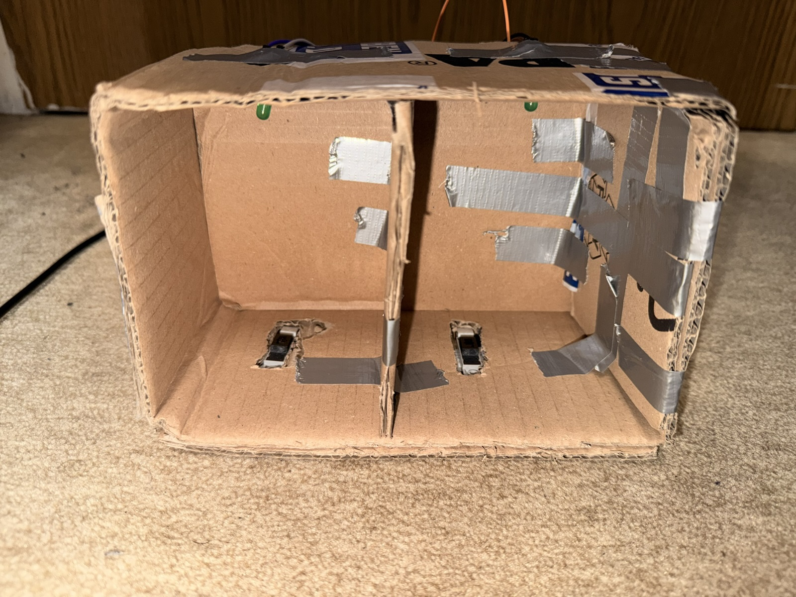 | منظر داخلي لنموذج الكرتون مع مكانين منفصلين | يوضح البناء الميكانيكي وموضع مساحات الوقوف |
| 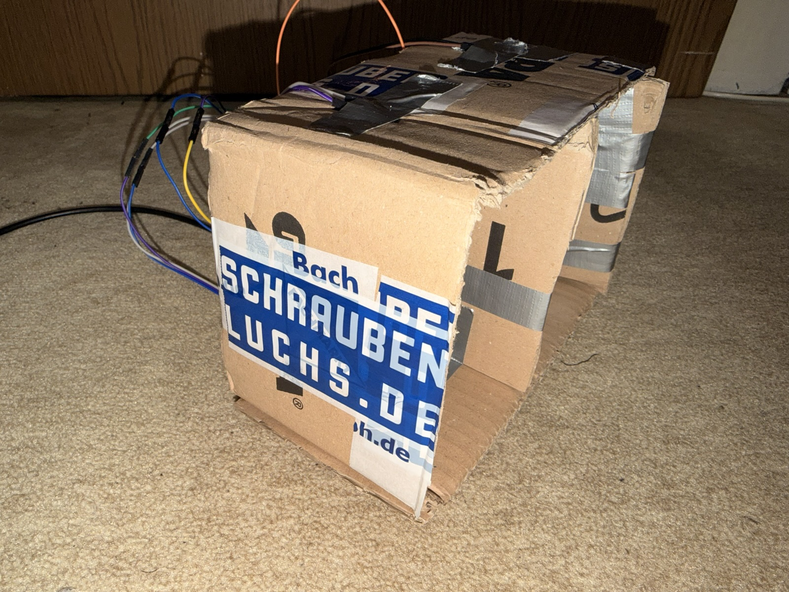 | منظر خارجي لهيكل النموذج | يوثق الهيكل النهائي المصنوع من الكرتون |
| 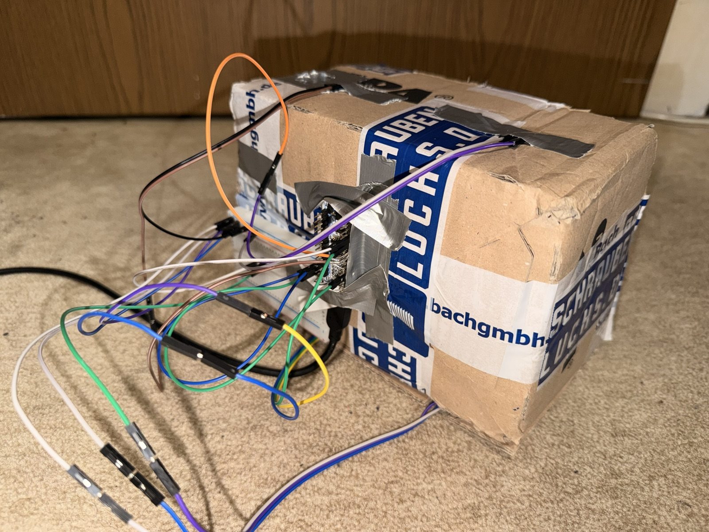 | الجهة الخلفية مع لوحة NUCLEO وأسلاك jumper | يبين أن الإلكترونيات موصولة بالنموذج |
| 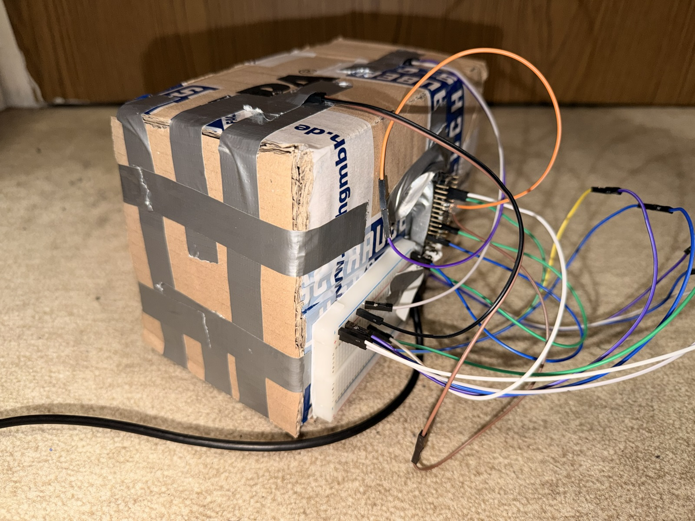 | منظر جانبي لمسار الأسلاك | يساعد على تتبع التوصيل من اللوحة إلى الحساسات و LEDs |
| 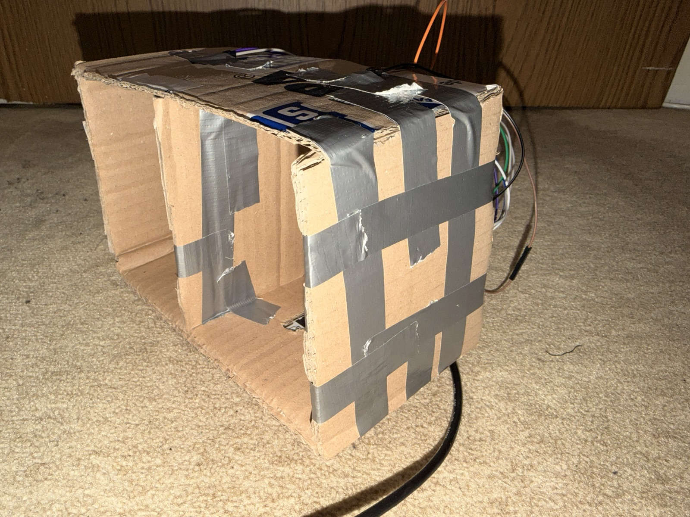 | منظر خارجي للهيكل | يوثق الثبات والشكل وطريقة بناء النموذج |
| 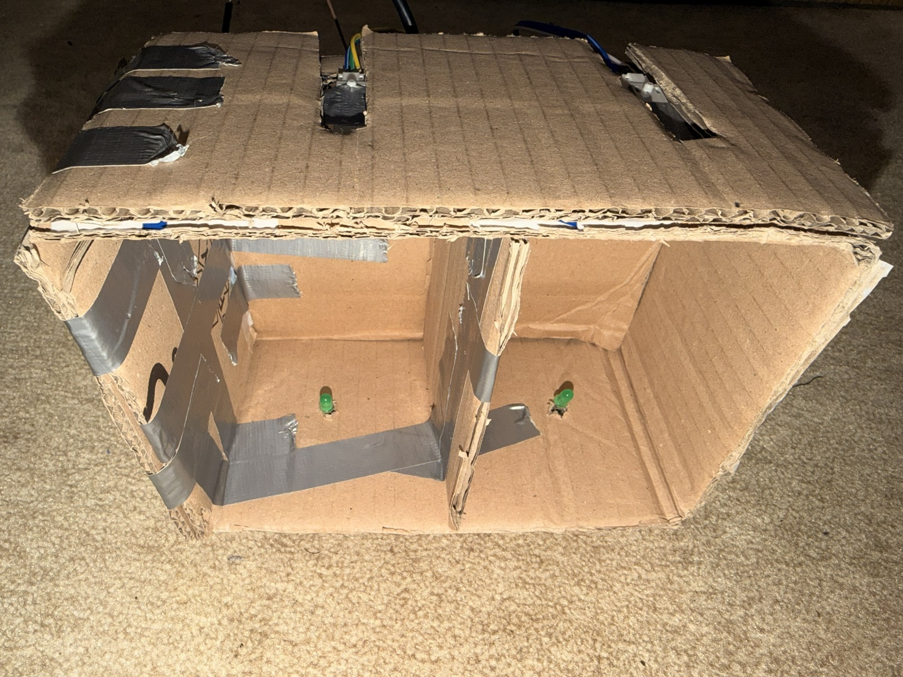 | منظر داخلي مع كلا LEDي التوفر الأخضرين | يعرض الإشارة العتادية المباشرة للأماكن الفارغة |
| 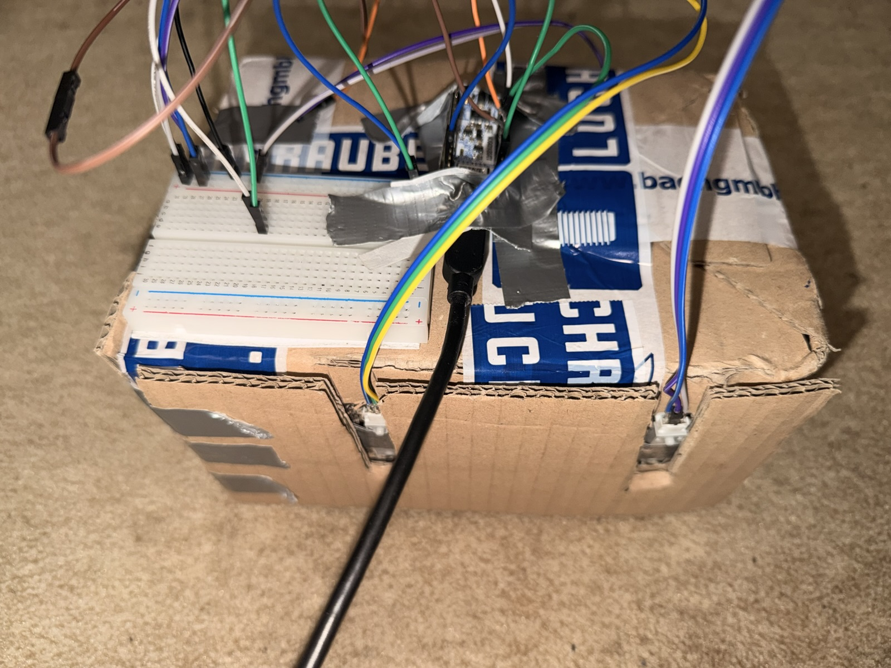 | Breadboard ومنطقة NUCLEO وأسلاك التوصيل | يعمل كدليل على تركيب الاختبار الكهربائي |
| 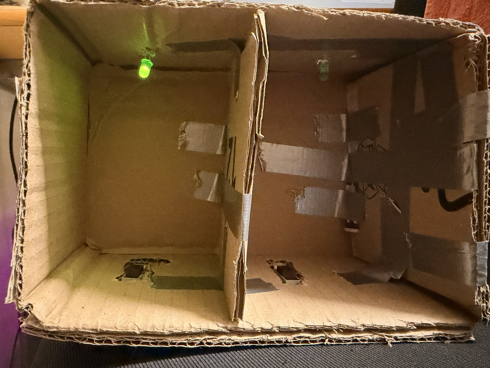 | LED أخضر مضاء داخل مكان الوقوف | يوضح الوظيفة: المكان الفارغ يشار إليه بضوء أخضر |
| 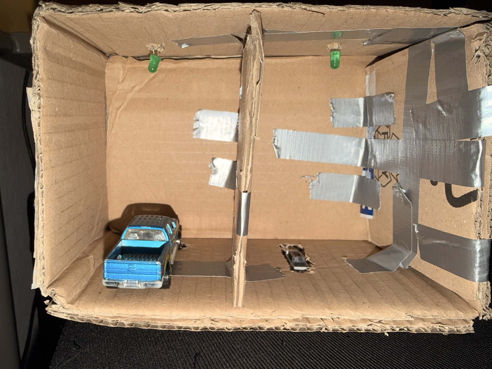 | مكان وقوف مع سيارة نموذجية ضمن مجال الحساس | يعرض النتيجة النهائية في حالة اختبار واقعية |

## طريقة IPERKA ذات الست مراحل

يتبع هذا القسم القالب `03 Vorlage - IPERKA 6-Phasen-Methode.docx`. يحتوي القالب على مجالات المهمة/المنتج النهائي، والموعد، والطالب، والاتفاقات الأخرى، ومعايير التقييم، بالإضافة إلى خطوات العمل الست: المعلومات، التخطيط، القرار، التنفيذ، التحقق، والتقييم/التفكير. لكل خطوة عمل أضيفت جمل كاملة حتى يمكن استخدام التوثيق مباشرة في تسليم المشروع.

### المهمة والمنتج النهائي

تتمثل المهمة في بناء وبرمجة وتوثيق Parking Station كمشروع متحكم صغير. المنتج النهائي هو نموذج أولي يعمل، يكتشف مكانين لوقوف السيارات بحساسات IR ويخرج الحالة عبر واجهة تسلسلية. بالإضافة إلى ذلك توجد واجهة ويب تجعل البيانات الحية مرئية. يصف التوثيق التركيب والوظيفة والحدود وحالات الاختبار والعمل وفق IPERKA.

### الموعد والمكان والطالب

| الحقل من القالب | الإدخال |
| --- | --- |
| موعد الانتهاء / التسليم | 20.05.2026 |
| المكان / VZ | Nordhorn KBS |
| الطالب | Mohammad Dyaa Addin Shami |
| اتفاقات أخرى | مشروع STM32، حساسان حقيقيان، لوحة تحكم ويب، توثيق README |

### معايير التقييم من القالب

| النسبة | المعيار |
| --- | --- |
| 1/3 | التوثيق وفق نموذج IPERKA، الفكرة وطلب المشروع |
| 2/3 | نتيجة المشروع والعرض |

### خطوة العمل 1: المعلومات

في مرحلة المعلومات تم أولا توضيح الوظيفة التي يجب أن تمتلكها Parking Station في النهاية. كان مهما أن يتم التعرف على مكانين على الأقل بالحساسات وأن تعرض الحالات بشكل مرئي. بعد ذلك تم فحص ملفات المشروع الموجودة، ولوحة NUCLEO-G431KB، وإعداد STM32CubeMX، وواجهة HTML. تبين أن `A12` و `A41` مخصصان كأماكن حساسات حقيقية وأن الاتصال يتم عبر ST-LINK Virtual COM Port. كنتيجة لهذه المرحلة أصبحت المتطلبات والواجهات والحدود الأساسية للنموذج الأولي واضحة.

معلومات مختصرة: استخدمت ملفات مشروع STM32Cube و `main.c` و `main.h` و `ParkingStation.ioc` و `parking-station.html` وقالب IPERKA. النتيجة هي فهم واضح للعتاد والبرمجيات ومنطق الحساسات ومتطلبات التوثيق.

### خطوة العمل 2: التخطيط

في مرحلة التخطيط تم تحديد كيف يجب أن يعمل العتاد والبرنامج الثابت ولوحة الويب معا. يجب أن تكون الحساسات على `PA0` و `PA1`، و LEDs الخضراء للتوفر على `PA4` و `PA5`، بينما يعمل الخرج التسلسلي عبر `COM1` بسرعة 115200 baud. بالنسبة للبرنامج الثابت تم تخطيط آلة حالات بسيطة تتجاهل التشويش القصير وتبلغ عن الإشغال فقط بعد ثلاث ثوان. بالنسبة للتوثيق تقرر وصف بنية المشروع وتوزيع الأرجل والبروتوكول والاختبارات والحدود بالتفصيل في README. هكذا نشأت خطة قابلة للتنفيذ تعتمد مباشرة على الملفات الموجودة.

معلومات مختصرة: استخدمت بنية CMake، وتوزيع أرجل CubeMX، ولوحة HTML الموجودة، ومتطلبات المهمة. النتيجة هي خطة عمل لتعليقات البرنامج الثابت، وبنية README، وبنية إثبات للصور/الفيديوهات.

### خطوة العمل 3: القرار

في مرحلة القرار تم الإبقاء على البنية الموجودة لأنها واضحة ومناسبة لنموذج أولي. تقرر تعليق الكود البرمجي الخاص بالمشروع بشكل محدد فقط، وعدم إعادة بناء ملفات HAL و drivers المولدة. تم الإبقاء على JSON لخرج الحالة لأنه مقروء في الطرفية ويمكن للوحة الويب معالجته مباشرة. تبقى `A12` و `A41` كأماكن حية، بينما تستخدم بقية أماكن لوحة التحكم كقيم وهمية. هذه القرارات تجعل المشروع بسيطا وقابلا للعرض وسهل الصيانة.

معلومات مختصرة: استخدمت قرارات المشروع الموجودة مثل STM32 HAL/BSP و CMake و Web Serial وبروتوكول JSON السطري. النتيجة هي اتجاه تقني واضح من دون توسيع غير ضروري لنطاق المشروع.

### خطوة العمل 4: التنفيذ

في مرحلة التنفيذ تمت هيكلة البرنامج الثابت بحيث يقرأ قيم الحساسات، ويزيل الاهتزاز، ويعالجها كحالة مكان وقوف. يهيئ الكود GPIO وساعة النظام و COM1 و LEDي التوفر والاستقبال UART بالمقاطعة. منطق الحالة يرسل `used` فقط بعد إشغال مستقر ويرسل `free` عندما يصبح مكان سبق أن كان مشغولا فارغا مرة أخرى. تستطيع لوحة التحكم الاتصال عبر Web Serial، وإرسال الأمر `STATUS`، وعرض رد JSON. بالإضافة إلى ذلك تم إنشاء README كتوثيق مركزي للمشروع وتم تزويد الكود البرمجي بتعليقات توضيحية.

معلومات مختصرة: تم تعديل `README.md` و `Core/Src/main.c` و `Core/Inc/main.h` و `parking-station.html`. النتيجة هي برنامج ثابت موثق بشكل أفضل وتوثيق مشروع كبير مع التركيب والوظيفة والحدود و IPERKA.

### خطوة العمل 5: التحقق

في مرحلة التحقق يجب فحص ما إذا كانت الحساسات والبرنامج الثابت ولوحة التحكم تعرض السلوك المتوقع. لذلك تتم تغطية الحساسات بشكل منفرد، ثم تحريرها، ومراقبة خرج JSON في الطرفية أو لوحة التحكم. من المهم بشكل خاص اختبار أن الإشغالات القصيرة تحت ثلاث ثوان لا تبلغ كتغيير وقوف حقيقي. كذلك يجب التحقق من أن `STATUS` يعيد دائما الحالة الحالية لـ `A12` و `A41`. إذا نجحت هذه الاختبارات، تكون النتيجة النهائية الأساسية قد تحققت.

معلومات مختصرة: تستخدم طرفية تسلسلية، ولوحة التحكم الويب، واختبارات تغطية الحساسات، وجدول الاختبار في هذا README. النتيجة هي إثبات وظيفي واضح للعرض.

### خطوة العمل 6: التقييم / التفكير

في مرحلة التفكير يتم تقييم ما إذا كان هدف المشروع قد تحقق بالوسائل المتاحة. يوضح النموذج الأولي فكرة مراقبة أماكن الوقوف جيدا، لأنه يعالج قيم الحساسات ويخرجها بشكل مرئي. في الوقت نفسه تظهر الحدود بوضوح، لأن مكانين حقيقيين فقط متصلان، ولأن الحساسات تكتشف إشغالا رقميا بسيطا فقط. لنظام أكبر يجب إضافة حساسات أكثر، ومعالجة غير حاجزة، وتخزين دائم، وعتاد أكثر متانة. بشكل عام يناسب المشروع كتركيب تعليمي وعرضي لأن العلاقة بين العتاد والبرنامج الثابت والواجهة تبقى واضحة.

معلومات مختصرة: تم تقييم الوظيفة والحدود وقابلية التوسعة وجودة التوثيق. النتيجة هي تقييم ذاتي واقعي مع إمكانات تحسين محددة.

## الكود البرمجي المعلق

الكود البرمجي المكتوب ذاتيا معلق في المواضع المهمة. أهم التعليقات هي الخاصة بمنطق الحساس active-low، وإزالة الاهتزاز، وآلة حالات أماكن الوقوف، ومخزن أوامر UART، ودوال callback. يجب ألا تكرر التعليقات كل سطر C، بل تشرح القرارات التقنية. تبقى ملفات STM32 HAL و CMSIS و BSP المولدة غالبا من دون تغيير، لأنها عادة لا تعلق أو تعاد كتابتها يدويا.

المواضع الأساسية المعلقة:

| الملف | المجال المعلق |
| --- | --- |
| `Core/Src/main.c` | `ParkingPlaceState`، تعريفات الزمن، الحلقة الرئيسية، إعداد GPIO، دوال الحساسات، LEDs التوفر، خرج JSON، معالجة أوامر UART |
| `Core/Inc/main.h` | تعريفات الأرجل لأماكن الوقوف الحية و LEDs التوفر |
| `parking-station.html` | اختيار الأماكن الحية، معالجة JSON، اتصال Web Serial، أمر `STATUS` |

## توسعات ممكنة

- توصيل أماكن وقوف إضافية كحساسات حقيقية.
- تنفيذ قراءة الحساسات بطريقة غير حاجزة باستخدام timers أو interrupts.
- توسيع لوحة التحكم بحيث تأتي كل أماكن الوقوف مباشرة من المتحكم.
- استخدام أسماء أماكن قابلة للإعداد بدلا من `A12`/`A41` الثابتة في الكود.
- تخزين الأحداث مع وقت حقيقي، مثلا عبر RTC.
- إرسال البيانات إلى خادم أو MQTT broker أو قاعدة بيانات.
- إضافة كشف مستقل لأخطاء الحساسات إذا كان مطلوبا اكتشاف الحساسات المفصولة أو المعطوبة تلقائيا.
- إضافة هيكل وتوصيلات ثابتة ودوائر حماية لتركيب أكثر متانة.
