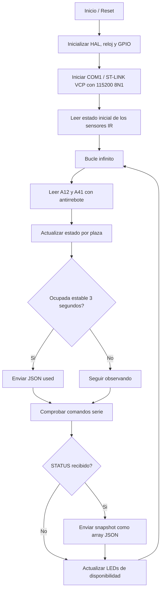
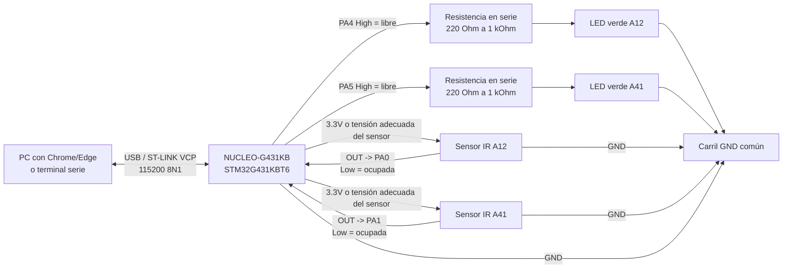
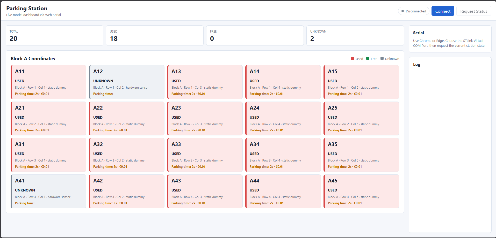
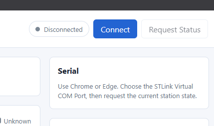
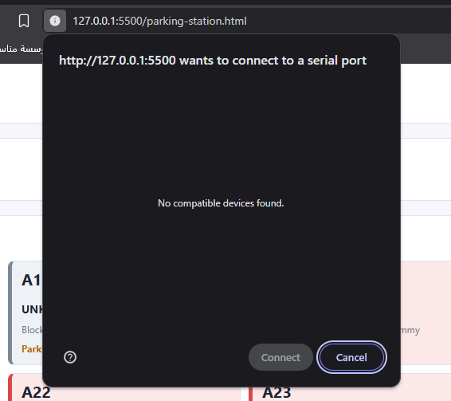
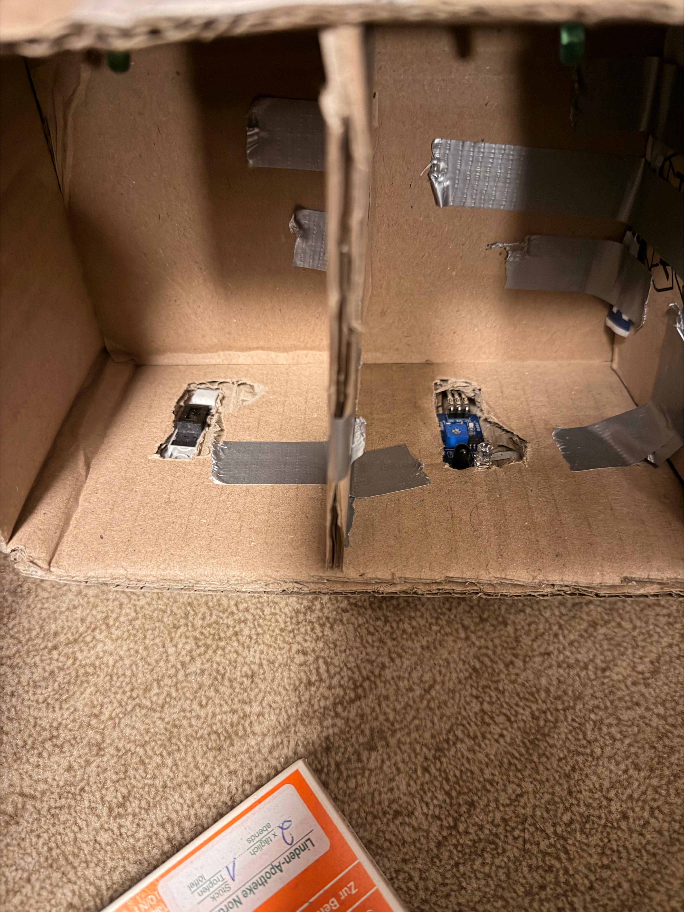
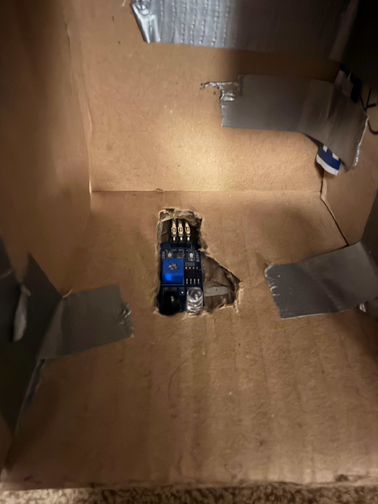

# ParkingStation

[Deutsch](README_DE.md) | [English](README.md) | [العربية](README_AR.md) | [Español](README_ES.md) | [Français](README_FR.md)

ParkingStation es un prototipo STM32 para una pequeña detección de plazas de aparcamiento con dos sensores IR reales, dos LEDs verdes de disponibilidad y una interfaz sencilla mediante Web Serial. El proyecto detecta si las plazas `A12` y `A41` están ocupadas o libres, envía los cambios de estado como JSON a través del ST-LINK Virtual COM Port y muestra los valores de forma visual en `parking-station.html`. El firmware se ejecuta en una placa NUCLEO-G431KB con STM32G431KBT6 y utiliza STM32 HAL/BSP junto con CMake como sistema de compilación. El foco está en el montaje de hardware, el comportamiento de la lógica de sensores, las interfaces serie y los límites del modelo.

## Índice

- [Objetivo del proyecto](#objetivo-del-proyecto)
- [Resultado final](#resultado-final)
- [Hardware](#hardware)
- [Asignación de pines](#asignación-de-pines)
- [Esquema / cableado](#esquema--cableado)
- [Estructura del software](#estructura-del-software)
- [Comportamiento del firmware](#comportamiento-del-firmware)
- [Protocolo serie](#protocolo-serie)
- [Panel web](#panel-web)
- [Herramientas y referencias](#herramientas-y-referencias)
- [Compilar, flashear e iniciar](#compilar-flashear-e-iniciar)
- [Pruebas y comprobaciones](#pruebas-y-comprobaciones)
- [Límites y restricciones conocidas](#límites-y-restricciones-conocidas)
- [Fotos y videos del resultado final](#fotos-y-videos-del-resultado-final)
- [Método IPERKA de 6 fases](#método-iperka-de-6-fases)
- [Código de programa comentado](#código-de-programa-comentado)
- [Posibles ampliaciones](#posibles-ampliaciones)

## Objetivo del proyecto

El objetivo del proyecto es un modelo funcional de una Parking Station. Dos plazas de aparcamiento se supervisan con sensores IR para que el microcontrolador reconozca si un objeto o un vehículo de maqueta está sobre la plaza. Además, un LED verde por plaza indica directamente si la plaza está libre. El microcontrolador procesa los datos de los sensores, filtra interferencias breves e informa el estado como líneas JSON por la conexión serie. Una interfaz HTML puede conectarse mediante Web Serial y muestra las plazas en vivo junto con otras plazas ficticias como aparcamiento de maqueta.

El proyecto está construido conscientemente como prototipo. Muestra la función básica de una supervisión de aparcamientos, pero no sustituye a un sistema industrial robusto de guiado de aparcamiento. El hardware se mantiene sencillo para que el montaje, el código y el comportamiento sean fáciles de entender. Por eso el proyecto es especialmente adecuado para documentación, presentación y demostración de la interacción entre sensores, microcontrolador e interfaz de usuario.

## Resultado final

El resultado final consta de tres partes:

| Parte | Resultado |
| --- | --- |
| Hardware | NUCLEO-G431KB con dos sensores IR y dos LEDs verdes de disponibilidad para las plazas `A12` y `A41` |
| Firmware | Código C en `Core/Src/main.c` que evalúa sensores, envía JSON y recibe comandos serie |
| Interfaz de usuario | `parking-station.html` como panel local con conexión Web Serial |

La Parking Station funciona según el siguiente flujo:



## Hardware

### Componentes principales

| Componente | Tarea en el proyecto | Nota |
| --- | --- | --- |
| NUCLEO-G431KB | Placa de microcontrolador y conexión USB ST-LINK | Placa del entorno STM32G4 |
| STM32G431KBT6 | Ejecuta firmware, lógica GPIO y comunicación UART | Reloj del sistema configurado en el proyecto a 170 MHz |
| Sensor IR A12 | Detecta la ocupación de la plaza `A12` | Se espera señal activa en bajo |
| Sensor IR A41 | Detecta la ocupación de la plaza `A41` | Se espera señal activa en bajo |
| LED verde A12 | Indica si la plaza `A12` está libre | GPIO High = LED encendido = plaza libre |
| LED verde A41 | Indica si la plaza `A41` está libre | GPIO High = LED encendido = plaza libre |
| USB/ST-LINK VCP | Alimentación, programación y conexión de datos serie | Puerto COM para panel o terminal |

### Principio de funcionamiento de los sensores

Los sensores IR se leen como entradas digitales. El firmware interpreta una señal baja en el GPIO del sensor como ocupación detectada porque las entradas están configuradas con pull-up interno. Si no hay objeto o la salida del sensor no está activa, el pull-up mantiene la entrada en alto y la plaza se considera libre. Esta lógica coincide con muchos sensores IR de obstáculos sencillos, pero debe comprobarse si se usa otro hardware de sensor. Una salida de sensor abierta o desconectada también puede parecer una plaza libre por el pull-up.

Cada sensor se lee dos veces. Entre las dos mediciones hay una breve espera de `20 ms`. Solo si ambas mediciones entregan una detección, la plaza se acepta como ocupada. Esto reduce picos de interferencia muy cortos, pero no evita automáticamente mediciones erróneas lentas o sensores mal alineados.

### Alimentación y niveles de señal

La placa normalmente se alimenta por USB. Los sensores IR deben funcionar con una tensión adecuada para la placa; se recomienda una salida compatible con 3.3 V. El GND de los sensores y el GND de la placa NUCLEO deben estar conectados juntos, de lo contrario los niveles digitales no son claros. Antes de conectar un sensor, se debe comprobar si su nivel de salida es admisible para el GPIO del STM32.

## Asignación de pines

| Función | Plaza / señal | Pin STM32 | Puerto | Dirección | Lógica |
| --- | --- | --- | --- | --- | --- |
| Sensor IR | `A12` | `PA0` | `GPIOA` | Entrada | Low = ocupada |
| Sensor IR | `A41` | `PA1` | `GPIOA` | Entrada | Low = ocupada |
| LED verde de disponibilidad | `A12` | `PA4` | `GPIOA` | Salida | High = libre / LED encendido |
| LED verde de disponibilidad | `A41` | `PA5` | `GPIOA` | Salida | High = libre / LED encendido |
| Virtual COM TX | ST-LINK VCP | `PA2` | `GPIOA` | Alternate Function | LPUART1 TX mediante BSP-COM1 |
| Virtual COM RX | ST-LINK VCP | `PA3` | `GPIOA` | Alternate Function | LPUART1 RX mediante BSP-COM1 |
| SWDIO | Debug | `PA13` | `GPIOA` | Debug | ST-LINK |
| SWCLK | Debug | `PA14` | `GPIOA` | Debug | ST-LINK |
| SWO | Debug | `PB3` | `GPIOB` | Debug | Opcional |

Las plazas en vivo están definidas en `Core/Inc/main.h`:

```c
#define PARKING_PLACE_A12_Pin GPIO_PIN_0
#define PARKING_PLACE_A12_GPIO_Port GPIOA
#define PARKING_PLACE_A41_Pin GPIO_PIN_1
#define PARKING_PLACE_A41_GPIO_Port GPIOA
#define PARKING_PLACE_A12_LED_Pin GPIO_PIN_4
#define PARKING_PLACE_A12_LED_GPIO_Port GPIOA
#define PARKING_PLACE_A41_LED_Pin GPIO_PIN_5
#define PARKING_PLACE_A41_LED_GPIO_Port GPIOA
```

El código serie activo utiliza la definición BSP `COM1`. En `Drivers/BSP/STM32G4xx_Nucleo/stm32g4xx_nucleo.h`, `COM1` para esta placa está asignado a `LPUART1` con `PA2` y `PA3`. Si el proyecto se regenera más adelante con STM32CubeMX, debe comprobarse que esta configuración BSP-COM y el manejador `LPUART1_IRQHandler` sigan coincidiendo.

## Esquema / cableado

El siguiente esquema muestra la estructura lógica del prototipo. No sustituye a un esquema profesional de KiCad o EDA, pero para la documentación hace visibles las señales conectadas entre sensores, LEDs, placa NUCLEO y panel web.



### Tabla de cableado

| Componente / señal | Conexión en NUCLEO-G431KB | Propósito |
| --- | --- | --- |
| Sensor A12 `VCC` | `3.3V` o tensión adecuada del sensor | Alimentación del sensor en vivo izquierdo |
| Sensor A12 `GND` | `GND` | Punto de referencia común |
| Sensor A12 `OUT` | `PA0` | Señal digital activa en bajo para la plaza `A12` |
| Sensor A41 `VCC` | `3.3V` o tensión adecuada del sensor | Alimentación del sensor en vivo derecho |
| Sensor A41 `GND` | `GND` | Punto de referencia común |
| Sensor A41 `OUT` | `PA1` | Señal digital activa en bajo para la plaza `A41` |
| Ánodo LED verde A12 | `PA4 -> resistencia en serie -> ánodo LED` | El LED se enciende cuando `A12` está libre |
| Cátodo LED verde A12 | `GND` | Retorno del LED |
| Ánodo LED verde A41 | `PA5 -> resistencia en serie -> ánodo LED` | El LED se enciende cuando `A41` está libre |
| Cátodo LED verde A41 | `GND` | Retorno del LED |
| USB / ST-LINK | Cable USB al PC | Programación, alimentación y Virtual COM Port |

`PA6` y `PA7` no se usan en el firmware actual. Por eso, una línea de sensor abierta o defectuosa no se detecta como estado de error propio, sino que puede parecer una plaza libre por el pull-up interno.

## Estructura del software

```text
ParkingStation/
+-- Core/
|   +-- Inc/
|   |   +-- main.h
|   |   +-- stm32g4xx_hal_conf.h
|   |   +-- stm32g4xx_it.h
|   +-- Src/
|       +-- main.c
|       +-- stm32g4xx_it.c
|       +-- stm32g4xx_hal_msp.c
|       +-- syscalls.c
|       +-- sysmem.c
|       +-- system_stm32g4xx.c
+-- Drivers/
|   +-- BSP/STM32G4xx_Nucleo/
|   +-- CMSIS/
|   +-- STM32G4xx_HAL_Driver/
+-- cmake/
|   +-- gcc-arm-none-eabi.cmake
|   +-- starm-clang.cmake
|   +-- stm32cubemx/CMakeLists.txt
+-- CMakeLists.txt
+-- CMakePresets.json
+-- ParkingStation.ioc
+-- STM32G431XX_FLASH.ld
+-- startup_stm32g431xx.s
+-- Assets/
|   +-- image-20260520-232528-615.jpeg
|   +-- ...
+-- parking-station.html
+-- 03 Vorlage - IPERKA 6-Phasen-Methode.docx
+-- README.md
+-- README_DE.md
+-- README_AR.md
+-- README_ES.md
+-- README_FR.md
```

### Archivos importantes

| Archivo | Significado |
| --- | --- |
| `Core/Src/main.c` | Lógica principal del firmware: inicialización, sensores, máquina de estados, salida JSON, comandos UART |
| `Core/Inc/main.h` | Definiciones de pines para las plazas en vivo y los LEDs de disponibilidad |
| `Core/Src/stm32g4xx_it.c` | Manejadores de interrupción, incluido `LPUART1_IRQHandler` para COM1 |
| `parking-station.html` | Panel local con Web Serial API |
| `ParkingStation.ioc` | Configuración de proyecto STM32CubeMX |
| `CMakeLists.txt` | Script CMake superior |
| `cmake/stm32cubemx/CMakeLists.txt` | Listas de fuentes, includes y controladores generadas por CubeMX |
| `STM32G431XX_FLASH.ld` | Script de linker para distribución de Flash/RAM |

## Comportamiento del firmware

### Inicialización

Al arrancar, el firmware llama primero a `HAL_Init()` y después configura el reloj del sistema. A continuación se inicializan los puertos GPIO para los sensores IR y los dos LEDs verdes de disponibilidad. Después se inicia `BSP_COM_Init(COM1, ...)` con 115200 baudios, 8 bits de datos, 1 bit de parada, sin paridad y sin control de flujo por hardware. La recepción se activa por interrupciones con `HAL_UART_Receive_IT()`.

### Estado de la plaza

Cada plaza real tiene una pequeña estructura de estado:

```c
typedef struct
{
  uint8_t occupied;
  uint8_t usedReported;
  uint32_t occupiedStartedAt;
} ParkingPlaceState;
```

`occupied` describe el estado de ocupación detectado de forma estable. `usedReported` evita que el firmware envíe continuamente nuevos eventos `used` mientras el mismo vehículo permanece sin cambios en la plaza. `occupiedStartedAt` guarda el momento en el que empezó la ocupación. Así el firmware puede comprobar si una plaza lleva ocupada más tiempo que el retardo de notificación definido.

### Detección de ocupación

Una plaza no se considera ocupada inmediatamente con el primer valor activo del sensor. El firmware espera primero dos muestras activas iguales separadas por `SENSOR_DEBOUNCE_MS`, es decir `20 ms`. Si después la plaza permanece ocupada de forma continua, se envía un evento `used` solo después de `PARKING_USED_REPORT_DELAY_MS`, es decir `3000 ms`. Así, un paso breve o un movimiento de la mano no se informa inmediatamente como aparcamiento real.

### Detección de plaza libre

Cuando una plaza vuelve a quedar libre, el firmware envía `free`, pero solo si antes se había enviado un evento `used` para esa ocupación. Esto evita mensajes innecesarios en interferencias muy cortas que nunca alcanzaron el límite de tres segundos. Si un objeto se detecta solo brevemente y luego se retira, puede que no se genere ningún mensaje JSON. El estado actual puede consultarse en cualquier momento con el comando `STATUS`.

### Comportamiento de los LEDs

Cada plaza en vivo tiene su propio LED verde de disponibilidad. El LED de `A12` está conectado a `PA4`, y el LED de `A41` a `PA5`. Un LED está encendido mientras la plaza correspondiente está libre. En cuanto el sensor de esa plaza detecta ocupación, el firmware apaga el LED correspondiente.

La indicación LED sigue el estado actual del sensor después del antirrebote. No espera el retardo de tres segundos del mensaje serie `used`. Así se ve inmediatamente en el montaje que la plaza ya no está libre, mientras la salida JSON sigue filtrando interferencias breves.

### Cableado de los LEDs verdes

Los LEDs están previstos como salidas activas en alto. Esto significa: el pin STM32 entrega una señal High, la corriente fluye por la resistencia en serie y el LED hacia GND, y el LED se enciende. Cada LED necesita su propia resistencia en serie, normalmente de `220 Ohm` a `1 kOhm`; un buen valor inicial es `330 Ohm`.

| Plaza | Pin STM32 | Conexión |
| --- | --- | --- |
| `A12` | `PA4` | `PA4 -> resistencia en serie -> ánodo LED`, cátodo LED -> `GND` |
| `A41` | `PA5` | `PA5 -> resistencia en serie -> ánodo LED`, cátodo LED -> `GND` |

El lado largo del LED normalmente es el ánodo; el lado corto o el lado plano de la carcasa normalmente es el cátodo. Si el LED se monta al revés, no se enciende, pero con una conexión normal por lo general no se rompe. Es importante que cada LED tenga una resistencia en serie y que ningún GPIO se cortocircuite directamente.

## Protocolo serie

### Conexión

| Parámetro | Valor |
| --- | --- |
| Puerto | ST-LINK Virtual COM Port |
| Interfaz de firmware | `COM1` / `LPUART1` mediante BSP |
| Baudrate | `115200` |
| Bits de datos | `8` |
| Bits de parada | `1` |
| Paridad | Ninguna |
| Control de flujo | Ninguno |
| Final de línea para comandos | `\r`, `\n` o `\r\n` |

### Eventos automáticos

Cuando una plaza está ocupada el tiempo suficiente, el firmware envía una línea JSON:

```json
{"place":"A12","state":"used","timestamp_ms":3120}
```

Cuando una plaza previamente notificada vuelve a quedar libre, el firmware envía:

```json
{"place":"A12","state":"free","timestamp_ms":9400}
```

`timestamp_ms` proviene de `HAL_GetTick()` y describe los milisegundos desde el inicio del controlador. Este valor no es una hora real. Tras un tiempo de ejecución largo, el valor del tick puede desbordarse; para los intervalos cortos del proyecto no es crítico.

### Comando `STATUS`

El único comando compatible es:

```text
STATUS
```

La respuesta es un array JSON con las dos plazas en vivo:

```json
[{"place":"A12","state":"free","timestamp_ms":12055},{"place":"A41","state":"used","timestamp_ms":12055}]
```

### Salidas de error

| Situación | Respuesta |
| --- | --- |
| Comando desconocido | `{"error":"unknown_command"}` |
| Comando más largo que el buffer | `{"error":"command_too_long"}` |

El buffer de comandos tiene `16` caracteres. Como un carácter se reserva para el cierre de cadena, un comando puede tener como máximo `15` caracteres visibles. Esto es suficiente para `STATUS`, pero es un límite intencionado del prototipo.

## Panel web

El archivo `parking-station.html` es una interfaz local sencilla. Muestra un bloque de aparcamiento con 20 plazas de `A11` a `A45`. Solo `A12` y `A41` son plazas de hardware reales, porque solo esas dos plazas están conectadas con sensores IR en el firmware. Las plazas restantes son valores ficticios y se muestran ocupadas por defecto para que el modelo parezca un aparcamiento más grande.

### Uso

1. Flashear el firmware en la placa NUCLEO.
2. Conectar la placa al ordenador mediante USB.
3. Abrir `parking-station.html` mediante un servidor local en Chrome o Edge.
4. Hacer clic en `Connect` y seleccionar el ST-LINK Virtual COM Port.
5. Con `Request Status`, solicitar el estado actual.
6. Cubrir el sensor A12 o A41 y observar el LED verde correspondiente; después de unos tres segundos aparece también el cambio JSON.

### Capturas del panel

La siguiente vista general muestra el panel antes de establecer la conexión serie. Las plazas de hardware `A12` y `A41` aparecen inicialmente como desconocidas hasta que se solicita el estado actual.



| Botón Connect | Selección del puerto serie |
| --- | --- |
|  |  |
| Hacer clic en `Connect` abre la selección de dispositivos Web Serial del navegador. | Seleccionar el ST-LINK Virtual COM Port. Si no aparece ningún dispositivo compatible, comprobar la conexión USB y que ningún otro programa esté usando el puerto. |

### Inicio local del panel

Web Serial normalmente funciona en Chrome o Edge y necesita un contexto seguro. Para desarrollo local, `localhost` es adecuado. Un inicio sencillo es:

```powershell
py -m http.server 8000
```

Después abrir en el navegador:

```text
http://localhost:8000/parking-station.html
```

Si `py` no está disponible, también puede usarse otro servidor local de archivos estáticos o una extensión de IDE como Live Server.

## Herramientas y referencias

### Herramientas usadas

| Herramienta | Propósito en el proyecto | Enlace |
| --- | --- | --- |
| STM32CubeMX | Pinout, reloj, configuración de periféricos y generación de código para proyectos STM32 | [STM32CubeMX](https://www.st.com/stm32cubemx) |
| STM32CubeProgrammer | Flashear y comprobar firmware mediante ST-LINK/SWD | [STM32CubeProgrammer](https://www.st.com/en/product/stm32cubeprog) |
| Visual Studio Code | Editor para código C, README y panel HTML | [Visual Studio Code](https://code.visualstudio.com/) |
| STM32CubeIDE for Visual Studio Code | Soporte STM32 en VS Code, importación de proyecto, build/debug y funciones ST-LINK | [VS Code Marketplace](https://marketplace.visualstudio.com/items?itemName=stmicroelectronics.stm32-vscode-extension) |
| C/C++ Extension Pack | IntelliSense, soporte C/C++ y CMake Tools para VS Code | [VS Code Marketplace](https://marketplace.visualstudio.com/items?itemName=ms-vscode.cpptools-extension-pack) |
| Live Server | Servidor web local para `parking-station.html` | [VS Code Marketplace](https://marketplace.visualstudio.com/items?itemName=ritwickdey.LiveServer) |
| CMake | Sistema de compilación para el proyecto STM32 | [CMake Download](https://cmake.org/download/) |
| ARM GNU Toolchain | Compilador, ensamblador y linker para ARM Cortex-M | [Arm GNU Toolchain Downloads](https://developer.arm.com/downloads/-/arm-gnu-toolchain-downloads) |

### Referencias técnicas

| Referencia | Importancia para el proyecto | Enlace |
| --- | --- | --- |
| UM2397 - STM32G4 Nucleo-32 board (MB1430) | Manual de usuario oficial de la placa NUCLEO-G431KB usada, ST-LINK, headers y funciones de placa | [STMicroelectronics PDF](https://www.st.com/resource/en/user_manual/um2397-stm32g4-nucleo32-board-mb1430-stmicroelectronics.pdf) |
| Hoja de datos GP2A200LCS0F Series | Referencia para sensores IR reflectivos con `VCC`, `VOUT` y `GND`, además de distancia de detección | [Reichelt / SHARP PDF](https://cdn-reichelt.de/documents/datenblatt/C900/GP2A200LCS0FN.pdf) |

## Compilar, flashear e iniciar

### Requisitos

- CMake desde la versión 3.22
- Ninja o un generador CMake compatible
- ARM GCC Toolchain compatible con `cmake/gcc-arm-none-eabi.cmake`
- STM32CubeProgrammer o una IDE con soporte ST-LINK
- Chrome o Edge para el panel web

### Compilación con CMake

```powershell
cmake --preset Debug
cmake --build --preset Debug
```

Para una build Release:

```powershell
cmake --preset Release
cmake --build --preset Release
```

Los archivos de build quedan, según el preset, en `build/Debug` o `build/Release`. El proyecto genera el objetivo STM32 `ParkingStation`. Según la configuración de la toolchain, se crean archivos como `.elf`, `.hex` o `.bin`.

### Flasheo

El flasheo no está guardado en el repositorio como script propio. En la práctica se usa STM32CubeProgrammer o una IDE STM32 adecuada. Para ello se conecta la placa NUCLEO por USB, se selecciona el archivo de firmware generado en la carpeta de build y se escribe en el controlador. Después la placa arranca automáticamente o puede reiniciarse con Reset.

## Pruebas y comprobaciones

### Prueba básica con terminal

Un terminal serie puede conectarse directamente al ST-LINK Virtual COM Port con `115200 8N1`. Tras el inicio, el firmware no necesariamente envía un estado de inmediato porque el estado inicial solo se adopta internamente. Si se envía `STATUS` con Enter, debe volver un array JSON con `A12` y `A41`. Si un sensor se cubre durante más de tres segundos, debe aparecer un evento `used`. Al liberar el sensor, debe aparecer un evento `free`.

### Casos de prueba

| No. | Acción | Resultado esperado |
| --- | --- | --- |
| 1 | No cubrir nada | Ambos LEDs verdes de disponibilidad encendidos, `STATUS` muestra ambas plazas libres |
| 2 | Cubrir sensor A12 brevemente, menos de 3 segundos | LED A12 apagado durante la cobertura, luego encendido otra vez; sin evento `used` |
| 3 | Cubrir sensor A41 brevemente | LED A41 apagado, LED A12 permanece encendido |
| 4 | Cubrir sensor A12 más de 3 segundos | LED A12 apagado y JSON `{"place":"A12","state":"used",...}` |
| 5 | Liberar sensor A12 después de `used` | LED A12 encendido y JSON `{"place":"A12","state":"free",...}` |
| 6 | Cubrir sensor A41 más de 3 segundos | LED A41 apagado y JSON `{"place":"A41","state":"used",...}` |
| 7 | Cubrir ambos sensores | Ambos LEDs verdes de disponibilidad apagados, ambas plazas se muestran como `used` en `STATUS` |
| 8 | Enviar un comando desconocido, por ejemplo `HELLO` | JSON `{"error":"unknown_command"}` |
| 9 | Enviar un comando muy largo | JSON `{"error":"command_too_long"}` |

### Comprobación en el panel

En el panel, los campos `A12` y `A41` deben mostrar el estado real de los sensores. Con `Request Status`, el estado en vivo se actualiza inmediatamente según la respuesta snapshot. Los eventos automáticos se muestran en el log y actualizan las tarjetas. Las plazas ficticias permanecen sin cambios y solo sirven para la representación.

## Límites y restricciones conocidas

### Proyecto exclusivamente escolar y no apto para uso real

Esta Parking Station es exclusivamente un proyecto escolar y de demostración. Muestra la interacción básica entre sensores, firmware, comunicación serie e interfaz web, pero no es un producto certificado ni suficientemente robusto para funcionar en un aparcamiento público o comercial real. Un sistema real debe seguir siendo fiable con cambios meteorológicos, detectar fallos automáticamente, resistir tráfico y vandalismo, proteger sus comunicaciones y continuar funcionando de forma segura cuando falla un componente.

#### Posibles situaciones de fallo en el mundo real

- Una hoja, papel, basura u otro objeto sobre el sensor puede notificarse como un vehículo aparcado.
- La lluvia, charcos, condensación, barro, nieve o hielo pueden cubrir el sensor, cambiar la reflexión infrarroja, causar corrosión o provocar un fallo eléctrico.
- Una persona que permanezca en la plaza hablando con un amigo, una bicicleta, carrito de compra, animal u otro objeto que no sea un coche puede activar una ocupación falsa.
- Las superficies negras, mates, sucias o poco reflectantes pueden no devolver suficiente luz infrarroja y hacer que una plaza ocupada aparezca libre.
- La luz solar directa, los faros, las sombras y los cambios de luz ambiental pueden interferir con las mediciones infrarrojas.
- Un vehículo con gran altura libre al suelo, forma inusual o posición desfavorable puede no cubrir correctamente el sensor.
- Un vehículo vecino o una parte sobresaliente puede activar la plaza equivocada.
- Los cables y componentes expuestos pueden dañarse por humedad, tráfico, equipos de limpieza, vandalismo o contacto accidental.
- Pueden fallar la alimentación, USB, comunicación serie, navegador o microcontrolador. El prototipo no tiene aviso automático de fallos, redundancia, supervisión remota ni una estrategia fiable de recuperación.
- El panel Web Serial local sirve para una demostración, pero no es una plataforma de gestión escalable, protegida o de alta disponibilidad.

#### Mejores soluciones para aparcamientos reales

| Solución | Ventajas | Desventajas y realismo |
| --- | --- | --- |
| Sensor de suelo resistente a la intemperie con magnetómetro y radar | La fusión de sensores detecta la influencia magnética y la presencia física del vehículo; hojas, personas e iluminación tienen menos influencia | Solución exterior realista y robusta, pero las obras en el pavimento, instalación impermeable, sustitución de baterías, calibración y mantenimiento aumentan el coste |
| Sensor de peso o presión junto con sensor IR | Un umbral de peso adecuado puede distinguir muchos vehículos de hojas o personas, mientras IR aporta una segunda medición | Técnicamente posible, pero su instalación en la calzada es cara; drenaje, heladas, desgaste, cargas pesadas, motocicletas y calibración siguen siendo difíciles |
| Sensores superiores ultrasónicos o de radar | Montaje protegido y buena detección por plaza, especialmente en aparcamientos cubiertos | Realista donde existen techos o estructuras de soporte; menos práctico en aparcamientos abiertos y todavía requiere alimentación, red y mantenimiento |
| Sistema de cámaras con IA | Una cámara puede vigilar varias plazas y distinguir vehículos de muchos otros objetos | Potencialmente económico para muchas plazas, pero afectado por oclusión, oscuridad, clima, lentes sucias y errores del modelo; también genera importantes obligaciones de privacidad y ciberseguridad |

Para una instalación exterior real pequeña, un sensor de suelo industrial con clasificación IP que combine magnetómetro y radar suele ser más realista que el prototipo IR expuesto. Debe conectarse a un backend supervisado e incluir control de batería, comprobación de comunicación, estados de fallo, actualizaciones seguras y mantenimiento periódico. Una cámara con IA puede ser útil cuando deben cubrirse muchas plazas, pero debería procesar la ocupación localmente, evitar la identificación y no almacenar imágenes salvo que sea necesario y esté legalmente justificado.

#### Evaluación financiera, legal y operativa

- Los componentes económicos usados en este prototipo no representan el coste principal de un sistema real. Obra civil, carcasas resistentes a la intemperie, instalación, alimentación, red, software backend, calibración, inspecciones, reparaciones y mantenimiento a largo plazo pueden costar mucho más que los propios sensores.
- La fusión de sensores mejora la fiabilidad, pero aumenta el precio del hardware, consumo energético, complejidad del software y esfuerzo de mantenimiento. Incluso un sistema profesional necesita pruebas de campo y una medición de precisión antes de su uso.
- Los sistemas de cámaras pueden reducir el número de dispositivos por plaza, pero necesitan una planificación cuidadosa de ángulos de visión, iluminación, seguridad de datos, controles de acceso y validación continua del modelo.
- En Alemania y la UE, las imágenes con personas o matrículas pueden ser datos personales. La detección de aparcamiento mediante vídeo no está prohibida automáticamente, pero necesita una finalidad legítima, necesidad, proporcionalidad, transparencia, minimización de datos, tratamiento seguro y una política adecuada de eliminación. La [información sobre protección de datos de la Comisión Europea](https://commission.europa.eu/law/law-topic/data-protection_en) y las [directrices del Comité Europeo de Protección de Datos sobre dispositivos de vídeo](https://www.edpb.europa.eu/sites/default/files/files/file1/edpb_guidelines_201903_video_devices_en_0.pdf) ofrecen orientación relevante.
- La instalación en vías públicas o aparcamientos compartidos puede requerir además permiso del propietario o autoridad, trabajos eléctricos conformes, aprobación de obra, consideración de accesibilidad y responsabilidad definida por información de ocupación incorrecta.

### Fallo y sustitución del sensor durante las pruebas

Durante las pruebas, el sensor derecho de la plaza `A41` se dañó por un cortocircuito y dejó de funcionar. Se sustituyó por un [módulo sensor IR de detección de obstáculos de AZ-Delivery](https://www.az-delivery.de/en/products/ir-abstand-sensor-modul). El módulo de sustitución utiliza un comparador LM393, puede ajustarse mediante su potenciómetro y admite una tensión de funcionamiento de 3.3 V a 5 V.

En las pruebas del proyecto, el sensor de sustitución no detectó de forma fiable los tejidos negros. Los materiales oscuros pueden absorber gran parte de la luz infrarroja emitida en lugar de reflejarla hacia el receptor. Por ello, la plaza derecha puede aparecer incorrectamente como libre cuando un tejido negro u otra superficie oscura poco reflectante cubre el sensor. Esta es una limitación conocida del prototipo actual y debe tenerse en cuenta durante demostraciones y pruebas.

### Límites de hardware

- Solo se supervisan dos plazas reales: `A12` y `A41`.
- Los sensores reconocen solo una señal digital, pero no clase de vehículo, matrícula, dirección ni posición exacta.
- La lógica espera sensores activos en bajo; con sensores activos en alto habría que adaptar `IR_SensorDetected()`.
- Las salidas LED son activas en alto; con otro cableado habría que invertir `ParkingStation_UpdateFreeLeds()`.
- Una salida de sensor desconectada o defectuosa puede leerse como plaza libre por el pull-up interno.
- Los sensores IR pueden verse afectados por distancia, ángulo, luz externa, superficies reflectantes o mala alineación.
- Los pull-ups internos ayudan contra entradas abiertas, pero no sustituyen un cableado limpio ni una alimentación estable.
- El prototipo no tiene aislamiento galvánico ni circuitos de protección para entornos duros.

### Límites de firmware

- El antirrebote está implementado de forma bloqueante: por sensor el firmware espera `20 ms`.
- Con dos sensores esto no es problemático; con muchos sensores el bucle sería claramente más lento.
- Un evento `used` se genera solo después de `3000 ms` de ocupación estable.
- Las ocupaciones muy cortas se ignoran intencionadamente y no aparecen como eventos.
- Un evento `free` se envía solo si antes se informó un evento `used` para la misma ocupación.
- No hay almacenamiento persistente; tras un reset se pierde el historial.
- No hay una base de tiempo real como RTC o NTP, solo `HAL_GetTick()` desde el inicio.
- El conjunto de comandos serie contiene solo `STATUS`.
- El buffer de comandos está limitado a `16` caracteres.

### Límites del panel

- Web Serial no está disponible en todos los navegadores.
- La interfaz debe ejecutarse mediante `localhost` u otro contexto seguro.
- Solo `A12` y `A41` son datos en vivo; las otras plazas son visualizaciones ficticias.
- El panel no guarda datos de forma permanente.
- La duración y tarifa calculadas en el panel se basan en la hora del navegador desde que se recibe el estado `used` y solo son una visualización para la demo.

## Fotos y videos del resultado final

Las siguientes imágenes están en la carpeta `Assets/` y documentan el montaje real. Muestran la maqueta de cartón, las dos zonas de aparcamiento, los LEDs verdes, las posiciones de los sensores y la parte trasera con cableado. Actualmente no hay videos en el repositorio; para una entrega posterior pueden añadirse clips breves de cubrir y liberar los sensores.

| Imagen | Descripción | Propósito para la documentación |
| --- | --- | --- |
|  | Vista interior de la maqueta de cartón con dos plazas separadas | Muestra el montaje mecánico y la posición de las superficies de aparcamiento |
|  | Vista exterior de la carcasa del modelo | Documenta la carcasa terminada de cartón |
|  | Parte trasera con placa NUCLEO y cables jumper | Muestra que la electrónica está conectada al modelo |
|  | Vista lateral con guiado de cables | Ayuda a seguir el cableado desde la placa hasta sensores y LEDs |
|  | Vista exterior de la carcasa | Documenta estabilidad, forma y construcción del modelo |
|  | Vista interior con ambos LEDs verdes de disponibilidad | Muestra la indicación directa de hardware para plazas libres |
|  | Breadboard, zona NUCLEO y cables de conexión | Sirve como prueba del montaje eléctrico de prueba |
|  | LED verde encendido en la plaza | Muestra la función: una plaza libre se señaliza con luz verde |
|  | Plaza con coche de maqueta en la zona del sensor | Muestra el resultado final en una situación de prueba realista |
|  | Vista interior del modelo después de instalar el sensor de sustitución en la plaza derecha | Documenta el montaje modificado después de que el sensor original se dañara durante las pruebas |
|  | Primer plano del nuevo módulo sensor IR de detección de obstáculos de AZ-Delivery | Muestra el sensor de sustitución, sus componentes infrarrojos y el potenciómetro ajustable |

## Método IPERKA de 6 fases

Esta sección se orienta por la plantilla `03 Vorlage - IPERKA 6-Phasen-Methode.docx`. La plantilla contiene las áreas encargo/producto final, fecha, alumno, otros acuerdos, criterios de evaluación y los seis pasos de acción: informarse, planificar, decidir, realizar/ejecutar, controlar y evaluar/reflexionar. Para cada paso se incluyen frases desarrolladas para que la documentación pueda reutilizarse directamente en una entrega de proyecto.

### Encargo y producto final

El encargo consiste en construir, programar y documentar una Parking Station como proyecto de microcontrolador. El producto final es un prototipo funcional que detecta dos plazas con sensores IR y emite el estado mediante una interfaz serie. Además, forma parte del proyecto una interfaz web con la que se pueden hacer visibles los datos en vivo. La documentación describe montaje, función, límites, casos de prueba y el trabajo según IPERKA.

### Fecha, lugar y alumno

| Campo de la plantilla | Entrada |
| --- | --- |
| Fecha final / entrega | 20.05.2026 |
| Lugar / VZ | Nordhorn KBS |
| Alumno | Mohammad Dyaa Addin Shami |
| Otros acuerdos | Proyecto STM32, dos sensores reales, panel web, documentación README |

### Criterios de evaluación de la plantilla

| Parte | Criterio |
| --- | --- |
| 1/3 | Documentación según modelo IPERKA, idea y solicitud de proyecto |
| 2/3 | Resultado del proyecto y presentación |

### Paso de acción 1: Informarse

En la fase de información se aclaró primero qué función debía tener la Parking Station al final. Era importante que al menos dos plazas se reconocieran con sensores y que los estados pudieran mostrarse de forma visible. Después se examinaron los archivos de proyecto existentes, la placa NUCLEO-G431KB, la configuración de STM32CubeMX y la interfaz HTML. Se constató que `A12` y `A41` están previstas como plazas de sensor reales y que la comunicación se realiza por el ST-LINK Virtual COM Port. Como resultado de esta fase quedaron disponibles los requisitos, interfaces y límites más importantes del prototipo.

Datos breves: Se usaron archivos de proyecto STM32Cube, `main.c`, `main.h`, `ParkingStation.ioc`, `parking-station.html` y la plantilla IPERKA. El resultado es una comprensión clara de hardware, software, lógica de sensores y requisitos de documentación.

### Paso de acción 2: Planificar

En la fase de planificación se definió cómo debían trabajar juntos hardware, firmware y panel web. Los sensores debían estar en `PA0` y `PA1`, los LEDs verdes de disponibilidad en `PA4` y `PA5`, mientras que la salida serie debía funcionar por `COM1` a 115200 baudios. Para el firmware se planificó una máquina de estados sencilla que ignora interferencias cortas y notifica una ocupación solo después de tres segundos. Para la documentación se decidió describir con detalle la estructura del proyecto, la asignación de pines, el protocolo, las pruebas y los límites en el README. Así surgió un plan realizable que se apoya directamente en los archivos existentes.

Datos breves: Se usaron la estructura CMake, la asignación de pines de CubeMX, el panel HTML existente y los requisitos de la tarea. El resultado es un plan de trabajo para comentarios de firmware, estructura del README y estructura de evidencias para fotos/videos.

### Paso de acción 3: Decidir

#### Por qué se utilizó STM32 en lugar de Arduino

El plan original era implementar el proyecto con un Arduino. Una semana antes de la fecha de entrega se encargaron un Arduino y los sensores necesarios. La entrega debía llegar en dos días, lo que normalmente habría dejado tiempo suficiente para el montaje, la programación y las pruebas. Sin embargo, la entrega se retrasó considerablemente y los componentes solicitados todavía no habían llegado el día anterior a la entrega.

Como el proyecto debía entregarse a la mañana siguiente, se tomaron prestados de la empresa `3P-Services` una placa de desarrollo STM32 y dos sensores IR. Esto permitió continuar el proyecto con poca antelación, pero también cambió considerablemente los requisitos técnicos. En comparación con la solución Arduino prevista originalmente, el STM32 exigió de repente mucha más configuración y trabajo cercano al hardware. Fue necesario comprender y configurar bajo una fuerte presión de tiempo la asignación de pines, los modos GPIO, el reloj, la comunicación UART, las interrupciones, la estructura del firmware, el sistema de compilación y la integración de los controladores STM32 HAL/BSP.

Los controladores STM32 generados no se reescribieron completamente desde cero, pero tuvieron que seleccionarse, integrarse, configurarse y conectarse correctamente con el firmware propio del proyecto. Esto supuso una carga de trabajo mucho mayor de lo esperado poco antes de la entrega. Al mismo tiempo, el uso del STM32 permitió comprender con mayor profundidad la inicialización de microcontroladores, las capas de abstracción de hardware, la comunicación serie, las interrupciones y los sistemas de compilación embebidos de lo que probablemente habría requerido una implementación Arduino más sencilla.

En la fase de decisión se mantuvo la arquitectura existente porque es clara y adecuada para un prototipo. Se decidió comentar de forma específica solo el código propio del programa y no reconstruir internamente los archivos HAL y de controladores generados. Para la salida de estado se mantuvo JSON, porque es legible en el terminal y también puede ser procesado directamente por el panel web. `A12` y `A41` siguen siendo las plazas en vivo, mientras que las otras plazas del panel se usan como valores ficticios. Estas decisiones mantienen el proyecto sencillo, presentable y fácil de mantener.

Datos breves: Se usaron decisiones existentes como STM32 HAL/BSP, CMake, Web Serial y protocolo JSON por líneas. El resultado es una dirección técnica clara sin ampliar innecesariamente el alcance del proyecto.

### Paso de acción 4: Realizar / ejecutar

En la fase de realización, el firmware se estructuró para leer valores de sensores, aplicar antirrebote y procesarlos como estado de plaza. El código inicializa GPIO, reloj del sistema, COM1, los dos LEDs de disponibilidad y la recepción UART por interrupciones. La lógica de estado informa `used` solo después de una ocupación estable y envía `free` cuando una plaza previamente ocupada vuelve a quedar libre. El panel puede conectarse por Web Serial, enviar el comando `STATUS` y mostrar la respuesta JSON. Además, el README se creó como documentación central del proyecto y el código de programa recibió comentarios explicativos.

Datos breves: Se editaron `README.md`, `Core/Src/main.c`, `Core/Inc/main.h` y `parking-station.html`. El resultado es un firmware mejor documentado y una documentación amplia con montaje, función, límites e IPERKA.

### Paso de acción 5: Controlar

En la fase de control debe comprobarse si sensores, firmware y panel muestran el comportamiento esperado. Para ello se cubren los sensores individualmente, se liberan de nuevo y se observan las salidas JSON en el terminal o el panel. Es especialmente importante la prueba de que ocupaciones cortas por debajo de tres segundos no se notifiquen como un cambio real de aparcamiento. También debe comprobarse si `STATUS` devuelve siempre el estado actual de `A12` y `A41`. Si estas pruebas son correctas, el resultado final central se ha alcanzado.

Datos breves: Se usan terminal serie, panel web, pruebas de cubrir sensores y la tabla de pruebas de este README. El resultado es una prueba funcional comprensible para la presentación.

### Paso de acción 6: Evaluar / reflexionar

En la fase de reflexión se valora si el objetivo del proyecto se alcanzó con los medios disponibles. El prototipo muestra bien la idea básica de una supervisión de aparcamientos porque procesa valores de sensores y los emite de forma visible. Al mismo tiempo, los límites son claros, ya que solo hay dos plazas reales conectadas y los sensores solo reconocen una ocupación digital sencilla. Para un sistema mayor habría que añadir más sensores, una evaluación no bloqueante, almacenamiento permanente y hardware más robusto. En conjunto, el proyecto es adecuado como montaje de aprendizaje y demostración porque la conexión entre hardware, firmware e interfaz permanece transparente.

Datos breves: Se evaluaron función, límites, posibilidad de ampliación y calidad de documentación. El resultado es una autoevaluación realista con opciones concretas de mejora.

## Código de programa comentado

El código de programa escrito por el proyecto está comentado en las zonas relevantes. Son especialmente importantes los comentarios sobre la lógica activa en bajo de los sensores, el antirrebote, la máquina de estados de plazas, el buffer de comandos UART y las funciones callback. Los comentarios no deben repetir cada línea de C, sino explicar las decisiones técnicas. Los archivos generados de STM32 HAL, CMSIS y BSP permanecen en gran parte sin cambios porque normalmente no se comentan ni reescriben manualmente.

Zonas principales comentadas:

| Archivo | Zona comentada |
| --- | --- |
| `Core/Src/main.c` | `ParkingPlaceState`, defines de tiempo, bucle principal, configuración GPIO, funciones de sensores, LEDs de disponibilidad, salida JSON, manejo de comandos UART |
| `Core/Inc/main.h` | Definiciones de pines para plazas en vivo y LEDs de disponibilidad |
| `parking-station.html` | Selección de plazas en vivo, procesamiento JSON, conexión Web Serial, comando `STATUS` |

## Posibles ampliaciones

- Conectar más plazas como sensores reales.
- Implementar la lectura de sensores de forma no bloqueante con timers o interrupciones.
- Ampliar el panel para que todas las plazas lleguen en vivo desde el controlador.
- Usar nombres de plazas configurables en lugar de `A12`/`A41` codificados de forma fija.
- Guardar eventos con hora real, por ejemplo mediante RTC.
- Enviar datos a un servidor, broker MQTT o base de datos.
- Añadir una detección separada de errores de sensor si se deben reconocer automáticamente sensores desconectados o defectuosos.
- Añadir carcasa, conectores estables y circuitos de protección para un montaje más robusto.
