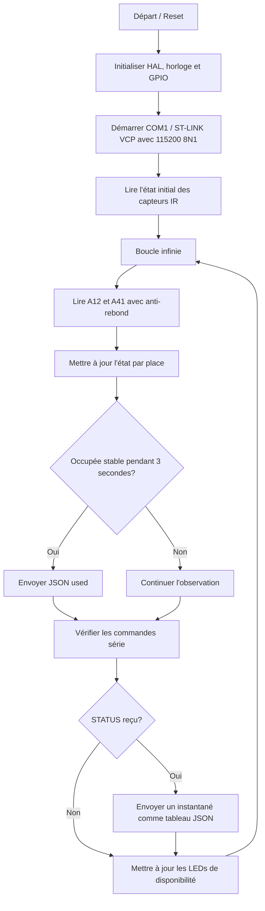
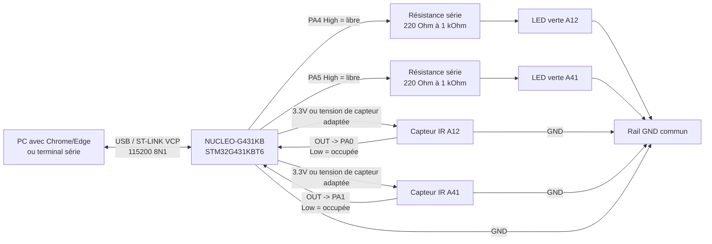

# ParkingStation

[Deutsch](README_DE.md) | [English](README.md) | [العربية](README_AR.md) | [Español](README_ES.md) | [Français](README_FR.md)

ParkingStation est un prototype STM32 pour une petite détection de places de parking avec deux vrais capteurs IR, deux LEDs vertes de disponibilité et une interface simple via Web Serial. Le projet détecte si les places `A12` et `A41` sont occupées ou libres, envoie les changements d'état au format JSON par le ST-LINK Virtual COM Port et affiche les valeurs visuellement dans `parking-station.html`. Le firmware fonctionne sur une carte NUCLEO-G431KB avec un STM32G431KBT6 et utilise STM32 HAL/BSP ainsi que CMake comme système de compilation. L'accent est mis sur le montage matériel, le comportement de la logique des capteurs, les interfaces série et les limites du modèle.

## Table des matières

- [Objectif du projet](#objectif-du-projet)
- [Résultat final](#résultat-final)
- [Matériel](#matériel)
- [Affectation des broches](#affectation-des-broches)
- [Schéma / câblage](#schéma--câblage)
- [Structure logicielle](#structure-logicielle)
- [Comportement du firmware](#comportement-du-firmware)
- [Protocole série](#protocole-série)
- [Tableau de bord web](#tableau-de-bord-web)
- [Outils et références](#outils-et-références)
- [Compiler, flasher et démarrer](#compiler-flasher-et-démarrer)
- [Tests et contrôles](#tests-et-contrôles)
- [Limites et restrictions connues](#limites-et-restrictions-connues)
- [Photos et vidéos du résultat final](#photos-et-vidéos-du-résultat-final)
- [Méthode IPERKA en 6 phases](#méthode-iperka-en-6-phases)
- [Code du programme commenté](#code-du-programme-commenté)
- [Extensions possibles](#extensions-possibles)

## Objectif du projet

L'objectif du projet est de créer un modèle fonctionnel de Parking Station. Deux places de parking sont surveillées avec des capteurs IR afin que le microcontrôleur reconnaisse si un objet ou un véhicule miniature se trouve sur la place. De plus, une LED verte par place indique directement si la place est libre. Le microcontrôleur traite les données des capteurs, filtre les perturbations courtes et signale l'état sous forme de lignes JSON via la connexion série. Une interface HTML peut se connecter avec Web Serial et affiche les deux places en direct avec d'autres places factices comme parking modèle.

Le projet est volontairement construit comme prototype. Il montre la fonction de base d'une surveillance de parking, mais ne remplace pas un système industriel robuste de guidage de stationnement. Le matériel reste simple afin que le montage, le code et le comportement soient faciles à comprendre. Le projet convient donc particulièrement à la documentation, à la présentation et à la démonstration de l'interaction entre capteurs, microcontrôleur et interface utilisateur.

## Résultat final

Le résultat final se compose de trois parties:

| Partie | Résultat |
| --- | --- |
| Matériel | NUCLEO-G431KB avec deux capteurs IR et deux LEDs vertes de disponibilité pour les places `A12` et `A41` |
| Firmware | Code C dans `Core/Src/main.c` qui évalue les capteurs, envoie du JSON et reçoit des commandes série |
| Interface utilisateur | `parking-station.html` comme tableau de bord local avec connexion Web Serial |

La Parking Station fonctionne selon le déroulement suivant:



## Matériel

### Composants principaux

| Composant | Rôle dans le projet | Remarque |
| --- | --- | --- |
| NUCLEO-G431KB | Carte microcontrôleur et connexion USB ST-LINK | Carte de l'environnement STM32G4 |
| STM32G431KBT6 | Exécute le firmware, la logique GPIO et la communication UART | Horloge système configurée dans le projet à 170 MHz |
| Capteur IR A12 | Détecte l'occupation de la place `A12` | Signal actif à l'état bas attendu |
| Capteur IR A41 | Détecte l'occupation de la place `A41` | Signal actif à l'état bas attendu |
| LED verte A12 | Indique si la place `A12` est libre | GPIO High = LED allumée = place libre |
| LED verte A41 | Indique si la place `A41` est libre | GPIO High = LED allumée = place libre |
| USB/ST-LINK VCP | Alimentation, programmation et connexion de données série | Port COM pour le tableau de bord ou le terminal |

### Principe de fonctionnement des capteurs

Les capteurs IR sont lus comme des entrées numériques. Le firmware considère un signal bas sur le GPIO du capteur comme une occupation détectée, car les entrées sont configurées avec un pull-up interne. Si aucun objet n'est présent ou si la sortie du capteur n'est pas active, le pull-up maintient l'entrée à l'état haut et la place est considérée comme libre. Cette logique correspond à de nombreux capteurs IR d'obstacle simples, mais elle doit être vérifiée avec un autre matériel de capteur. Une sortie de capteur ouverte ou débranchée peut également apparaître comme une place libre à cause du pull-up.

Chaque capteur est lu deux fois. Une courte attente de `20 ms` se trouve entre les deux mesures. La place n'est acceptée comme occupée que si les deux mesures indiquent une détection. Cela réduit les pics de perturbation très courts, mais les erreurs de mesure lentes ou les capteurs mal alignés ne sont pas automatiquement évités.

### Alimentation et niveaux de signal

La carte est normalement alimentée par USB. Les capteurs IR doivent fonctionner avec une tension adaptée à la carte; une sortie compatible 3.3 V est recommandée. Le GND des capteurs et celui de la carte NUCLEO doivent être reliés ensemble, sinon les niveaux numériques ne sont pas clairement définis. Avant de connecter un capteur, il faut vérifier que son niveau de sortie est autorisé pour un GPIO STM32.

## Affectation des broches

| Fonction | Place / signal | Broche STM32 | Port | Direction | Logique |
| --- | --- | --- | --- | --- | --- |
| Capteur IR | `A12` | `PA0` | `GPIOA` | Entrée | Low = occupée |
| Capteur IR | `A41` | `PA1` | `GPIOA` | Entrée | Low = occupée |
| LED verte de disponibilité | `A12` | `PA4` | `GPIOA` | Sortie | High = libre / LED allumée |
| LED verte de disponibilité | `A41` | `PA5` | `GPIOA` | Sortie | High = libre / LED allumée |
| Virtual COM TX | ST-LINK VCP | `PA2` | `GPIOA` | Alternate Function | LPUART1 TX via BSP-COM1 |
| Virtual COM RX | ST-LINK VCP | `PA3` | `GPIOA` | Alternate Function | LPUART1 RX via BSP-COM1 |
| SWDIO | Debug | `PA13` | `GPIOA` | Debug | ST-LINK |
| SWCLK | Debug | `PA14` | `GPIOA` | Debug | ST-LINK |
| SWO | Debug | `PB3` | `GPIOB` | Debug | Optionnel |

Les places en direct sont définies dans `Core/Inc/main.h`:

```c
#define PARKING_PLACE_A12_Pin GPIO_PIN_0
#define PARKING_PLACE_A12_GPIO_Port GPIOA
#define PARKING_PLACE_A41_Pin GPIO_PIN_1
#define PARKING_PLACE_A41_GPIO_Port GPIOA
#define PARKING_PLACE_A12_LED_Pin GPIO_PIN_4
#define PARKING_PLACE_A12_LED_GPIO_Port GPIOA
#define PARKING_PLACE_A41_LED_Pin GPIO_PIN_5
#define PARKING_PLACE_A41_LED_GPIO_Port GPIOA
```

Le code série actif utilise la définition BSP `COM1`. Dans `Drivers/BSP/STM32G4xx_Nucleo/stm32g4xx_nucleo.h`, `COM1` est associé pour cette carte à `LPUART1` avec `PA2` et `PA3`. En cas de régénération ultérieure avec STM32CubeMX, il faut vérifier que cette configuration BSP-COM et le gestionnaire `LPUART1_IRQHandler` correspondent toujours.

## Schéma / câblage

Le schéma suivant montre la structure logique du prototype. Il ne remplace pas un schéma professionnel KiCad ou EDA, mais rend visibles dans la documentation les signaux reliés entre capteurs, LEDs, carte NUCLEO et tableau de bord web.



### Tableau de câblage

| Composant / signal | Connexion sur NUCLEO-G431KB | But |
| --- | --- | --- |
| Capteur A12 `VCC` | `3.3V` ou tension de capteur adaptée | Alimentation du capteur en direct gauche |
| Capteur A12 `GND` | `GND` | Point de référence commun |
| Capteur A12 `OUT` | `PA0` | Signal numérique actif bas pour la place `A12` |
| Capteur A41 `VCC` | `3.3V` ou tension de capteur adaptée | Alimentation du capteur en direct droit |
| Capteur A41 `GND` | `GND` | Point de référence commun |
| Capteur A41 `OUT` | `PA1` | Signal numérique actif bas pour la place `A41` |
| Anode LED verte A12 | `PA4 -> résistance série -> anode LED` | La LED s'allume quand `A12` est libre |
| Cathode LED verte A12 | `GND` | Retour de la LED |
| Anode LED verte A41 | `PA5 -> résistance série -> anode LED` | La LED s'allume quand `A41` est libre |
| Cathode LED verte A41 | `GND` | Retour de la LED |
| USB / ST-LINK | Câble USB vers le PC | Programmation, alimentation et Virtual COM Port |

`PA6` et `PA7` ne sont pas utilisés dans le firmware actuel. Une ligne de capteur ouverte ou défectueuse n'est donc pas reconnue comme un état d'erreur séparé, mais peut apparaître comme une place libre à cause du pull-up interne.

## Structure logicielle

```text
ParkingStation/
+-- Core/
|   +-- Inc/
|   |   +-- main.h
|   |   +-- stm32g4xx_hal_conf.h
|   |   +-- stm32g4xx_it.h
|   +-- Src/
|       +-- main.c
|       +-- stm32g4xx_it.c
|       +-- stm32g4xx_hal_msp.c
|       +-- syscalls.c
|       +-- sysmem.c
|       +-- system_stm32g4xx.c
+-- Drivers/
|   +-- BSP/STM32G4xx_Nucleo/
|   +-- CMSIS/
|   +-- STM32G4xx_HAL_Driver/
+-- cmake/
|   +-- gcc-arm-none-eabi.cmake
|   +-- starm-clang.cmake
|   +-- stm32cubemx/CMakeLists.txt
+-- CMakeLists.txt
+-- CMakePresets.json
+-- ParkingStation.ioc
+-- STM32G431XX_FLASH.ld
+-- startup_stm32g431xx.s
+-- Assets/
|   +-- image-20260520-232528-615.jpeg
|   +-- ...
+-- parking-station.html
+-- 03 Vorlage - IPERKA 6-Phasen-Methode.docx
+-- README.md
+-- README_DE.md
+-- README_AR.md
+-- README_ES.md
+-- README_FR.md
```

### Fichiers importants

| Fichier | Signification |
| --- | --- |
| `Core/Src/main.c` | Logique principale du firmware: initialisation, capteurs, machine d'état, sortie JSON, commandes UART |
| `Core/Inc/main.h` | Définitions des broches pour les places en direct et les LEDs de disponibilité |
| `Core/Src/stm32g4xx_it.c` | Gestionnaires d'interruption, notamment `LPUART1_IRQHandler` pour COM1 |
| `parking-station.html` | Tableau de bord local avec Web Serial API |
| `ParkingStation.ioc` | Configuration du projet STM32CubeMX |
| `CMakeLists.txt` | Script de compilation CMake supérieur |
| `cmake/stm32cubemx/CMakeLists.txt` | Listes de sources, includes et drivers générées par CubeMX |
| `STM32G431XX_FLASH.ld` | Script linker pour la répartition Flash/RAM |

## Comportement du firmware

### Initialisation

Au démarrage, le firmware appelle d'abord `HAL_Init()` puis configure l'horloge système. Ensuite, les ports GPIO pour les capteurs IR et les deux LEDs vertes de disponibilité sont initialisés. Puis `BSP_COM_Init(COM1, ...)` démarre l'interface série avec 115200 bauds, 8 bits de données, 1 bit d'arrêt, aucune parité et aucun contrôle de flux matériel. La réception est activée par interruption avec `HAL_UART_Receive_IT()`.

### État d'une place

Chaque place réelle possède une petite structure d'état:

```c
typedef struct
{
  uint8_t occupied;
  uint8_t usedReported;
  uint32_t occupiedStartedAt;
} ParkingPlaceState;
```

`occupied` décrit l'état d'occupation actuellement détecté de façon stable. `usedReported` empêche le firmware d'envoyer constamment de nouveaux événements `used` tant que le même véhicule reste inchangé sur la place. `occupiedStartedAt` enregistre le moment où l'occupation a commencé. Le firmware peut ainsi vérifier si une place est occupée depuis plus longtemps que le délai de signalement défini.

### Détection d'occupation

Une place n'est pas considérée comme occupée dès la première valeur active du capteur. Le firmware attend d'abord deux échantillons actifs identiques séparés par `SENSOR_DEBOUNCE_MS`, donc `20 ms`. Si la place reste ensuite occupée en continu, un événement `used` n'est envoyé qu'après `PARKING_USED_REPORT_DELAY_MS`, donc `3000 ms`. Ainsi, un passage bref ou un mouvement de main n'est pas immédiatement signalé comme un vrai stationnement.

### Détection de libération

Quand une place redevient libre, le firmware envoie `free`, mais seulement si un événement `used` avait déjà été envoyé pour cette occupation. Cela évite les messages inutiles lors de perturbations très courtes qui n'ont jamais atteint la limite de trois secondes. Si un objet est détecté brièvement puis retiré, il peut ne pas y avoir de message JSON du tout. L'état actuel peut être demandé à tout moment avec la commande `STATUS`.

### Comportement des LEDs

Chaque place en direct possède sa propre LED verte de disponibilité. La LED pour `A12` est connectée à `PA4`, celle pour `A41` à `PA5`. Une LED est allumée tant que la place correspondante est libre. Dès que le capteur de cette place détecte une occupation, le firmware éteint la LED correspondante.

L'affichage LED suit l'état actuel du capteur après l'anti-rebond. Il n'attend pas le délai de trois secondes du message série `used`. Ainsi, on voit immédiatement sur le montage que la place n'est plus libre, tandis que la sortie JSON continue de filtrer les perturbations courtes.

### Câblage des LEDs vertes

Les LEDs sont prévues comme sorties actives à l'état haut. Cela signifie: la broche STM32 fournit un signal High, le courant traverse la résistance série et la LED vers GND, et la LED s'allume. Chaque LED nécessite sa propre résistance série, typiquement entre `220 Ohm` et `1 kOhm`; une bonne valeur de départ est `330 Ohm`.

| Place | Broche STM32 | Connexion |
| --- | --- | --- |
| `A12` | `PA4` | `PA4 -> résistance série -> anode LED`, cathode LED -> `GND` |
| `A41` | `PA5` | `PA5 -> résistance série -> anode LED`, cathode LED -> `GND` |

Le côté long de la LED est normalement l'anode, le côté court ou le côté aplati du boîtier est normalement la cathode. Si la LED est montée à l'envers, elle ne s'allume pas, mais avec un câblage normal elle n'est généralement pas détruite. Il est important que chaque LED ait une résistance série et qu'aucun GPIO ne soit directement court-circuité.

## Protocole série

### Connexion

| Paramètre | Valeur |
| --- | --- |
| Port | ST-LINK Virtual COM Port |
| Interface firmware | `COM1` / `LPUART1` via BSP |
| Débit | `115200` |
| Bits de données | `8` |
| Bits d'arrêt | `1` |
| Parité | Aucune |
| Contrôle de flux | Aucun |
| Fin de ligne pour commandes | `\r`, `\n` ou `\r\n` |

### Événements automatiques

Quand une place est occupée assez longtemps, le firmware envoie une ligne JSON:

```json
{"place":"A12","state":"used","timestamp_ms":3120}
```

Quand une place déjà signalée redevient libre, le firmware envoie:

```json
{"place":"A12","state":"free","timestamp_ms":9400}
```

`timestamp_ms` vient de `HAL_GetTick()` et décrit les millisecondes depuis le démarrage du contrôleur. Cette valeur n'est pas une vraie heure. Après une longue durée de fonctionnement, la valeur tick peut déborder; pour les courts intervalles du projet, ce n'est pas critique.

### Commande `STATUS`

La seule commande prise en charge est:

```text
STATUS
```

La réponse est un tableau JSON avec les deux places en direct:

```json
[{"place":"A12","state":"free","timestamp_ms":12055},{"place":"A41","state":"used","timestamp_ms":12055}]
```

### Sorties d'erreur

| Situation | Réponse |
| --- | --- |
| Commande inconnue | `{"error":"unknown_command"}` |
| Commande plus longue que le buffer | `{"error":"command_too_long"}` |

Le buffer de commande mesure `16` caractères. Comme un caractère est réservé à la terminaison de chaîne, une commande peut contenir au maximum `15` caractères visibles. Cela suffit pour `STATUS`, mais c'est une limite volontaire du prototype.

## Tableau de bord web

Le fichier `parking-station.html` est une interface utilisateur locale simple. Il affiche un bloc de parking avec 20 places de `A11` à `A45`. Seules `A12` et `A41` sont de vraies places matérielles, car seules ces deux places sont reliées à des capteurs IR dans le firmware. Les autres places sont des valeurs factices et sont affichées par défaut comme occupées afin que le modèle ressemble à un parking plus grand.

### Utilisation

1. Flasher le firmware sur la carte NUCLEO.
2. Connecter la carte à l'ordinateur par USB.
3. Ouvrir `parking-station.html` via un serveur local dans Chrome ou Edge.
4. Cliquer sur `Connect` et sélectionner le ST-LINK Virtual COM Port.
5. Utiliser `Request Status` pour demander l'état actuel.
6. Couvrir le capteur A12 ou A41 et observer la LED verte correspondante; après environ trois secondes, le changement JSON apparaît aussi.

### Démarrage local du tableau de bord

Web Serial fonctionne généralement dans Chrome ou Edge et nécessite un contexte sécurisé. Pour le développement local, `localhost` convient. Un démarrage simple est par exemple:

```powershell
py -m http.server 8000
```

Puis ouvrir dans le navigateur:

```text
http://localhost:8000/parking-station.html
```

Si `py` n'est pas disponible, un autre serveur local de fichiers statiques ou une extension d'IDE comme Live Server peut aussi être utilisé.

## Outils et références

### Outils utilisés

| Outil | But dans le projet | Lien |
| --- | --- | --- |
| STM32CubeMX | Pinout, horloge, configuration des périphériques et génération de code pour projets STM32 | [STM32CubeMX](https://www.st.com/stm32cubemx) |
| STM32CubeProgrammer | Flashage et vérification du firmware via ST-LINK/SWD | [STM32CubeProgrammer](https://www.st.com/en/product/stm32cubeprog) |
| Visual Studio Code | Éditeur pour code C, README et tableau de bord HTML | [Visual Studio Code](https://code.visualstudio.com/) |
| STM32CubeIDE for Visual Studio Code | Support STM32 dans VS Code, import de projet, build/debug et fonctions ST-LINK | [VS Code Marketplace](https://marketplace.visualstudio.com/items?itemName=stmicroelectronics.stm32-vscode-extension) |
| C/C++ Extension Pack | IntelliSense, support C/C++ et CMake Tools pour VS Code | [VS Code Marketplace](https://marketplace.visualstudio.com/items?itemName=ms-vscode.cpptools-extension-pack) |
| Live Server | Serveur web local pour `parking-station.html` | [VS Code Marketplace](https://marketplace.visualstudio.com/items?itemName=ritwickdey.LiveServer) |
| CMake | Système de compilation pour le projet STM32 | [CMake Download](https://cmake.org/download/) |
| ARM GNU Toolchain | Compilateur, assembleur et linker pour ARM Cortex-M | [Arm GNU Toolchain Downloads](https://developer.arm.com/downloads/-/arm-gnu-toolchain-downloads) |

### Références techniques

| Référence | Importance pour le projet | Lien |
| --- | --- | --- |
| UM2397 - STM32G4 Nucleo-32 board (MB1430) | Manuel utilisateur officiel de la carte NUCLEO-G431KB utilisée, ST-LINK, headers et fonctions de carte | [STMicroelectronics PDF](https://www.st.com/resource/en/user_manual/um2397-stm32g4-nucleo32-board-mb1430-stmicroelectronics.pdf) |
| Fiche technique GP2A200LCS0F Series | Référence pour capteurs IR réfléchissants avec `VCC`, `VOUT` et `GND` ainsi que distance de détection | [Reichelt / SHARP PDF](https://cdn-reichelt.de/documents/datenblatt/C900/GP2A200LCS0FN.pdf) |

## Compiler, flasher et démarrer

### Prérequis

- CMake version 3.22 ou plus récente
- Ninja ou un générateur CMake compatible
- ARM GCC Toolchain correspondant à `cmake/gcc-arm-none-eabi.cmake`
- STM32CubeProgrammer ou un IDE avec support ST-LINK
- Chrome ou Edge pour le tableau de bord web

### Compilation avec CMake

```powershell
cmake --preset Debug
cmake --build --preset Debug
```

Pour une compilation Release:

```powershell
cmake --preset Release
cmake --build --preset Release
```

Les fichiers de compilation se trouvent selon le preset sous `build/Debug` ou `build/Release`. Le projet génère la cible STM32 `ParkingStation`. Selon la configuration de la toolchain, cela produit des fichiers comme `.elf`, `.hex` ou `.bin`.

### Flashage

Le flashage n'est pas enregistré comme script séparé dans le dépôt. Le chemin pratique passe par STM32CubeProgrammer ou un IDE STM32 adapté. Il faut connecter la carte NUCLEO par USB, sélectionner le fichier firmware généré dans le dossier de build et l'écrire sur le contrôleur. Ensuite, la carte redémarre automatiquement ou peut être redémarrée avec Reset.

## Tests et contrôles

### Test de base avec un terminal

Un terminal série peut se connecter directement au ST-LINK Virtual COM Port avec `115200 8N1`. Après le démarrage, le firmware n'envoie pas forcément un état immédiatement, car l'état initial est seulement repris en interne. Si `STATUS` est envoyé avec Entrée, un tableau JSON avec `A12` et `A41` doit revenir. Si un capteur est couvert pendant plus de trois secondes, un événement `used` doit apparaître. Quand le capteur est ensuite libéré, un événement `free` doit apparaître.

### Cas de test

| No. | Action | Résultat attendu |
| --- | --- | --- |
| 1 | Ne rien couvrir | Les deux LEDs vertes de disponibilité sont allumées, `STATUS` indique les deux places libres |
| 2 | Couvrir brièvement le capteur A12 moins de 3 secondes | LED A12 éteinte pendant la couverture, puis rallumée; aucun événement `used` |
| 3 | Couvrir brièvement le capteur A41 | LED A41 éteinte, LED A12 reste allumée |
| 4 | Couvrir le capteur A12 plus de 3 secondes | LED A12 éteinte et JSON `{"place":"A12","state":"used",...}` |
| 5 | Libérer le capteur A12 après `used` | LED A12 allumée et JSON `{"place":"A12","state":"free",...}` |
| 6 | Couvrir le capteur A41 plus de 3 secondes | LED A41 éteinte et JSON `{"place":"A41","state":"used",...}` |
| 7 | Couvrir les deux capteurs | Les deux LEDs vertes de disponibilité sont éteintes, les deux places sont affichées comme `used` avec `STATUS` |
| 8 | Envoyer une commande inconnue, par exemple `HELLO` | JSON `{"error":"unknown_command"}` |
| 9 | Envoyer une commande très longue | JSON `{"error":"command_too_long"}` |

### Contrôle dans le tableau de bord

Dans le tableau de bord, les champs `A12` et `A41` doivent afficher l'état réel des capteurs. Avec `Request Status`, l'état en direct s'actualise immédiatement à partir de la réponse instantanée. Les événements automatiques sont affichés dans le journal et mettent les tuiles à jour. Les places factices restent inchangées et servent seulement à l'affichage.

## Limites et restrictions connues

### Limites matérielles

- Seules deux vraies places sont surveillées: `A12` et `A41`.
- Les capteurs détectent seulement un signal numérique, pas la classe du véhicule, la plaque, la direction ni la position exacte.
- La logique attend des capteurs actifs à l'état bas; avec des capteurs actifs à l'état haut, `IR_SensorDetected()` devrait être adapté.
- Les sorties LED sont actives à l'état haut; avec un autre câblage, `ParkingStation_UpdateFreeLeds()` devrait être inversé.
- Une sortie de capteur débranchée ou défectueuse peut être lue comme une place libre à cause du pull-up interne.
- Les capteurs IR peuvent être influencés par la distance, l'angle, la lumière ambiante, les surfaces réfléchissantes ou un mauvais alignement.
- Les pull-ups internes aident contre les entrées ouvertes, mais ne remplacent pas un câblage propre ni une alimentation stable.
- Le prototype ne possède pas d'isolation galvanique ni de circuit de protection pour des environnements difficiles.

### Limites du firmware

- L'anti-rebond est implémenté de façon bloquante: le firmware attend `20 ms` par capteur.
- Avec deux capteurs, ce n'est pas problématique; avec beaucoup de capteurs, la boucle deviendrait nettement plus lente.
- Un événement `used` n'apparaît qu'après `3000 ms` d'occupation stable.
- Les occupations très courtes sont volontairement ignorées et n'apparaissent pas comme événements.
- Un événement `free` est envoyé seulement si un événement `used` a été signalé auparavant pour la même occupation.
- Il n'y a pas de stockage persistant; après reset, l'historique est perdu.
- Il n'y a pas de vraie base de temps comme RTC ou NTP, seulement `HAL_GetTick()` depuis le démarrage.
- Le jeu de commandes série ne contient que `STATUS`.
- Le buffer de commande est limité à `16` caractères.

### Limites du tableau de bord

- Web Serial n'est pas disponible dans tous les navigateurs.
- L'interface doit fonctionner via `localhost` ou un autre contexte sécurisé.
- Seules `A12` et `A41` sont des données en direct; les autres places sont des affichages factices.
- Le tableau de bord ne stocke pas les données durablement.
- La durée de stationnement et le tarif calculés dans le tableau de bord sont basés sur l'heure du navigateur depuis la réception de l'état `used` et ne sont qu'un affichage pour la démonstration.

## Photos et vidéos du résultat final

Les images suivantes se trouvent dans le dossier `Assets/` et documentent le montage réel. Elles montrent le modèle en carton, les deux zones de parking, les LEDs vertes, les positions des capteurs et l'arrière avec le câblage. Les vidéos ne sont actuellement pas dans le dépôt; pour une remise ultérieure, de courts clips montrant la couverture et la libération des capteurs peuvent être ajoutés.

| Image | Description | But pour la documentation |
| --- | --- | --- |
|  | Vue intérieure du modèle en carton avec deux places séparées | Montre le montage mécanique et la position des surfaces de stationnement |
|  | Vue extérieure du boîtier du modèle | Documente le boîtier fini en carton |
|  | Arrière avec carte NUCLEO et câbles jumper | Montre que l'électronique est connectée au modèle |
|  | Vue latérale avec cheminement des câbles | Aide à comprendre le câblage de la carte vers les capteurs et LEDs |
|  | Vue extérieure du boîtier | Documente la stabilité, la forme et la construction du modèle |
|  | Vue intérieure avec les deux LEDs vertes de disponibilité | Montre l'affichage matériel direct pour les places libres |
|  | Breadboard, zone NUCLEO et fils de connexion | Sert de preuve du montage de test électrique |
|  | LED verte allumée dans la place | Montre la fonction: une place libre est signalée par une lumière verte |
|  | Place avec voiture miniature dans la zone du capteur | Montre le résultat final dans une situation de test réaliste |

## Méthode IPERKA en 6 phases

Cette section suit le modèle `03 Vorlage - IPERKA 6-Phasen-Methode.docx`. Le modèle contient les zones mission/produit final, date, élève, autres accords, critères d'évaluation ainsi que les six étapes d'action: s'informer, planifier, décider, réaliser/exécuter, contrôler et évaluer/réfléchir. Pour chaque étape, des phrases formulées sont incluses afin que la documentation puisse être réutilisée directement pour une remise de projet.

### Mission et produit final

La mission consiste à construire, programmer et documenter une Parking Station comme projet de microcontrôleur. Le produit final est un prototype fonctionnel qui détecte deux places avec des capteurs IR et émet l'état via une interface série. Une interface web en fait également partie afin de rendre les données en direct visibles. La documentation décrit le montage, la fonction, les limites, les cas de test et le travail selon IPERKA.

### Date, lieu et élève

| Champ du modèle | Entrée |
| --- | --- |
| Date finale / remise | 20.05.2026 |
| Lieu / VZ | Nordhorn KBS |
| Élève | Mohammad Dyaa Addin Shami |
| Autres accords | Projet STM32, deux vrais capteurs, tableau de bord web, documentation README |

### Critères d'évaluation du modèle

| Part | Critère |
| --- | --- |
| 1/3 | Documentation selon le modèle IPERKA, idée et proposition de projet |
| 2/3 | Résultat du projet et présentation |

### Étape d'action 1: S'informer

Dans la phase d'information, il a d'abord été clarifié quelle fonction la Parking Station devait avoir à la fin. Il était important qu'au moins deux places puissent être reconnues avec des capteurs et que les états puissent être affichés de façon visible. Ensuite, les fichiers de projet existants, la carte NUCLEO-G431KB, la configuration STM32CubeMX et l'interface HTML ont été examinés. Il a été constaté que `A12` et `A41` sont prévues comme vraies places de capteur et que la communication s'effectue via le ST-LINK Virtual COM Port. À la fin de cette phase, les exigences, interfaces et limites les plus importantes du prototype étaient connues.

Détails courts: les fichiers de projet STM32Cube, `main.c`, `main.h`, `ParkingStation.ioc`, `parking-station.html` et le modèle IPERKA ont été utilisés. Le résultat est une compréhension claire du matériel, du logiciel, de la logique des capteurs et des exigences de documentation.

### Étape d'action 2: Planifier

Dans la phase de planification, il a été défini comment le matériel, le firmware et le tableau de bord web devaient travailler ensemble. Les capteurs devaient être placés sur `PA0` et `PA1`, les LEDs vertes de disponibilité sur `PA4` et `PA5`, tandis que la sortie série devait fonctionner via `COM1` à 115200 bauds. Pour le firmware, une machine d'état simple a été planifiée afin d'ignorer les perturbations courtes et de signaler une occupation seulement après trois secondes. Pour la documentation, il a été décidé de décrire en détail la structure du projet, l'affectation des broches, le protocole, les tests et les limites dans le README. Cela a créé un plan réalisable basé directement sur les fichiers existants.

Détails courts: la structure CMake, l'affectation des broches CubeMX, le tableau de bord HTML existant et les exigences de la tâche ont été utilisés. Le résultat est un plan de travail pour les commentaires du firmware, la structure README et la structure de preuve pour photos/vidéos.

### Étape d'action 3: Décider

Dans la phase de décision, l'architecture existante a été conservée parce qu'elle est claire et adaptée à un prototype. Il a été décidé de commenter de manière ciblée uniquement le code propre du programme et de ne pas reconstruire les fichiers HAL et drivers générés. Pour la sortie d'état, JSON a été conservé parce qu'il est lisible dans le terminal et peut être traité directement par le tableau de bord web. `A12` et `A41` restent les places en direct, tandis que les autres places du tableau de bord servent de valeurs factices. Ces décisions gardent le projet simple, présentable et maintenable.

Détails courts: les décisions existantes du projet comme STM32 HAL/BSP, CMake, Web Serial et le protocole JSON par lignes ont été utilisées. Le résultat est une direction technique claire sans extension inutile du périmètre du projet.

### Étape d'action 4: Réaliser / exécuter

Dans la phase de réalisation, le firmware a été structuré afin de lire les valeurs des capteurs, les filtrer par anti-rebond et les traiter comme état de place. Le code initialise GPIO, l'horloge système, COM1, les deux LEDs de disponibilité et la réception UART par interruption. La logique d'état signale `used` seulement après une occupation stable et envoie `free` quand une place précédemment occupée redevient libre. Le tableau de bord peut se connecter via Web Serial, envoyer la commande `STATUS` et afficher la réponse JSON. De plus, le README a été créé comme documentation centrale du projet et le code du programme a reçu des commentaires explicatifs.

Détails courts: `README.md`, `Core/Src/main.c`, `Core/Inc/main.h` et `parking-station.html` ont été modifiés. Le résultat est un firmware mieux documenté et une grande documentation de projet avec montage, fonction, limites et IPERKA.

### Étape d'action 5: Contrôler

Dans la phase de contrôle, il faut vérifier si les capteurs, le firmware et le tableau de bord montrent le comportement attendu. Pour cela, les capteurs sont couverts individuellement, relâchés de nouveau et les sorties JSON dans le terminal ou le tableau de bord sont observées. Le test montrant que les occupations courtes de moins de trois secondes ne sont pas signalées comme un vrai changement de parking est particulièrement important. Il faut aussi vérifier si `STATUS` renvoie toujours l'état actuel de `A12` et `A41`. Si ces tests réussissent, le résultat final central est atteint.

Détails courts: un terminal série, le tableau de bord web, des tests de couverture des capteurs et le tableau de tests de ce README sont utilisés. Le résultat est une preuve fonctionnelle compréhensible pour la présentation.

### Étape d'action 6: Évaluer / réfléchir

Dans la phase de réflexion, il est évalué si l'objectif du projet a été atteint avec les moyens disponibles. Le prototype montre bien l'idée de base d'une surveillance de parking, car les valeurs des capteurs sont traitées et affichées visiblement. En même temps, les limites sont clairement visibles, car seulement deux vraies places sont connectées et les capteurs détectent uniquement une occupation numérique simple. Pour un système plus grand, il faudrait ajouter plus de capteurs, une évaluation non bloquante, un stockage durable et un matériel plus robuste. Dans l'ensemble, le projet convient bien comme montage d'apprentissage et de démonstration, car le lien entre matériel, firmware et interface reste transparent.

Détails courts: la fonction, les limites, l'extensibilité et la qualité de la documentation ont été évaluées. Le résultat est une autoévaluation réaliste avec des possibilités d'amélioration concrètes.

## Code du programme commenté

Le code du programme écrit par le projet est commenté dans les zones pertinentes. Les commentaires sur la logique active à l'état bas des capteurs, l'anti-rebond, la machine d'état des places, le buffer de commande UART et les fonctions callback sont particulièrement importants. Les commentaires ne doivent pas répéter chaque ligne C, mais expliquer les décisions techniques. Les fichiers générés STM32 HAL, CMSIS et BSP restent en grande partie inchangés, car ils ne sont normalement pas commentés ou réécrits manuellement.

Zones clés commentées:

| Fichier | Zone commentée |
| --- | --- |
| `Core/Src/main.c` | `ParkingPlaceState`, defines de timing, boucle principale, configuration GPIO, fonctions capteurs, LEDs de disponibilité, sortie JSON, gestion des commandes UART |
| `Core/Inc/main.h` | Définitions de broches pour places en direct et LEDs de disponibilité |
| `parking-station.html` | Sélection des places en direct, traitement JSON, connexion Web Serial, commande `STATUS` |

## Extensions possibles

- Connecter d'autres places comme vrais capteurs.
- Implémenter la lecture des capteurs de façon non bloquante avec des timers ou des interruptions.
- Étendre le tableau de bord afin que toutes les places viennent en direct du contrôleur.
- Utiliser des noms de places configurables au lieu de `A12`/`A41` codés en dur.
- Stocker les événements avec une vraie heure, par exemple via RTC.
- Envoyer les données à un serveur, broker MQTT ou base de données.
- Ajouter une détection séparée d'erreurs de capteur si les capteurs débranchés ou défectueux doivent être reconnus automatiquement.
- Ajouter un boîtier, des connexions stables et des circuits de protection pour un montage plus robuste.
